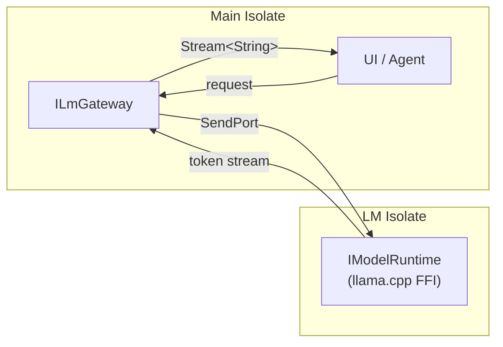
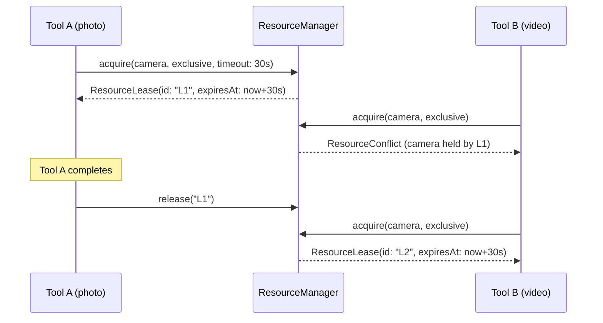
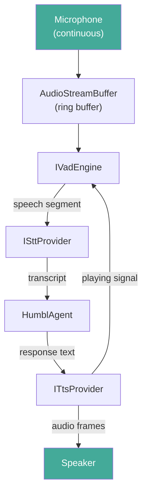

# Concurrency Model

Humbl runs multiple concurrent operations: LM inference, pipeline processing, tool execution, voice streaming, and hardware resource management. This page documents how concurrency is handled at each layer without traditional locking.

## Guiding Principles

1. **Immutable state, no locks.** `PipelineState` is immutable. Each pipeline run operates on its own state chain. There is no shared mutable state between runs, so no mutex is needed.
2. **Isolate-based heavy computation.** LM inference and embedding generation run in background Dart isolates. The main isolate stays responsive for UI and event handling.
3. **Stream-based event propagation.** All inter-component communication uses Dart `Stream` (broadcast `StreamController`). No polling, no callbacks-in-callbacks.
4. **Lease-based resource arbitration.** Hardware resources (camera, mic, BLE) use lease objects with expiry timers instead of mutexes.

## Concurrent Pipeline Runs

`PipelineOrchestrator` supports multiple simultaneous `run()` and `runStream()` calls. There is no global lock:

```dart
/// Pre-wired pipeline graph -- supports concurrent runs.
///
/// Concurrent runs: multiple run()/runStream() calls are allowed simultaneously.
/// Each run has its own PipelineState (immutable). Shared dependencies
/// (gateway, tools, resources) are concurrent-safe.
class PipelineOrchestrator {
  int _runCounter = 0;

  Future<PipelineState> run(PipelineState initialState) async {
    _runCounter++;
    return _graph.run(initialState);
  }

  Stream<PipelineState> runStream(PipelineState initialState) {
    _runCounter++;
    return _graph.runStream(initialState);
  }
}
```

### Why This Works

Each pipeline run creates its own `PipelineState` at the start. Every node returns a new `PipelineState` via `copyWith()` -- the previous state is never mutated. Shared dependencies are concurrent-safe:

| Shared Dependency | Concurrency Safety |
|------------------|--------------------|
| `ILmGateway` | Stateless request/response. Each call is independent. The `LmScheduler` handles queuing. |
| `ToolRegistry` | Read-only lookup. Tool list does not change during a run. |
| `HardwareResourceManager` | Lease-based. Concurrent acquire calls are serialized internally. |
| `IMemoryService` | SQLite with WAL mode. Concurrent reads are safe. Writes are serialized by SQLite. |
| `ConversationStore` | Same as memory service -- SQLite serializes writes. |

### HumblAgent Dispatch

`HumblAgent` is the dispatcher that creates concurrent pipeline runs:

```dart
class HumblAgent {
  final Map<String, _ActiveRun> _activeRuns = {};

  /// Never blocks. Dispatches input to a new pipeline run.
  Future<void> dispatch(PipelineInput input) async {
    final runId = _nextRunId();
    final state = _buildInitialState(input, runId);

    _activeRuns[runId] = _ActiveRun(runId: runId, startedAt: DateTime.now());

    // Fire-and-forget. Result arrives via stream.
    _orchestrator.run(state).then((result) {
      _activeRuns.remove(runId);
      _resultController.add(AgentResult(runId: runId, state: result));
    }).catchError((e) {
      _activeRuns.remove(runId);
      _resultController.add(AgentResult.error(runId: runId, error: e));
    });
  }
}
```

Typical concurrent scenarios:

| Scenario | Runs |
|----------|------|
| User types while a scout agent runs | 2 concurrent runs |
| Timer trigger fires during voice interaction | 2 concurrent runs |
| Multiple button presses on glasses | 1-3 concurrent runs |
| Background consolidation + user query | 2 concurrent runs |

## Isolate-Based LM Inference

LM inference (llama.cpp, ONNX) runs in a background Dart isolate to keep the UI responsive. The main isolate communicates via `SendPort`/`ReceivePort`:



### LM Scheduler

When multiple pipeline runs need LM inference simultaneously, the `LmScheduler` in the gateway manages priority:

| Priority | Source | Behavior |
|----------|--------|----------|
| **Realtime** | User-initiated pipeline run | Preempts background tasks |
| **Background** | Scout agent, consolidation | Queued, runs when realtime is idle |
| **Batch** | Training data export, bulk embedding | Lowest priority, pausable |

Preemption works at the token level: a background inference can be paused between tokens to service a realtime request. The background run resumes when the realtime request completes.

## Hardware Resource Leasing

`HardwareResourceManager` provides lease-based access to physical resources. Two access modes handle concurrent tool execution:

### Access Modes

```dart
enum AccessMode {
  /// Multiple tools can hold simultaneous leases.
  /// Example: two tools reading GPS location.
  shared,

  /// Only one tool can hold a lease at a time.
  /// Example: camera capture -- only one tool records at once.
  exclusive,
}
```

### Lease Lifecycle



### Force Acquisition

Emergency and system-critical tools can set `forceAcquireResources = true` to revoke conflicting leases:

```dart
class EmergencyCallTool extends HumblTool {
  @override
  bool get forceAcquireResources => true;

  @override
  AccessLevel get declaredAccessLevel => AccessLevel.system;
}
```

### Lease Expiry

Every lease has an expiry timer. If a tool does not release its lease within the timeout (default 30s), the lease is automatically revoked and the resource becomes available. This prevents deadlocks from crashed or hung tools.

```dart
class ResourceLease {
  final String leaseId;
  final ResourceType resource;
  final String resourceId;
  final String callerId;
  final AccessMode mode;
  final DateTime acquiredAt;
  final DateTime expiresAt;
}
```

## Stream-Based Event Propagation

All inter-component communication uses broadcast `StreamController`s. This decouples producers from consumers and supports multiple listeners:

| Stream | Producer | Consumers |
|--------|----------|-----------|
| `HumblAgent.results` | Pipeline completion | UI, voice TTS, logging |
| `SettingsService.onSettingsChanged` | Settings write | Tools, UI, pipeline |
| `ServiceEventBus.events` | Any service | Any service |
| `StreamSessionCoordinator.transcriptions` | STT provider | Agent dispatch |
| `HardwareResourceManager.events` | Lease acquire/release | Logging, diagnostics |

### runStream for UI Progress

`PipelineOrchestrator.runStream()` yields the `PipelineState` after each node completes. The UI listens to this stream to show real-time progress:

```dart
// UI subscribes to pipeline progress
orchestrator.runStream(initialState).listen((state) {
  switch (state.currentNode) {
    case 'classify':
      showStatus('Understanding your request...');
    case 'execute_tool':
      showStatus('Running ${state.activeToolName}...');
    case 'deliver':
      showResponse(state.outputText ?? '');
  }
});
```

## Voice Session Concurrency

The voice pipeline manages multiple concurrent audio streams:



### TTS-Aware VAD

The VAD engine receives a signal from the TTS provider when audio is playing. During playback, the VAD suppresses self-hearing (the microphone picking up the speaker output) to prevent false triggers:

```dart
abstract class IVadEngine {
  /// Notify VAD that TTS is currently playing.
  /// VAD should suppress voice detection during playback.
  void setTtsPlaying(bool isPlaying);

  /// Process audio frame and return speech probability.
  VadResult process(Float32List audioFrame);
}
```

### Barge-In Support

If the user speaks while TTS is playing (barge-in), the STT provider detects this and:
1. Cancels TTS playback
2. Captures the user's speech
3. Dispatches a new pipeline run via `HumblAgent`

The previous pipeline run's result is discarded.

## SQLite Concurrency

All four databases use SQLite's built-in concurrency handling:

| Database | Mode | Concurrent Reads | Concurrent Writes |
|----------|------|------------------|-------------------|
| `humbl_journal.db` | WAL | Yes (multiple readers) | Serialized (single writer) |
| `humbl_core.db` | Default | Yes | Serialized |
| `humbl_memory.db` | Default | Yes | Serialized |
| `humbl_vectors.db` | Default (sqlite3 FFI) | Yes | Serialized |

WAL mode is used for the journal because it has the highest write frequency (every pipeline event). Other databases have infrequent writes and do not benefit significantly from WAL.

The `humbl_vectors.db` uses a raw `sqlite3` connection (not `sqflite`) because the `sqlite_vector` extension requires direct FFI access. This connection is independent of the `sqflite` global state and does not interfere with other database operations.

## Thread Safety Summary

| Component | Strategy | Safe For |
|-----------|----------|----------|
| `PipelineState` | Immutable, `copyWith()` | Concurrent reads, no writes |
| `PipelineOrchestrator` | No lock, independent runs | Concurrent `run()`/`runStream()` |
| `HumblAgent` | Fire-and-forget dispatch | Concurrent dispatches |
| `ToolRegistry` | Read-only after startup | Concurrent lookups |
| `HardwareResourceManager` | Internal serialization | Concurrent acquire/release |
| `ILmGateway` | Stateless per request | Concurrent completions |
| SQLite databases | SQLite internal locking | Concurrent reads, serialized writes |
| `StreamController.broadcast` | Dart async semantics | Multiple listeners |
| LM inference | Background isolate | UI stays responsive |
