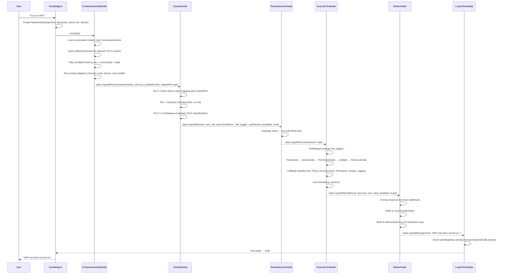
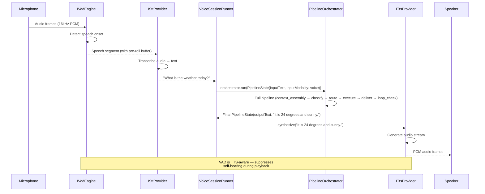
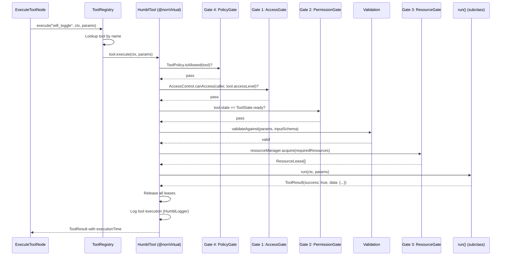
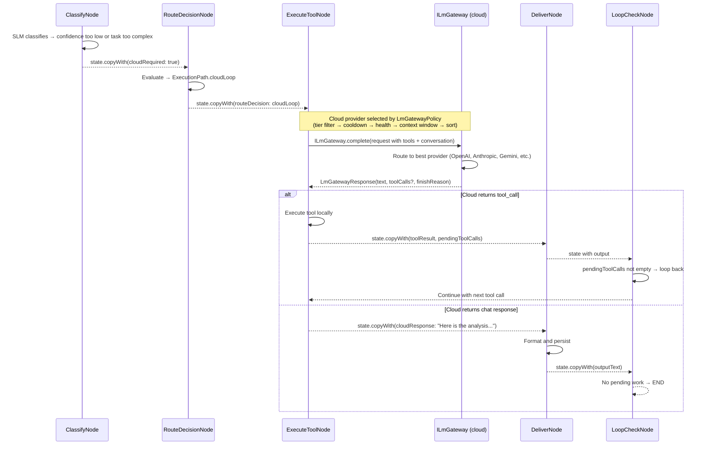
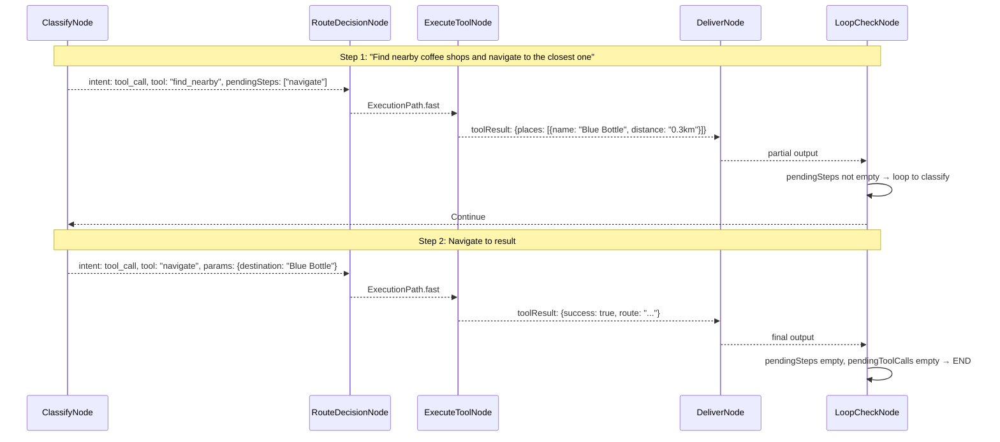

# Data Flow

This page traces how data moves through the Humbl system for the four primary interaction patterns: text input, voice input, tool execution, and cloud escalation. Each flow includes a sequence diagram followed by a step-by-step narrative explaining what happens, what data transforms, and why that design choice was made.

## Text Input Flow

The most common path: user types a message, the pipeline classifies intent, executes a tool (if needed), and delivers a response.



### Step-by-Step Narrative

**Step 1: User Input -> HumblAgent (~0ms).** The user types "Turn on WiFi" in the companion app. The `InputArbitrator` receives it as a `RawInput`, classifies it as a normal-priority text input (not a cancel keyword), creates a `PipelineInput`, and emits it to `HumblAgent`. The agent calls `SessionManager.getOrCreateSession()` to get the current session, then builds a `PipelineState` with the input text, session ID, user ID, tier, and current device state.

**Step 2: ContextAssemblyNode (~10-50ms).** This node enriches the pipeline state with all the context the LM needs to classify the intent:

- **Conversation history** is loaded from `ConversationStore` -- the last N turns from the current session, trimmed to fit the context budget. Typical: 5-10 turns, ~500-2000 tokens.
- **Memory context** is queried from `IMemoryService` -- T2 key-value facts (user preferences, location, habits) and T3 vector search results (semantically relevant past interactions). Typical: 3-5 relevant facts, ~200-500 tokens.
- **Available tools** are filtered by the user's tier, current connectivity, device capabilities, and tool state. Free-tier users lose cloud-dependent tools. Offline users lose internet-requiring tools. The filtered list is converted to MCP schema format for the LM prompt.
- **Prompt adapters** assemble the final prompt: system instruction + memory context + tool schemas + conversation history + user input. The `ContextBudget` ensures the total stays within the model's context window.

**Why this design:** Context assembly is separated from classification because the same assembled context is reusable across classification attempts (retries, loops). It also allows the context budget to be tuned independently of classification logic.

**Step 3: ClassifyNode (~0-400ms).** This node determines what the user wants. It uses a tiered classification strategy to minimize latency:

- **Tier 0: Pre-classified.** If the input arrived with `activeToolName` pre-set (from a device button mapping or scout spawn), skip directly to the result. Cost: 0ms, 0 tokens. This path is used by scout agents and device input mappings.
- **Tier 1: Keyword matching.** Simple pattern matching against known tool trigger phrases ("turn on wifi", "take photo", "set timer"). Cost: under 1ms, 0 tokens. Handles ~20% of common commands without any LM call.
- **Tier 2: SLM classification.** Sends the assembled prompt to `ILmGateway.complete()` for the on-device SLM (Qwen3-0.6B). The SLM returns structured JSON: `{"type": "tool_call", "tool": "wifi_toggle", "params": {"enabled": true}, "confidence": 0.95}`. Cost: ~200-400ms warm (model already loaded), ~1-2s cold (model loading). Consumes ~50-100 input tokens + ~20-50 output tokens.

For "Turn on WiFi," Tier 1 keyword matching likely catches it (~0ms). If not, the SLM classifies it at Tier 2 (~400ms).

**Step 4: RouteDecisionNode (~0ms).** Evaluates the classification result and selects an `ExecutionPath`:

- **`fast`** -- the tool is available locally, confidence is high. Proceed directly to execute. This is the common path for straightforward tool calls.
- **`cloudLoop`** -- the SLM flagged the query as too complex (low confidence, multi-step reasoning, no matching local tool) and cloud escalation is available. Route to cloud gateway.
- **`slmLoop`** -- the SLM needs more information from the user (ambiguous intent, missing parameters). Route to ask_user node.

For "Turn on WiFi" with high confidence and a local `wifi_toggle` tool, this selects `ExecutionPath.fast`.

**Step 5: ExecuteToolNode (~10-500ms).** Looks up the tool in `ToolRegistry` and runs it through the five-gate security model:

- **Gate 4 (PolicyGate):** Is this tool allowed by user policy? (User may have disabled WiFi toggling.) ~0ms.
- **Gate 1 (AccessGate):** Does the caller's access level meet the tool's required access level? ~0ms.
- **Gate 2 (PermissionGate):** Is the tool in `ToolState.ready`? Are OS permissions granted? ~0ms (cached check).
- **Validation:** Do the parameters match the tool's JSON Schema? ~0ms.
- **Gate 3 (ResourceGate):** Acquire hardware resource leases (WiFi radio). ~0-5ms.

After all gates pass, `tool.run(ctx, params)` is called. For `wifi_toggle`, this calls the platform's `IWifiManager.setEnabled(true)`. On Android, this is a platform channel call to the native WiFi API. Typical latency: 50-200ms depending on platform.

**Step 6: DeliverNode (~5-20ms).** Formats the tool result into a human-readable response:

- Converts `{success: true, data: {enabled: true}}` into "WiFi has been turned on."
- Writes the turn (user input + assistant response) to `ConversationStore` for future context assembly.
- Writes to `IMemoryService` interaction log (T4) for memory consolidation.
- Logs the tool execution via `HumblLogger.tool()`.

**Step 7: LoopCheckNode (~0ms).** Checks if there is more work to do:

- `pendingSteps` -- are there remaining steps in a multi-step plan? (Empty for this single-tool call.)
- `pendingToolCalls` -- did the cloud LM request additional tool calls? (N/A for local execution.)

Both are empty, so the pipeline terminates with `END`. The final `PipelineState` flows back to `HumblAgent`, which emits it as an `AgentResult` on the `results` stream. The UI displays "WiFi has been turned on."

**Total latency (warm, Tier 1 match):** ~60-270ms. **Total latency (warm, Tier 2 SLM):** ~460-670ms.

### State Immutability

Every node receives a `PipelineState` and returns a new copy via `copyWith()`. The original is never mutated. This makes concurrent pipeline runs safe -- each run operates on its own state chain. There are no shared mutable data structures between runs.

```dart
// Inside ClassifyNode.process()
return state.copyWith(
  intent: Intent.toolCall,
  activeToolName: 'wifi_toggle',
  toolParams: {'enabled': true},
  confidence: 0.95,
  intentStatus: IntentProcessorStatus.complete,
);
```

The `copyWith()` method uses an `_absent` sentinel for nullable fields. This allows explicitly setting a field to `null` (e.g., clearing `activeToolName` after execution) versus leaving it unchanged. Without the sentinel, `copyWith(activeToolName: null)` would be indistinguishable from `copyWith()` (field not mentioned).

## Voice Input Flow

Voice input adds VAD (voice activity detection), STT (speech-to-text), and TTS (text-to-speech) around the standard pipeline:



### Step-by-Step Narrative

**Step 1: Audio Capture (~continuous).** The microphone captures audio at 16kHz, 16-bit PCM, mono. Audio frames are streamed to both the `AudioStreamBuffer` (ring buffer) and `IVadEngine` (voice activity detection). The ring buffer holds the last 300ms of audio at all times, ensuring no speech onset is lost.

**Step 2: Voice Activity Detection (~10-30ms latency).** The VAD engine analyzes each audio frame for speech presence. It uses energy-based detection with a noise floor model that adapts to ambient conditions. Key behaviors:

- **Speech onset detection:** When energy exceeds the threshold for a sustained period (~100ms), VAD triggers and begins forwarding frames to STT.
- **Pre-roll buffer:** The `AudioStreamBuffer` provides the 300ms of audio before VAD triggered, ensuring the beginning of the utterance (which the user already spoke before VAD reacted) is not lost.
- **TTS awareness:** During TTS playback, VAD raises its threshold to avoid detecting the assistant's own voice as user speech. Software AEC (acoustic echo cancellation) provides additional suppression.
- **Barge-in detection:** If the user speaks during TTS playback and the speech energy is significantly above the TTS output level, VAD triggers a barge-in: TTS playback is stopped and the user's new input is processed.

**Step 3: Speech-to-Text (~200-1000ms).** The STT provider transcribes the speech segment. Latency depends on the provider:

- **On-device Whisper (~500-1000ms):** Runs the Whisper model locally via ONNX runtime. No network required. Accuracy is good for clear speech.
- **Cloud STT (~200-500ms):** Sends audio to a cloud provider (Google, Azure). Higher accuracy, especially for noisy environments and accented speech.

The transcribed text ("What is the weather today?") is passed to `VoiceSessionRunner`.

**Step 4: Pipeline Execution (~400-700ms).** `VoiceSessionRunner` creates a `PipelineInput` with `inputModality: voice` and feeds it through the standard pipeline. The voice modality is noted in the pipeline state so that `DeliverNode` knows to prepare output suitable for TTS (shorter sentences, no markdown, no URLs).

**Step 5: TTS Synthesis (~100-500ms).** The pipeline's output text ("It is 24 degrees and sunny.") is passed to `ITtsProvider.synthesize()`. The TTS provider generates PCM audio frames streamed to the speaker. Streaming synthesis means playback starts before the full utterance is generated.

- **On-device Piper (~100-200ms to first audio):** Fast, runs locally. Limited voice variety.
- **Cloud TTS (~200-500ms to first audio):** Higher quality, more natural prosody, more voices.

**Step 6: Playback + VAD Suppression.** During playback, VAD suppresses self-hearing to prevent the assistant from triggering on its own output. The `SoftwareAec` layer subtracts the known TTS output signal from the microphone input.

**Total voice-to-voice latency (warm, Tier 1 match):** ~500-1500ms. **Total voice-to-voice latency (warm, Tier 2 SLM + cloud STT):** ~900-2500ms.

### AudioStreamBuffer

The `AudioStreamBuffer` ensures zero audio loss during the VAD-to-STT handoff. Audio frames are buffered in a ring buffer with configurable pre-roll so that speech onset captured by VAD includes the beginning of the utterance:

```dart
// Ring buffer captures audio before VAD triggers
final buffer = AudioStreamBuffer(
  preRollDuration: Duration(milliseconds: 300),
  sampleRate: 16000,
);
// When VAD fires, buffer provides pre-roll + ongoing frames
final segment = buffer.extractSegment();
```

The 300ms pre-roll is chosen based on typical speech onset characteristics: the average human takes 100-200ms to articulate the first phoneme of a word. 300ms provides comfortable margin without capturing excessive pre-speech noise.

## Tool Execution Detail

The five-gate security model inside `HumblTool.execute()`:



### Step-by-Step Narrative

**Step 1: Tool Lookup (~0ms).** `ToolRegistry.execute()` looks up the tool by name from an in-memory map. If the tool is not found, execution fails immediately with a "tool not found" error.

**Step 2: Gate 4 -- PolicyGate (~0ms).** Checks the user-configured `ToolPolicy` for this tool. The user can disable specific tools via settings (e.g., "never use wifi_toggle"). If the policy denies the tool, execution fails with "disabled by user policy." This gate runs first because it is the cheapest check and respects the user's explicit preferences.

**Step 3: Gate 1 -- AccessGate (~0ms).** Checks the caller's `AccessLevel` against the tool's effective `accessLevel`. The caller's level is set by the pipeline context (system for internal calls, standard for MCP tools, etc.). If the caller's level is lower than the tool's requirement, execution fails with "Access denied." This gate prevents privilege escalation -- a standard-level MCP tool cannot invoke a system-level tool.

**Step 4: Gate 2 -- PermissionGate (~0ms, cached).** Checks that the tool is in `ToolState.ready` (OS permissions granted, hardware available) and that `canExecute(ctx)` returns true (tool-specific readiness check). This gate prevents attempting operations that will fail at the OS level (e.g., camera access when the user denied camera permission).

**Step 5: Validation (~0ms).** Validates the provided parameters against the tool's `inputSchema` (JSON Schema). Checks required fields, types, enum constraints, and range limits. Invalid parameters fail with a descriptive validation error that the LM can use to retry with corrected parameters.

**Step 6: Gate 3 -- ResourceGate (~0-5ms).** Acquires hardware resource leases from `HardwareResourceManager` for each resource the tool requires (e.g., WiFi radio, camera, microphone). Leases are exclusive or shared depending on the resource policy. If a resource is already exclusively leased by another tool, this gate fails with "Resource acquisition failed." Leases have timeouts to prevent deadlocks.

**Step 7: Tool Execution (~10-500ms).** The tool's `run()` method (implemented by the subclass) is called. This is the actual platform operation: toggling WiFi, taking a photo, sending a message, etc. Latency varies widely by tool type:

- WiFi/Bluetooth toggle: ~50-200ms (platform channel + radio state change).
- Camera capture: ~200-500ms (camera init + capture + save).
- Web search: ~500-2000ms (HTTP request to search API).
- File operations: ~10-50ms (local filesystem).

**Step 8: Cleanup (~0ms).** All resource leases are released. The tool execution is logged via `HumblLogger.tool()` with execution time, gate results, and parameters. The `ToolResult` (with `executionTime` metadata) is returned to `ExecuteToolNode`.

### Gate Descriptions

| Gate | Name | Checks | Failure Result | Latency |
|------|------|--------|---------------|---------|
| **Gate 4** | PolicyGate | User-configured `ToolPolicy` allows this tool | "disabled by user policy" | ~0ms |
| **Gate 1** | AccessGate | Caller's `AccessLevel` >= tool's effective `accessLevel` | "Access denied" | ~0ms |
| **Gate 2** | PermissionGate | `tool.state == ToolState.ready` and `canExecute(ctx)` returns true | "Tool not ready" | ~0ms |
| Validation | -- | Params match `inputSchema` JSON Schema | Validation error message | ~0ms |
| **Gate 3** | ResourceGate | `HardwareResourceManager.acquire()` succeeds for all `requiredResources` | "Resource acquisition failed" | ~0-5ms |

**Why this gate order?** Gates are ordered from cheapest/most-likely-to-reject to most-expensive. Policy check is instant and catches user-disabled tools before any other work. Access check is instant and catches privilege violations. Permission check is cached and catches unavailable tools. Validation catches bad parameters before resource acquisition. Resource acquisition is the most expensive gate (may involve IPC) and runs last.

## Cloud Escalation Flow

When the on-device SLM cannot handle a query (low confidence, complex reasoning, multi-step planning), the pipeline escalates to cloud:



### Step-by-Step Narrative

**Step 1: SLM Classification Fails (~400ms).** The on-device SLM classifies the user's query but reports low confidence (below the threshold, typically under 0.7) or identifies the task as requiring capabilities it lacks (complex reasoning, long-form generation, multi-step planning). The SLM output might be: `{"type": "cloud_required", "reason": "complex_reasoning", "confidence": 0.3}`. The `ClassifyNode` sets `cloudRequired: true` on the pipeline state.

**Step 2: Route to Cloud (~0ms).** `RouteDecisionNode` sees `cloudRequired: true` and checks eligibility:

- Is the user's tier at least `standard`? (Free users cannot use cloud.)
- Does `QuotaManager.checkRateLimit()` allow the request?
- Is the device online?

If all checks pass, the route is `ExecutionPath.cloudLoop`. If any check fails, the pipeline falls back to a local response (possibly lower quality) or asks the user to upgrade.

**Step 3: Provider Selection (~0ms).** The `HumblLmGateway` selects the best cloud provider through a multi-step filter. This happens within `ILmGateway.complete()`:

1. **Tier filter (~0ms):** Free users cannot use `appCloud` providers. BYOK users can use any provider they have keys for.
2. **Cooldown filter (~0ms):** Skip providers in exponential backoff after recent failures (via `CooldownRegistry`).
3. **Health filter (~0ms):** Skip providers marked unhealthy by `HeartbeatRegistry`.
4. **Context window filter (~0ms):** Skip providers whose max context window cannot fit the assembled prompt + expected output.
5. **Policy sort (~0ms):** Order by `RoutingPolicyPreset` (auto, onDeviceOnly, cloudOnly, cloudFirst, custom). Auto mode prefers the cheapest provider that can handle the task.
6. **Try first eligible:** Send the request to the top-ranked provider.

**Step 4: Cloud LM Request (~500-2000ms).** The request is sent to the selected provider via the appropriate `ILmConnector`. Privacy is maintained throughout:

- **Minimum data only:** The request includes the assembled prompt relevant to the task and filtered tool schemas — but no user identity, device ID, or full session history beyond what's needed.
- **Identity-blind routing:** For Humbl-quota users, the request routes through Edge Function proxy — the cloud provider sees only Humbl's API key and server IP. The user is anonymous to the provider. For BYOK users, the request goes directly (user's key, user's identity — their choice).
- **Permission-gated context:** If the cloud agent needs additional PII (e.g., user's city for a location-aware query), it pushes an information request back. The Humbl app gates this through user permission before responding — the user can deny.

The cloud LM responds with either a chat response (plain text) or a tool call (structured JSON requesting a specific tool with parameters). The cloud agent retains no state after responding — it is containerised and stateless.

**Step 5a: Tool Call Response (~10-500ms per tool).** If the cloud LM requests a tool call:

1. `ExecuteToolNode` executes the tool locally through the standard five-gate security model.
2. The tool result is added to the pipeline state.
3. `LoopCheckNode` detects `pendingToolCalls` and loops back to `ExecuteToolNode`.
4. The next iteration sends the tool result back to the cloud LM for further processing.
5. This loop continues until the cloud LM returns a final chat response or the step limit (20) is reached.

**Step 5b: Chat Response (~0ms processing).** If the cloud LM returns a final chat response, it flows directly to `DeliverNode` for formatting and persistence.

**Step 6: Quota Tracking (~1ms).** After the cloud response, `QuotaManager.recordUsage()` writes a `SpendEntry` to the local `SpendLog` with the model, provider, token counts, and cost. This updates the client-side quota counters for immediate dashboard feedback.

**Total latency (cloud, no tool call):** ~900-2400ms. **Total latency (cloud, one tool call):** ~1400-3400ms.

### LM Gateway Routing Algorithm

The `HumblLmGateway` selects the best provider through a multi-step filter:

1. **Tier filter** -- Free users cannot use `appCloud` providers.
2. **Cooldown filter** -- Skip providers in exponential backoff after failures.
3. **Health filter** -- Skip providers marked unhealthy by heartbeat.
4. **Context window filter** -- Skip providers that cannot fit the request.
5. **Policy sort** -- Order by `RoutingPolicyPreset` (auto, onDeviceOnly, cloudOnly, cloudFirst, custom).
6. **Try first eligible** -- Send request to top-ranked provider.
7. **Failover** -- On failure, record cooldown and try next provider (if `autoFailover` enabled).
8. **Exhausted** -- Return error response if all providers fail.

The entire routing algorithm is deterministic and completes in microseconds -- it is pure filtering and sorting on in-memory data structures. The actual latency is dominated by the network round-trip to the selected provider.

## Multi-Step Agentic Loop

For complex tasks requiring multiple tool invocations, the pipeline loops through classify-execute-deliver until all steps are complete:



### Step-by-Step Narrative

**Step 1: Plan Decomposition (~400ms).** The SLM receives "Find nearby coffee shops and navigate to the closest one" and decomposes it into steps:

```json
{
  "type": "tool_call",
  "tool": "find_nearby",
  "params": {"category": "coffee_shop", "limit": 5},
  "pendingSteps": [
    {"tool": "navigate", "params": {"destination": "$result[0].name"}}
  ]
}
```

The `pendingSteps` field is a plan -- an ordered list of remaining steps that reference previous step results via `$result` placeholders. The SLM produces this plan in a single classification call, avoiding multiple round-trips for plan construction.

**Step 2: First Tool Execution (~200-500ms).** `find_nearby` executes via the standard five-gate path. The result (a list of nearby coffee shops) is stored in the pipeline state's `toolResult` field.

**Step 3: Loop Check → Continue.** `LoopCheckNode` sees `pendingSteps` is not empty. It resolves `$result` placeholders in the next step's parameters (replacing `$result[0].name` with "Blue Bottle") and loops back to `ClassifyNode`. On this second pass, `ClassifyNode` has the pre-resolved step and skips SLM classification (Tier 0 pass-through, since the tool and params are already known).

**Step 4: Second Tool Execution (~100-300ms).** `navigate` executes with the resolved destination. The result is a route to Blue Bottle Coffee.

**Step 5: Loop Check → END.** `pendingSteps` is now empty and `pendingToolCalls` is empty. The pipeline terminates. `DeliverNode` assembles the combined output from both steps: "I found 5 coffee shops nearby. The closest is Blue Bottle Coffee, 0.3km away. I've started navigation."

**Total latency (two local tools, SLM classification):** ~700-1200ms.

The `StateGraph` enforces a maximum of 20 steps per run to prevent infinite loops. The `LoopCheckNode` increments a step counter and terminates with an error if the limit is reached. This protects against runaway plans where the SLM generates circular step dependencies.
