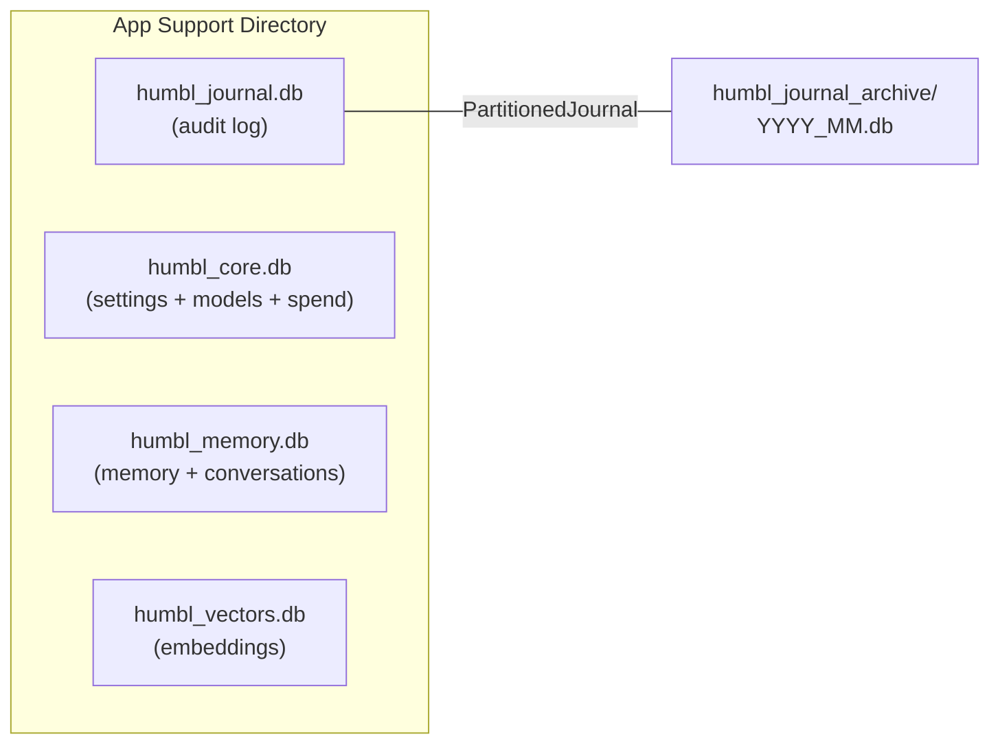

# Database Layout

Humbl uses four SQLite databases, each dedicated to a specific concern. All databases live in the app's support directory (`getApplicationSupportDirectory()`). There is no shared-nothing boundary -- each service owns its tables and indexes within its database file.

## Why 4 Databases?

A single database file would be simpler, but four separate files are justified by the fundamentally different lifecycle, retention, access pattern, and library requirements of each data domain:

1. **Journal (`humbl_journal.db`)** has different retention/pruning rules than everything else. It uses monthly rotation (partition files that get deleted whole), 180-day minimum retention (CERT-In compliance), WAL mode for concurrent reads during cloud sync, and size-capped storage (4 GB). None of these apply to settings or memory.

2. **Core config (`humbl_core.db`)** stores settings, model index, and spend log -- data that rarely changes, never gets pruned, and needs to be immediately available at startup. Mixing this with the high-write journal would mean the journal's WAL and fsync behavior affects settings read latency.

3. **Memory (`humbl_memory.db`)** has different sync patterns than the journal. Memory data (user facts, conversation history) syncs bidirectionally with cloud for cross-device continuity. Journal data syncs unidirectionally (push only). Mixing them would complicate the sync service's conflict resolution logic.

4. **Vectors (`humbl_vectors.db`)** requires a different SQLite library entirely. It uses raw `sqlite3` FFI (not `sqflite`) so the `sqlite_vector` native extension can be loaded for in-database vector similarity computation. Mixing vector tables into a `sqflite`-managed database would require loading the extension into `sqflite`'s global state, affecting all databases.



## The fromDatabase Pattern

Three services share `humbl_core.db`: `SettingsService`, `ModelIndex`, and `SpendLog`. Rather than each service opening its own database file (wasteful) or passing around raw SQL (unsafe), the `fromDatabase(Database db)` factory pattern is used:

```dart
// App startup: open the database once
final coreDb = await openDatabase('${appDir.path}/humbl_core.db', version: 1);

// Each service creates its tables idempotently and shares the handle
final settingsService = await SettingsService.fromDatabase(coreDb);
final modelIndex = await ModelIndex.fromDatabase(coreDb);
final spendLog = await SpendLog.fromDatabase(coreDb);
```

### How It Works

Each service's `fromDatabase()` method:

1. Accepts an already-opened `Database` handle.
2. Runs `CREATE TABLE IF NOT EXISTS ...` for its tables and indexes. This is idempotent -- safe to call on every startup, even if the tables already exist.
3. Sets an internal `_ownsDb = false` flag.
4. Returns the service instance, ready to use.

The `_ownsDb` flag is critical for preventing double-close. When a service is created via `fromDatabase()`, it does not own the database handle -- the caller does. Only the caller should close the database. If the service is created via `open(String dbPath)` (standalone mode), it opens and owns the database, and `close()` will close it.

```dart
// Inside SettingsService
Future<void> close() async {
  if (_ownsDb) {
    await _db.close(); // Only close if we opened it
  }
}
```

This pattern keeps each service self-contained (it knows its schema, its queries, its migrations) while sharing a single database file and connection pool.

### Why Not Separate Files?

Three small tables (settings: ~100 rows, model_index: ~10 rows, spend_log: ~1000 rows/month) do not justify three separate SQLite files. Each file brings overhead:

- A separate file handle (limited OS resource on mobile).
- A separate WAL file and shared-memory file (3 files per database on disk).
- Separate backup and migration logic.
- No transactional consistency across files (if you need to update settings and spend in one transaction, separate files cannot do it).

A single `humbl_core.db` means one file handle, one WAL, one backup target, and the option for cross-table transactions.

## WAL Mode

SQLite's Write-Ahead Logging (WAL) mode is used for the journal database. Understanding why requires understanding what WAL changes:

**Default journal mode:** SQLite writes changes to a rollback journal, then applies them to the main database file. During a write, all readers are blocked (and vice versa). This is fine for low-write databases (settings, model index) but problematic for the journal.

**WAL mode:** SQLite writes changes to a WAL file. Readers see the database state at the time they started reading -- they are never blocked by writers. The writer is never blocked by readers. Changes are periodically checkpointed (merged back to the main file) automatically.

**Why the journal needs WAL:** The journal database receives writes continuously during pipeline execution (tool starts, tool ends, LM requests, errors). Simultaneously, the cloud sync service reads unsynced entries to push them upstream. The debug dashboard queries the journal for recent events. Without WAL, these reads would block writes (stalling the pipeline's logging) or writes would block reads (stalling the sync service and dashboard). With WAL, all three operations proceed concurrently.

**Why other databases do not need WAL:** `humbl_core.db` has very infrequent writes (settings changes, model additions, spend entries). `humbl_memory.db` has moderate writes but no concurrent readers that would conflict. The default journal mode is simpler and sufficient.

## 1. humbl_journal.db -- Audit Log

**Owner:** `PartitionedJournal`
**Library:** `sqflite`
**Mode:** WAL (Write-Ahead Logging) for concurrent read/write

The journal records every significant event in the system: pipeline runs, tool executions, errors, auth events, and sync operations. It is the primary debugging and audit trail.

### Schema

```sql
CREATE TABLE journal_events (
    id                INTEGER PRIMARY KEY AUTOINCREMENT,
    trace_id          TEXT NOT NULL,
    user_id           TEXT NOT NULL,
    session_id        TEXT NOT NULL,
    event_type        TEXT NOT NULL,
    timestamp         TEXT NOT NULL,
    duration_ms       INTEGER,
    is_confidential   INTEGER NOT NULL DEFAULT 0,
    metadata_json     TEXT,
    encrypted_payload TEXT,
    is_synced         INTEGER NOT NULL DEFAULT 0
);

CREATE INDEX idx_journal_trace_id    ON journal_events (trace_id);
CREATE INDEX idx_journal_event_type  ON journal_events (event_type);
CREATE INDEX idx_journal_timestamp   ON journal_events (timestamp);
CREATE INDEX idx_journal_user_id     ON journal_events (user_id);
CREATE INDEX idx_journal_is_synced   ON journal_events (is_synced);
```

### Key Columns

| Column | Purpose | Design Rationale |
|--------|---------|-----------------|
| `trace_id` | Correlates all events within a single pipeline run | UUID v4. Every node, tool execution, and LM call within a pipeline run shares the same trace ID. Enables end-to-end debugging: query all events for a trace ID to reconstruct what happened. |
| `event_type` | Structured event name (e.g., `pipeline.start`, `tool.execute`, `lm.request`) | Dot-notation namespacing. Enables filtered queries: `WHERE event_type LIKE 'tool.%'` for all tool events. |
| `is_confidential` | When `1`, `metadata_json` is empty and content is in `encrypted_payload` | Encrypted via `ILogEncryptor`. The journal never stores plaintext for confidential entries. Only the user's private key (held in secure storage) can decrypt. Metadata is scrubbed because even field names could leak information (e.g., a metadata key `doctor_name` reveals a medical context). |
| `is_synced` | Cloud sync tracking -- `0` = not synced, `1` = synced to Supabase | Controls pruning eligibility. Only synced entries can be pruned. Unsynced entries survive even past size limits, ensuring no audit data is lost during offline periods. |
| `metadata_json` | Structured JSON with event-specific data | Flexible schema: tool events include tool name, parameters, execution time; LM events include model, provider, token counts; auth events include user ID, method. |

### Partitioning and Retention

The journal uses monthly file partitioning:

- **Active partition:** `humbl_journal.db` (current month, read-write, WAL mode)
- **Archives:** `humbl_journal_archive/YYYY_MM.db` (previous months, read-only after rotation)
- **Rotation:** On month boundary at open or via `rotateIfNeeded()`. The current partition is renamed to `YYYY_MM.db` and moved to the archive directory. A new empty `humbl_journal.db` is created.

Retention rules:

| Rule | Value | Why |
|------|-------|-----|
| Default retention | 365 days | One year of audit trail. Configurable via `JournalConfig`. |
| Prune floor | 180 days minimum | CERT-In India mandates 180-day log retention for organizations. No entry younger than 180 days is pruned, regardless of other rules. |
| Size limit | 4 GB total across all partitions | Prevents storage exhaustion on mobile. At ~100-200 MB/month typical usage, this allows 20+ months before pruning kicks in. |
| Pruning policy | Only synced entries (`is_synced = 1`) are eligible | Unsynced entries are retained regardless of age or size. The user's audit trail is never silently dropped. If the user is offline for months, the journal grows beyond normal limits. When they reconnect and sync completes, pruning resumes. |

**Why instant pruning matters:** Deleting an old partition is `File.deleteSync()` -- a single filesystem operation. No `DELETE FROM` query, no `VACUUM`, no dead page cleanup. For a 200 MB partition file, this takes milliseconds instead of the seconds or minutes that vacuuming a monolithic journal would require.

## 2. humbl_core.db -- Shared Core Database

**Owner:** Shared by `SettingsService`, `ModelIndex`, and `SpendLog` via the `fromDatabase()` pattern
**Library:** `sqflite`
**Mode:** Default journal mode (WAL not needed -- low write frequency)

Three services share a single database file. Each service creates its tables idempotently via `fromDatabase(Database db)`.

### Settings Table

```sql
CREATE TABLE settings (
    namespace   TEXT NOT NULL,
    key         TEXT NOT NULL,
    value_json  TEXT NOT NULL,
    updated_at  TEXT NOT NULL,
    PRIMARY KEY (namespace, key)
);
```

Settings are organized by namespace (e.g., `camera`, `voice`, `privacy`). Each registered `ISettingsProvider` declares its namespace and setting definitions. The service handles persistence, reactivity (via `StreamController<SettingUpdate>`), and access control enforcement.

Only `configuration` and `preference` category settings are persisted here. `status` category settings are memory-only and not written to the database.

The `value_json` column stores the value as a JSON string regardless of the actual type (bool, int, string, list, map). This avoids type-specific columns and supports complex structured values. The `SettingsService` deserializes based on the `SettingDefinition.valueType` declared by the provider.

### Model Index Table

```sql
CREATE TABLE model_index (
    id              TEXT PRIMARY KEY,
    file_path       TEXT NOT NULL UNIQUE,
    file_name       TEXT NOT NULL,
    format          TEXT NOT NULL,
    size_bytes      INTEGER NOT NULL,
    runtime_id      TEXT NOT NULL,
    capabilities    TEXT NOT NULL,
    quantization    TEXT,
    source          TEXT NOT NULL,
    source_model_id TEXT,
    display_name    TEXT NOT NULL,
    is_active       INTEGER NOT NULL DEFAULT 0,
    active_role     TEXT,
    added_at        TEXT NOT NULL,
    last_used_at    TEXT
);

CREATE INDEX idx_model_format  ON model_index (format);
CREATE INDEX idx_model_runtime ON model_index (runtime_id);
```

Tracks all model files known to the app: downloaded GGUF models (SLM), ONNX embedding models, Whisper STT models, and Piper TTS models.

| Column | Purpose |
|--------|---------|
| `format` | File format: `gguf`, `onnx`, `openvino`, etc. Determines which runtime can load it. |
| `runtime_id` | Which `IModelRuntime` handles this model (e.g., `llama_cpp`, `onnx_runtime`, `executorch`). |
| `capabilities` | JSON array of model capabilities: `["chat", "tool_use"]`, `["embedding"]`, `["stt"]`, `["tts"]`. |
| `active_role` | Which role a model is currently serving (`slm`, `embedding`, `stt`, `tts`). Only one model can be active per role. |
| `is_active` | Marks the currently selected model per role. `SELECT * FROM model_index WHERE is_active = 1` returns the active model set. |
| `source` | Where the model came from: `bundled`, `huggingface`, `local_import`. |
| `last_used_at` | For LRU eviction of downloaded models when storage is low. |

### Spend Log Table

```sql
CREATE TABLE spend_log (
    id            INTEGER PRIMARY KEY AUTOINCREMENT,
    user_id       TEXT NOT NULL,
    model_id      TEXT NOT NULL,
    provider_id   TEXT NOT NULL,
    quota_source  TEXT NOT NULL,
    input_tokens  INTEGER NOT NULL,
    output_tokens INTEGER NOT NULL,
    cost_usd      REAL NOT NULL,
    trace_id      TEXT,
    timestamp     TEXT NOT NULL
);

CREATE INDEX idx_spend_user_month ON spend_log (user_id, timestamp);
CREATE INDEX idx_spend_model      ON spend_log (model_id, timestamp);
```

Records every LM API call with token counts and cost. Used by `QuotaManager` to enforce monthly quotas and by the dashboard to show usage breakdown.

| Column | Purpose |
|--------|---------|
| `quota_source` | Which quota pool was charged: `subscription`, `top_up`, `promo`, `referral`, `byok`, `local`. Enables per-source breakdown in the dashboard. |
| `cost_usd` | Computed from the provider's public pricing at request time. Stored in USD for provider reconciliation. Converted to INR for user display using a server-pushed exchange rate. |
| `trace_id` | Links back to the pipeline run in the journal. Enables: "this LM call cost X tokens and was part of pipeline run Y." |

The `idx_spend_user_month` compound index optimizes the most common query: `SELECT SUM(input_tokens + output_tokens) FROM spend_log WHERE user_id = ? AND timestamp >= ?` (monthly usage check, called on every cloud request).

Synced to Supabase for paid tiers via the `spend-log` Edge Function. The server is the source of truth for billing; the client is a fast cache.

## 3. humbl_memory.db -- Memory and Conversations

**Owner:** `SqliteMemoryService` (T2 + T4) and `ConversationStore`
**Library:** `sqflite`
**Mode:** Default journal mode

Two services share this database. `SqliteMemoryService` owns the KV store (T2) and interaction log (T4). `ConversationStore` owns conversation turns. Both create their tables idempotently via the `fromDatabase()` pattern.

### T2: Key-Value Store

```sql
CREATE TABLE kv_store (
    user_id    TEXT NOT NULL,
    key        TEXT NOT NULL,
    value_json TEXT NOT NULL,
    importance REAL NOT NULL DEFAULT 0.5,
    updated_at TEXT NOT NULL,
    PRIMARY KEY (user_id, key)
);

CREATE INDEX idx_kv_user ON kv_store (user_id);
```

Stores structured user facts (preferences, names, locations, habits) as JSON values. These are the "things Humbl knows about you" that persist across sessions and devices.

| Column | Purpose |
|--------|---------|
| `key` | Dot-notation fact key: `user.name`, `user.location.home`, `preferences.coffee`, `habits.morning_routine`. |
| `value_json` | The fact value as JSON: `"Shubhajit"`, `{"lat": 12.97, "lon": 77.59}`, `"oat milk latte"`. |
| `importance` | Score from 0.0 to 1.0 determining priority during context assembly. Higher-importance facts are included first when the context budget is tight. Default 0.5. The `MemoryConsolidator` adjusts importance based on access frequency: facts queried often get higher importance. |

**Why importance scoring?** The SLM's context window is limited (~2K-4K tokens for Qwen3-0.6B). If the user has 500 stored facts, they cannot all fit in the prompt. Importance scoring determines which facts are included. A fact like "user's name is Shubhajit" (importance 0.9) is almost always included. A fact like "user ordered pizza on March 3" (importance 0.2) is only included when contextually relevant (e.g., the user asks about food orders).

### T4: Interaction Log

```sql
CREATE TABLE interaction_log (
    id          INTEGER PRIMARY KEY AUTOINCREMENT,
    run_id      TEXT NOT NULL,
    trace_id    TEXT,
    user_id     TEXT NOT NULL,
    session_id  TEXT NOT NULL,
    input_text  TEXT NOT NULL,
    output_text TEXT,
    tool_name   TEXT,
    success     INTEGER NOT NULL,
    duration_ms INTEGER NOT NULL,
    tokens_used INTEGER NOT NULL,
    timestamp   TEXT NOT NULL
);

CREATE INDEX idx_log_user  ON interaction_log (user_id);
CREATE INDEX idx_log_trace ON interaction_log (trace_id);
```

Records every pipeline run with input, output, tool invoked, success status, and token usage. This is the raw interaction history -- the "what happened" log that feeds memory consolidation.

The `MemoryConsolidator` periodically scans the interaction log for patterns:

- If the user toggles WiFi every morning, the consolidator creates a T2 fact: `habits.morning_wifi: true` with high importance.
- If the user asks about weather frequently for a specific location, the consolidator creates a T2 fact: `preferences.weather_location: "Bangalore"`.
- Semantic representations of interactions are promoted to T3 (vector store) for similarity search during context assembly.

### Conversation Turns

```sql
CREATE TABLE conversation_turns (
    id            INTEGER PRIMARY KEY AUTOINCREMENT,
    session_id    TEXT NOT NULL,
    user_id       TEXT NOT NULL,
    turn_index    INTEGER NOT NULL,
    role          TEXT NOT NULL,         -- 'user', 'assistant', 'tool'
    content       TEXT NOT NULL,
    model_id      TEXT,
    tool_name     TEXT,
    quality_score REAL NOT NULL DEFAULT 0.7,
    feedback      TEXT,
    tokens_used   INTEGER NOT NULL DEFAULT 0,
    timestamp     TEXT NOT NULL
);

CREATE INDEX idx_conv_session   ON conversation_turns (session_id);
CREATE INDEX idx_conv_user      ON conversation_turns (user_id);
CREATE INDEX idx_conv_timestamp ON conversation_turns (timestamp);
```

Stores the full conversation history for context assembly. Each turn is one message in the conversation: user input, assistant response, or tool result.

| Column | Purpose |
|--------|---------|
| `session_id` | Groups turns by session. Context assembly loads turns from the current session. |
| `turn_index` | Ordering within a session. Ensures conversation history is reconstructed in order. |
| `role` | Who produced this turn: `user`, `assistant`, or `tool`. Maps to the standard chat completion roles. |
| `model_id` | Which model generated the assistant turn. Useful for quality analysis (did the local SLM or cloud model produce better responses?). |
| `quality_score` | Implicit quality score: 0.7 default, 0.3 if the user rephrases within 30 seconds (indicating low quality -- the assistant misunderstood). Explicit feedback overrides the implicit score. |
| `feedback` | Explicit user feedback: thumbs up/down, free text. Rare but high signal. |

Quality scores feed training data selection: high-quality turns are candidates for fine-tuning data export (via `ITrainingDataExporter`). Low-quality turns are candidates for negative examples.

## 4. humbl_vectors.db -- Vector Embeddings (T3)

**Owner:** `SqliteVecStore`
**Library:** `sqlite3` (raw FFI) + `sqlite_vector` extension
**Mode:** Default journal mode

Uses a separate `sqlite3` connection (not `sqflite`) so the `sqlite_vector` native extension can be loaded without affecting the `sqflite` global state. This is a hard technical constraint: `sqflite` uses its own internal SQLite build, and loading a custom extension into it requires modifying `sqflite`'s native code. Using raw `sqlite3` FFI provides full control over extension loading.

Vector similarity is computed inside SQLite via `vector_full_scan` -- only top-K results cross the FFI boundary. This is critical for performance: transferring 500K vectors (each 384 floats = 1.5KB) across FFI would be prohibitively slow. Computing similarity in SQLite and returning only the top 10 results means ~15KB crosses the boundary regardless of database size.

### Schema

```sql
CREATE TABLE vector_store (
    id            TEXT NOT NULL,
    embedding     BLOB NOT NULL,
    text_content  TEXT,
    metadata_json TEXT,
    importance    REAL NOT NULL DEFAULT 0.5,
    created_at    TEXT NOT NULL,
    updated_at    TEXT NOT NULL
);

CREATE INDEX idx_vec_importance ON vector_store (importance DESC);
```

| Column | Purpose |
|--------|---------|
| `embedding` | 384-dimensional float32 vector stored as a BLOB (1,536 bytes). The `sqlite_vector` extension operates directly on this binary format. |
| `text_content` | The original text that was embedded. Returned with search results so the LM can use it directly in the prompt without a separate lookup. |
| `metadata_json` | Source metadata: which interaction, which session, what type of content (fact, conversation, tool result). Enables filtered similarity search. |
| `importance` | Same scoring as T2's importance. Combines with vector similarity distance to produce a hybrid ranking. |

### Embedding Model

| Property | Value |
|----------|-------|
| Model | all-MiniLM-L6-v2 (ONNX) |
| Dimensions | 384 |
| Provider | `OnnxEmbeddingProvider` (falls back to `NoopEmbeddingProvider` if model file missing) |
| Capacity | ~500K on-device vectors before ANN indexing needed |
| Embedding latency | ~5-10ms per sentence on mobile (ONNX runtime, CPU) |

### Vector Operations

```sql
-- Similarity search (computed inside SQLite)
SELECT id, text_content, metadata_json,
       vector_full_scan(embedding, ?, 'type=FLOAT32,dimension=384') as distance
FROM vector_store
ORDER BY distance ASC
LIMIT ?;
```

The `importance` column enables hybrid scoring: vector similarity (semantic match) is combined with importance weight (user-assigned or consolidator-assigned) to rank results for context assembly. The formula is:

```
final_score = (1 - distance) * 0.7 + importance * 0.3
```

This means a semantically relevant fact (low distance) with moderate importance outranks a less relevant fact with high importance. The weights (0.7 similarity, 0.3 importance) are tunable via settings.

### Why Full Scan?

At ~500K vectors with 384 dimensions, a full scan takes ~50-100ms on mobile. This is fast enough for the assistant's use case (context assembly happens once per pipeline run, and 50ms is negligible compared to the ~400ms SLM classification). Approximate nearest neighbor (ANN) indexing (HNSW, IVF) would reduce this to ~5-10ms but adds significant complexity (index maintenance, memory overhead, rebuild on import). ANN is planned for when the vector count exceeds 500K.

## Database Sizing

| Database | Typical Size | Max Size | Retention | Growth Rate |
|----------|-------------|----------|-----------|-------------|
| `humbl_journal.db` | 50-200 MB/month | 4 GB total | 365 days (180-day floor) | ~2-7 MB/day for active users |
| `humbl_core.db` | 1-10 MB | Unbounded | Permanent | Negligible (settings + models rarely change) |
| `humbl_memory.db` | 5-50 MB | ~20 MB for 10K memories | Permanent (importance-scored) | ~1-5 MB/month |
| `humbl_vectors.db` | 10-100 MB | ~750 MB for 500K vectors | Permanent | ~1-10 MB/month |

**Total typical storage:** 70-350 MB for the first month, growing ~50-200 MB/month. On a modern phone with 128+ GB storage, this is under 0.3% even after a year of use.

All databases use SQLite's default page size (4096 bytes). The journal database uses WAL mode for better concurrent performance. Other databases use the default journal mode since writes are infrequent and concurrent access is not a concern.
