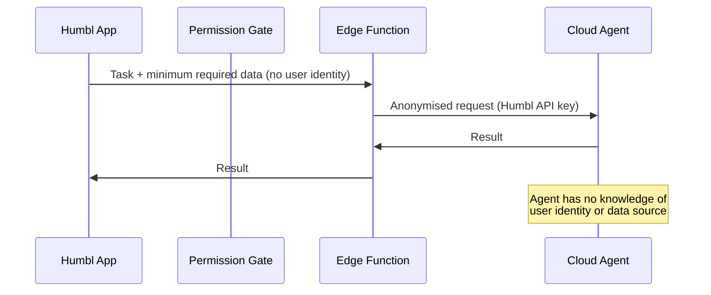
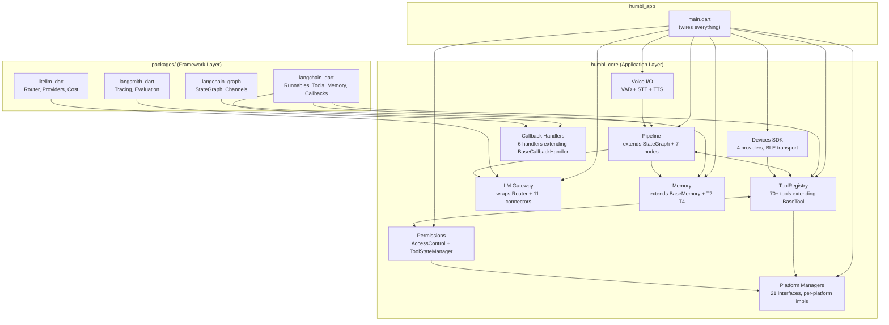

# Architecture Overview

Humbl is a **voice-native, edge-first AI application** that connects to smart accessories — glasses, pendants, AI pins — and smartphones as extension devices. The system routes 60-80% of processing on-device through a small language model (SLM), falling back to cloud providers for complex or multi-step tasks. A **multi-provider architecture** lets users independently configure LM, STT, TTS, and embedding providers to their requirements.

## Built on LangChain, LangGraph, and LiteLLM — in Dart

Humbl's AI layer is built on native Dart ports of four industry-standard Python AI frameworks:

| Package | Port of | What It Provides |
|---------|---------|-----------------|
| [`langchain_dart`](https://github.com/qwr-app/humbl/tree/main/packages/langchain_dart) | LangChain | Runnables (LCEL + Assign/Pick/Each/Binding), tools (`BaseTool`), memory (buffer + summary), callbacks, prompts (few-shot), messages (merge/trim/filter), retrievers, vector stores |
| [`langchain_graph`](https://github.com/qwr-app/humbl/tree/main/packages/langchain_graph) | LangGraph | `StateGraph`, superstep execution, `Send` fan-out, fan-in barriers, subgraph composition, `MessageGraph`, channels, checkpointing, prebuilt agents (ReAct), graph runtime |
| [`litellm_dart`](https://github.com/qwr-app/humbl/tree/main/packages/litellm_dart) | LiteLLM | Multi-provider `Router`, 11 provider adapters (incl. Gemini, Azure, Bedrock, Vertex AI, Cohere, HuggingFace), embedding API, cost tracking, budget manager, `acompletion()` pipeline |
| [`langsmith_dart`](https://github.com/qwr-app/humbl/tree/main/packages/langsmith_dart) | LangSmith | `Client` (HTTP API), `LangChainTracer`, run/dataset/example CRUD, `evaluate()` with scoring, tracing, feedback, metrics |

These are **not wrappers** — they are full Dart reimplementations following the same interfaces as their Python counterparts. All Humbl features are extensions of these ports:

- `HumblTool` extends `BaseTool` (from `langchain_dart`)
- `IMemoryService` extends `BaseMemory` (from `langchain_dart`)
- `ConversationStore` implements `BaseChatMessageHistory` (from `langchain_dart`)
- The pipeline uses `StateGraph` (from `langchain_graph`)
- `HumblChatModel` extends `BaseChatModel` (from `langchain_dart`) as the single LM entry point
- `HumblChatModel` delegates to the `Router` (from `litellm_dart`) for provider selection
- 6 callback handlers extend `BaseCallbackHandler` (from `langchain_dart`)
- `ConfidentialTracer` and `MetricsTracer` extend `BaseTracer` (from `langsmith_dart`)

This means cloud agents can run real Python LangChain + LangGraph + LiteLLM, sharing the same abstractions as the Dart ports. Same graph definitions, same tool schemas, same routing strategies.

See the [LangChain Framework](./subsystems/langchain-framework) page for detailed documentation of each package.

## Why Edge-First?

The decision to process the majority of queries on-device is not a technical constraint -- it is a deliberate architectural choice driven by four factors:

**Privacy with transparency.** All users — including free and unregistered — have anonymised telemetry, logging, and analytics synced to the server. Logs are mostly readable plaintext; only PII sections (conversation content, contact names, location data, etc.) are encrypted with the user's key before leaving the device. The encryption is non-deterministic — the same plaintext produces a different ciphertext each time, but decryption always yields the original value. Only the user's private key can decrypt PII fields. This means Humbl can analyse usage patterns, model performance, and system health for all users while remaining unable to read any personal content.

**Latency.** The on-device SLM handles intent classification and parameter extraction in approximately 400ms warm (first-token latency). A cloud round-trip adds 200-2000ms depending on provider and network conditions. For a smart glasses assistant where the user expects near-instant responses to "turn on WiFi" or "set a timer for 5 minutes", the difference between 400ms and 1500ms is the difference between feeling responsive and feeling sluggish.

**Cost.** Cloud inference costs money -- per token, per request, or per subscription. Humbl's free tier is sustainable precisely because most queries never touch the cloud. The SLM classifies intent locally, the pipeline routes deterministically, and tools execute on-device. Cloud is reserved for complex multi-step reasoning, large context windows, or explicit user preference.

**Offline-first.** Smart glasses are worn outdoors, in transit, in areas with poor connectivity. An assistant that stops working when the network drops is not an assistant -- it is a liability. Humbl's on-device pipeline, tool system, and memory service all function without any network connection. The LM Gateway escalation chain (on-device, local network, BYOK cloud, app cloud) means the system degrades gracefully rather than failing outright.

## Architecture Philosophy

### Why Modularisation?

Smart accessories (glasses, pendants, AI pins) vary wildly in capability. A pair of glasses with a camera, microphone, and display is a fundamentally different device from an AI pendant with only a microphone and speaker. An AI pin adds touch input. A smartphone adds a full screen.

If the AI logic is entangled with any specific hardware, supporting a new device means rewriting the AI. Humbl solves this by **strict module separation** — the pipeline, tools, memory, and LM gateway know nothing about which device is connected. They operate on abstract capabilities. The device layer (Devices SDK) normalises hardware differences into a capability model (`PeripheralCapabilities`), and the tool system automatically filters available tools by what the connected device supports.

This is not theoretical cleanliness — it is a business requirement. Humbl must support new hardware without touching AI logic, and new AI capabilities without touching hardware drivers.

### Why Interfaces Everywhere?

Every module boundary in Humbl is a Dart interface (`I`-prefix convention). No module directly instantiates another module's internals. All wiring happens at the app level in `main.dart`.

**The reason is testability and swappability.** The entire test suite (509 tests) runs without Supabase, device hardware, LM models, or any cloud connection. Every dependency is an interface that can be mocked. This is not aspirational — it is enforced by the architecture. If a module tried to `import 'package:sqflite/sqflite.dart'` directly instead of going through `IMemoryService`, its tests would fail on CI where SQLite is unavailable.

Swappability is equally critical. The LM provider landscape changes monthly — new models, new APIs, new local runtimes. Humbl's `ILmGateway` interface means swapping from llama.cpp to ExecuTorch, or from OpenAI to Anthropic, requires zero changes to the pipeline, tools, or memory system. The same applies to STT (swap Whisper for Deepgram), TTS (swap Piper for ElevenLabs), and embeddings (swap ONNX MiniLM for a cloud embedder).

### Why a Multi-Provider System?

Most AI applications hardcode their inference provider. Humbl cannot do this for three reasons:

1. **User choice.** Users in different regions, with different budgets, and different privacy preferences need different providers. A user in India may prefer Sarvam for Indic language STT. A privacy-conscious user may insist on local-only inference. A power user may want Claude for complex reasoning and a local SLM for quick commands. Humbl's multi-provider architecture lets each user configure every module independently.

2. **Resilience.** A single-provider system fails when that provider has an outage. Humbl's `ILmGateway` tries providers in priority order — on-device first, then local network, then BYOK cloud, then app cloud. If one fails, the next is tried automatically. `CooldownRegistry` tracks failures and `CircuitBreaker` prevents hammering a down provider.

3. **Cost optimisation.** Different tasks have different cost profiles. Intent classification ("turn on WiFi") costs nothing on the local SLM. Complex multi-step reasoning ("plan my week based on calendar and weather") needs a cloud LLM. The gateway routes each request to the cheapest provider that can handle it.

The provider pattern is consistent across modules:

| Module | Interface | Built-in providers | User configurable? |
|--------|-----------|-------------------|-------------------|
| LM Inference | `ILmConnector` + `ILmProvider` | 11 connectors (OpenAI, Anthropic, Gemini, Ollama, etc.) | Yes — add API keys in settings |
| Speech-to-Text | `ISttProvider` | Android native, iOS native, Whisper API, Whisper.cpp | Yes — select in voice settings |
| Text-to-Speech | `ITtsProvider` | Android native, iOS native, ElevenLabs, OpenAI TTS, Piper | Yes — select in voice settings |
| Embeddings | `IEmbeddingProvider` | ONNX (MiniLM-L6-v2), Noop | Yes — model download in settings |
| Devices | `IPeripheralProvider` | Even G1, Frame, Humbl Glasses, Simulated | Auto-detected via BLE scan |

### Why a Tool System?

Voice-native AI needs to **do things**, not just answer questions. "Turn on WiFi", "take a photo", "set a timer", "call Mom" — these are tool invocations, not chat responses. The SLM classifies intent, extracts parameters, and the pipeline routes to the right tool.

The tool system exists because:

1. **Discoverability.** The SLM needs to know what tools exist and what parameters they accept. Each `HumblTool` self-describes with JSON Schema (`toMcpSchema()`), and the pipeline injects available tool schemas into the LM prompt. The SLM can only call tools it knows about.

2. **Security.** Not every tool should be callable by every caller. A third-party plugin should not be able to call `emergency_sos` or `factory_reset`. The five-gate security model (PolicyGate → AccessGate → PermissionGate → QuotaGate → ResourceGate) enforces this at the framework level — tool authors cannot bypass gates because `execute()` is `@nonVirtual`.

3. **MCP compatibility.** The Model Context Protocol is the industry standard for LLM-tool communication. Every Humbl tool exposes an MCP-compatible schema, which means any cloud LLM (OpenAI, Anthropic, Gemini) can discover and call tools without Humbl-specific integration code. And MCP servers (external tool providers) can be installed and immediately appear as tools in the registry.

4. **Hardware arbitration.** Two tools should not fight over the camera. The `HardwareResourceManager` provides lease-based access (shared vs exclusive) with timeout, renewal, and forced revocation. This is enforced by the ResourceGate in the tool execution template.

### Why a Deterministic Pipeline?

The pipeline (`StateGraph` + `PipelineOrchestrator`) is a deterministic graph — no LLM in the routing layer. Nodes and edges are static. This is deliberate:

- **Zero token cost for routing.** The pipeline decides *what* to do (call a tool, ask the user, escalate to cloud) without consuming any inference tokens. The SLM is only invoked inside `ClassifyNode` for intent classification.
- **Testable.** The pipeline can be tested with mock classifiers that return predetermined intents. The graph topology is verified by unit tests. No flaky LLM-dependent routing.
- **Predictable.** The same input + same state always produces the same route. No hallucinated routing decisions, no "sometimes it calls the tool, sometimes it doesn't" non-determinism.
- **Fast.** Routing takes under 1ms. The pipeline overhead is node transitions (~0.1ms each). All latency comes from the intentional work: classification (~400ms), tool execution (~10-500ms), cloud requests (~500-2000ms).

### Privacy with Transparency

Anonymised telemetry, logging, and analytics are collected for all users — including free and unregistered. Logs are mostly plaintext; only PII fields are encrypted with the user's private key before sync. Non-deterministic encryption ensures the same data produces different ciphertext each time, while decryption always yields the original. Humbl can analyse system health and usage patterns but can never read personal content.

## Cloud Privacy Model

When queries escalate to cloud providers, Humbl maintains user privacy through three mechanisms:

### Containerised Cloud Agents

Cloud agents are **identity-blind**. They do not know the origin, identity, or history of the user. Each agent receives only the minimum data required for the specific task, processes it, and returns a result. No user context persists in the cloud agent after the response.



### Minimum Data Principle

Only data required for the specific task leaves the device. If a cloud agent needs additional information (e.g., user's location for a weather query, a contact name for a call), it pushes an **information request** back to the Humbl app. The app presents this to the user through the permission gate — the user can approve or deny each request individually.

```
Cloud Agent: "I need the user's city to check weather"
    → Humbl App: "Weather agent wants your city. Allow?"
        → User approves → App sends "Mumbai" → Agent responds
        → User denies → Agent uses fallback or returns partial result
```

### BYOK vs Humbl Quota Routing

| Path | How it works | Provider sees |
|------|-------------|---------------|
| **BYOK** (Bring Your Own Key) | Device calls provider directly with user's API key | User's identity (their key, their IP) |
| **Humbl Quota** | Request routes through Humbl Edge Function proxy | Humbl's API key and server IP — user is **anonymous** to the provider |

BYOK users accept that the provider knows their identity (it's their account). Humbl-quota users benefit from the proxy layer that shields their identity from the cloud provider entirely.

## Repository Structure

```
packages/
  langchain_dart/       LangChain Core in Dart — runnables, tools, memory, callbacks
  langsmith_dart/       LangSmith observability — tracing, evaluation, feedback
  litellm_dart/         LiteLLM multi-provider gateway — routing, cost, tokens
  langchain_graph/      LangGraph state machine — StateGraph, channels, checkpoints

humbl_core/             Flutter plugin — pipeline, tools, memory, platform managers, security
humbl_app/              Flutter app — startup wiring, BLoC state management, UI screens
humbl_lm/               LLM connector implementations (planned)
humbl_voice/            Voice provider implementations (planned)
humbl_runtime/          Native runtimes — llama.cpp FFI, ONNX, ExecuTorch, LiteRT
humbl_utility/          Shared utilities — WebRTC, web search, weather, audio processing
humbl_connectors/       3rd party integrations — Spotify, Google Calendar, health, email
humbl_features/         App features — gamification, notifications, recording, profile, analytics
humbl_backend/          Supabase Edge Functions — spend-log, quota, cloud sync
humbl-doc/              Documentation — this site
```

| Package | Language | Status | Purpose |
|---------|----------|--------|---------|
| `langchain_dart` | Dart | **Active** — 166 tests | LangChain Core — runnables (LCEL + Assign/Pick/Each), tools, memory (buffer + summary), callbacks, prompts (few-shot), messages (merge/trim/filter), vector stores |
| `langsmith_dart` | Dart | **Active** — 56 tests | LangSmith — Client API, LangChainTracer, run/dataset/example CRUD, evaluate(), tracing, feedback, metrics |
| `litellm_dart` | Dart | **Active** — 113 tests | LiteLLM — Router, 11 providers (incl. Gemini/Azure/Bedrock/Vertex/Cohere/HuggingFace), embedding API, budget manager, acompletion pipeline |
| `langchain_graph` | Dart | **Active** — 109 tests | LangGraph — StateGraph, superstep execution, Send fan-out, fan-in barriers, subgraph composition, MessageGraph, checkpointing, ReAct agent |
| `humbl_core` | Dart | **Active** — 31 modules, 343 exports, 509 tests | All interfaces, pipeline, tools, memory, security, platform managers, devices SDK |
| `humbl_app` | Dart/Flutter | **Active** — wiring done, screens pending | Startup sequence (20-step wiring), BLoC state management (15 planned), 28+ screens (pending) |
| `humbl_lm` | Dart | **Scaffolded** | LLM provider implementations — concrete connectors for OpenAI, Anthropic, Gemini, etc. |
| `humbl_voice` | Dart | **Scaffolded** | STT/TTS/VAD provider implementations — Whisper.cpp, Piper, Silero, platform native |
| `humbl_runtime` | C++/Rust/Dart | **Scaffolded** | Native inference runtimes — llama.cpp FFI, ONNX Runtime, ExecuTorch, LiteRT, Whisper.cpp |
| `humbl_utility` | Dart | **Planned** | WebRTC transport, web search providers, weather, context summarization, audio utilities |
| `humbl_connectors` | Dart | **Planned** | 3rd party service connectors — Spotify, Google Calendar/Contacts/Tasks, Apple Health, Gmail |
| `humbl_features` | Dart | **Planned** | Gamification (badges, streaks), notifications, recording, security (voice fingerprint), profile, analytics |
| `humbl_backend` | TypeScript | **Partial** | Supabase Edge Functions — spend-log endpoint exists, quota/sync/reset pending |
| `humbl-doc` | Docusaurus | **Active** | This documentation site |

### Why is humbl_app mostly empty?

The project has followed a **foundation-first** strategy: build all interfaces, pipeline logic, security gates, platform abstractions, and memory systems in `humbl_core` before writing any UI code. This is deliberate:

1. **humbl_core is the product.** The pipeline, tools, memory, and LM gateway are the AI brain. UI is a presentation layer that attaches to running services. The architecture is **service-first, not UI-first** — services run independently, UI attaches and detaches as an optional layer.

2. **humbl_app depends on everything.** The 20-step startup wiring in `main.dart` creates every service, connects every interface, and launches the app. If the interfaces don't exist yet, the screens can't be built. BLoC state management wraps `humbl_core` interfaces — `ChatBloc` subscribes to `HumblAgent.results`, `VoiceBloc` wraps `VoiceSessionRunner`, `SettingsBloc` wraps `SettingsService`.

3. **The app plan is waiting on the master plan.** The frontend plan (`sparkling-dazzling-creek.md`) explicitly states: "This plan starts AFTER the master plan completes." It defines 15 BLoCs, 28+ screens, and 4 phases — but all phases require master plan interfaces to be delivered first.

**What has been done so far:**
- `main.dart` — Full 20-step startup wiring (all services created and connected)
- `services/humbl/` — Supabase implementations (auth, cloud sync, blob storage, key vault)
- `config/cloud_config.dart` — Cloud configuration

**What comes next (app frontend plan):**
- Phase 1: BLoC infrastructure + auth + navigation shell (AuthBloc, LifecycleBloc, AppShell)
- Phase 2: Chat + voice + conversation screens (ChatBloc, VoiceBloc, ConversationBloc)
- Phase 3: Settings + profile + device management screens
- Phase 4: Features (notes, badges, gamification, voice enrollment)

### What about humbl_lm, humbl_voice, humbl_utility?

These packages are **planned but not yet created**. Their interfaces already exist in `humbl_core`:

| Planned package | Interfaces in humbl_core | What the package will contain |
|----------------|------------------------|-------------------------------|
| `humbl_lm` | `ILmConnector`, `ILmProvider`, `ILoraTrainer` | Concrete connector implementations (API calls to OpenAI, Anthropic, etc.) |
| `humbl_voice` | `ISttProvider`, `ITtsProvider`, `IVadEngine`, `IWakeWordEngine` | Concrete provider implementations (Whisper.cpp, Piper, Silero, platform native) |
| `humbl_utility` | Various tool interfaces | WebRTC transport, web search, weather API, audio processing utilities |
| `humbl_connectors` | `IProvider` typed interfaces | Spotify SDK, Google Calendar OAuth, Apple Health, Gmail API connectors |
| `humbl_features` | `IProfileService`, `IAnalyticsService`, `IBadgeService` | Gamification logic, notification scheduling, recording, voice fingerprint |

The pattern is: **`humbl_core` owns every interface. Provider packages own concrete implementations.** This means `humbl_core` compiles and tests without any provider package. Provider packages depend on `humbl_core` for the interface, never the reverse.

## Core Subsystems

The system is organized into three layers: **framework packages** (pure Dart ports of AI frameworks), **humbl_core** (8 interconnected subsystems extending the frameworks), and **humbl_app** (wiring and UI). Each subsystem communicates through interfaces, never concrete classes. A tool never imports `AndroidWifiManager` -- it imports `IWifiManager`. The pipeline never imports `LlamaEngine` -- it imports `ILmGateway`.



### How Modules Connect

The diagram above shows dependency arrows, but the narrative is more important than the lines:

1. **Pipeline calls LM Gateway for classification.** When a user says "turn on WiFi", the pipeline's `ClassifyNode` sends the utterance to `ILmGateway.complete()`. The gateway figures out which model and provider to use (on-device SLM first, cloud fallback). The SLM returns structured JSON: `{"type":"tool_call","tool":"wifi_toggle","params":{"enabled":true}}`. The pipeline never knows which model answered.

2. **Pipeline calls ToolRegistry for execution.** `RouteDecisionNode` reads the intent. If it is a tool call, `ExecuteToolNode` calls `registry.execute()`. The registry enforces all five security gates (policy, access, permission, validation, resources), then delegates to the tool's `run()` method.

3. **Tools call platform managers for hardware.** `WifiToggleTool.run()` calls `IWifiManager.setEnabled(true)`. The tool does not know whether it is talking to `AndroidWifiManager` (which uses platform channels) or `DesktopWifiManager` (which shells out to `netsh`). The interface is the contract.

4. **Memory provides context to the pipeline via prompt adapters.** `ContextAssemblyNode` calls `IMemoryService.assembleContext()` which queries T2 key-value pairs (user preferences like "preferred units: metric") and T3 semantic vectors (past conversations about similar topics). The assembled context is injected into the LM prompt within a token budget so the SLM has relevant context without exceeding its context window.

5. **Voice I/O feeds the pipeline.** `VoiceSessionRunner` orchestrates VAD, STT, and TTS. When the user speaks, the transcript becomes `PipelineState.inputText` and the pipeline runs a full turn. The response text is sent to TTS for playback. Barge-in (user speaks during TTS) stops playback and starts a new pipeline turn.

6. **Devices SDK filters available tools.** When smart glasses connect, `PeripheralCompatibilityChecker` filters the tool list based on device capabilities. If the connected glasses lack a camera, camera tools are excluded from the LM's tool schema -- the model cannot even attempt to invoke them.

### Subsystem Responsibilities

| Subsystem | Key Classes | Role |
|-----------|------------|------|
| **Pipeline** | `PipelineOrchestrator`, `buildHumblPipeline()`, `StateGraph` (langchain_graph) | LangGraph-based deterministic router. 4-node graph (classify, route, execute, deliver). No LLM in routing. |
| **Tool System** | `HumblTool`, `ToolRegistry`, `createToolRegistry()` | MCP-compatible registry with 70+ tools across 16 domain files. Five-gate security template. |
| **Permissions** | `AccessControl`, `ToolStateManager`, `IPermissionService` | Three-layer access model: OS permissions, tool state probing, caller privilege math. |
| **Platform Managers** | `PlatformFactory`, 21 `I*Manager` interfaces | Per-platform implementations for WiFi, BLE, camera, mic, contacts, notifications, etc. |
| **LM Gateway** | `HumblChatModel`, `ConnectorRegistry`, litellm `Router` | Single LM entry point (`HumblChatModel extends BaseChatModel`). Routes requests via litellm Router to the best provider (on-device, local network, BYOK, app cloud). |
| **Memory** | `SqliteMemoryService`, `SqliteVecStore`, `ConversationStore` | T2 key-value, T3 vector similarity (ONNX embeddings), T4 interaction log. |
| **Devices SDK** | `DeviceRegistry`, `IPeripheralProvider`, `IConnectedDevice` | Provider-based abstraction for smart glasses. Built-in: Even G1, Frame, Humbl Glasses, Simulated. |
| **Voice I/O** | `VoiceSessionRunner`, `IVadEngine`, `ISttProvider`, `ITtsProvider` | Full voice pipeline: wake word, VAD, speech-to-text, pipeline dispatch, text-to-speech. |

## Tech Stack

| Layer | Technology |
|-------|-----------|
| Language | Dart 3.10+, Flutter 3.38+ |
| AI Frameworks | `langchain_dart`, `langchain_graph`, `litellm_dart`, `langsmith_dart` (Dart ports) |
| Persistence | SQLite via `sqflite` (app DB), `sqlite3` + `sqlite_vector` (vector store) |
| LM Inference | llama.cpp via FFI (on-device SLM), ONNX Runtime (embeddings) |
| Speech | Whisper.cpp (STT), Piper (local TTS), platform APIs (Android/iOS native STT/TTS) |
| Cloud | Supabase (auth, Postgres, Edge Functions, storage) |
| Networking | HTTP via `http`/`dio`, BLE via `flutter_blue_plus` |
| Native | Kotlin (Android method channels), Swift (iOS method channels) |

## Module Counts

The project spans 4 framework packages plus `humbl_core`:

| Metric | Count |
|--------|-------|
| Framework packages | 4 (langchain_dart, langsmith_dart, litellm_dart, langchain_graph) |
| Framework tests | 444 (166 + 109 + 113 + 56) |
| Dart modules (humbl_core) | 31 |
| Public exports (humbl_core) | 343 |
| Unit tests (all packages) | 509+ |
| Test files (all packages) | 101 |
| Platform manager interfaces | 21 |
| Tools registered | 70+ |
| LM connectors | 11 |
| Callback handlers | 6 |
| Native plugins (Kotlin) | 10 |
| Native plugins (Swift) | 10 |

## App-Level Wiring

All module instantiation and dependency injection happens in `humbl_app/lib/main.dart`. The 20-step startup sequence creates every service, connects interfaces, and launches the app. No module in `humbl_core` ever creates another module's internals.

This means:
- **Testing:** Any module can be tested by injecting mock interfaces. All 509 tests run without Supabase, device hardware, or LM models.
- **Swappability:** Replace the SLM, swap the cloud provider, add a new glasses vendor -- all without changing core logic.
- **Predictability:** The dependency graph is explicit. No hidden singletons, no service locators, no runtime discovery.

```dart
// Simplified startup flow (see main.dart for full 20-step sequence)
final journal = await PartitionedJournal.open(appDir.path);
final memoryService = await SqliteMemoryService.open(...);
final toolRegistry = createToolRegistry(system: system, wifi: wifi, ...);
final orchestrator = PipelineOrchestrator(
  lmGateway: lmGateway,
  toolRegistry: toolRegistry,
  memoryService: memoryService,
);
final agent = HumblAgent(
  orchestrator: orchestrator,
  arbitrator: arbitrator,
  sessionManager: sessionManager,
);
runApp(HumblApp(agent: agent, ...));
```

The wiring is deliberate about what depends on what. The `PipelineOrchestrator` receives `ILmGateway`, not `HumblLmGateway`. The `ToolRegistry` receives `IWifiManager`, not `AndroidWifiManager`. Every dependency is an interface, and the app level is the only place where concrete implementations are chosen. This makes the entire `humbl_core` library testable without any platform code.

See the [Startup Sequence](./startup-sequence) page for the complete 20-step breakdown.
