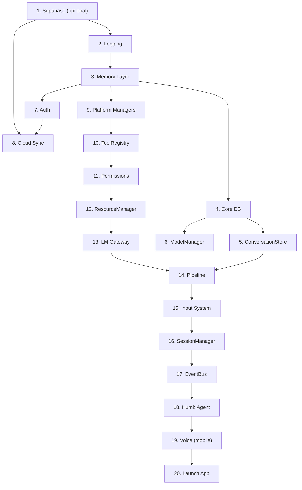

# Startup Sequence

The `humbl_app/lib/main.dart` file orchestrates a 20-step startup that initializes every service, connects all interfaces, and launches the app widget. This page documents each step, its dependencies, and what it produces.

## Framework Packages

The startup sequence depends on four framework packages under `packages/`:

- **`langchain_dart`** — provides `BaseTool`, `BaseMemory`, `BaseChatMessageHistory`, `BaseCallbackHandler` that `humbl_core` classes extend
- **`langsmith_dart`** — provides `BaseTracer` for observability (wired in Step 2: Logging)
- **`litellm_dart`** — provides `Router`, `SpendLog`, `CostCalculator` (wired in Step 13: LM Gateway)
- **`langchain_graph`** — provides `StateGraph` (not yet wired — SP6 will migrate the pipeline)

These packages are resolved via local path dependencies in `pubspec.yaml`. No separate initialization is needed — they are pure Dart libraries loaded on import.

## Design Principles

- **Sequential by necessity.** Each step depends on outputs from earlier steps. There is no parallel initialization -- ordering guarantees are more important than startup speed.
- **Fail-fast.** If any step throws, the app shows an `_ErrorApp` with the error message. No partial initialization.
- **No service locator.** Every dependency is a local variable passed explicitly. No global registry, no `GetIt`, no `Provider` at the initialization layer.
- **Graceful degradation.** Supabase, cloud sync, and voice session are optional. The app runs fully offline without them.

## Full Sequence



## Step-by-Step Breakdown

### Step 1: Supabase (optional)

```dart
sb.SupabaseClient? supabaseClient;
if (CloudConfig.isConfigured) {
  await sb.Supabase.initialize(
    url: CloudConfig.supabaseUrl,
    anonKey: CloudConfig.supabaseAnonKey,
  );
  supabaseClient = sb.Supabase.instance.client;
}
```

**Produces:** `SupabaseClient?` (null if no config)
**Dependencies:** None
**Notes:** `CloudConfig.isConfigured` checks for Supabase URL and anon key. Offline-first: the entire app works without Supabase.

---

### Step 2: Logging (PartitionedJournal + HumblLogger)

```dart
final appDir = await getApplicationSupportDirectory();
final journal = await PartitionedJournal.open(appDir.path);
HumblLogger.instance.setJournal(journal);
```

**Produces:** `PartitionedJournal`, configured `HumblLogger` singleton
**Dependencies:** Filesystem access
**Notes:** Logging is initialized first because every subsequent step logs through it. The journal opens (or creates) `humbl_journal.db` and rotates to a new partition on month boundaries.

---

### Step 3: Memory Layer (ONNX + VecStore + MemoryService + Consolidator)

```dart
final modelPath = '${appDir.path}/models/all-MiniLM-L6-v2.onnx';
final IEmbeddingProvider embedder = File(modelPath).existsSync()
    ? OnnxEmbeddingProvider(modelPath: modelPath)
    : const NoopEmbeddingProvider();
final vectorStore = await SqliteVecStore.open(
  '${appDir.path}/humbl_vectors.db',
  embedder: embedder,
);
final memoryService = await SqliteMemoryService.open(
  '${appDir.path}/humbl_memory.db',
  vectors: vectorStore,
  embedder: embedder,
);
await memoryService.initialize();

final consolidator = MemoryConsolidator(
  journal: journal,
  memory: memoryService,
);
```

**Produces:** `IEmbeddingProvider`, `SqliteVecStore`, `SqliteMemoryService`, `MemoryConsolidator`
**Dependencies:** Step 2 (journal for consolidator)
**Notes:** The ONNX embedding model is optional. If the file does not exist, `NoopEmbeddingProvider` is used and vector search returns empty results. The consolidator promotes patterns from T4 (interaction logs) to T2 (KV facts) and T3 (semantic vectors).

---

### Step 4: Core DB (Settings + ModelIndex + SpendLog + QuotaManager)

```dart
final coreDb = await openDatabase('${appDir.path}/humbl_core.db', version: 1);
final settingsService = await SettingsService.fromDatabase(coreDb);
final modelIndex = await ModelIndex.fromDatabase(coreDb);
final spendLog = await SpendLog.fromDatabase(coreDb);
final quotaManager = QuotaManager(spendLog: spendLog);
```

**Produces:** `SettingsService`, `ModelIndex`, `SpendLog`, `QuotaManager`
**Dependencies:** Filesystem access
**Notes:** Three services share one database file via the `fromDatabase()` pattern. Each creates its tables idempotently. The `QuotaManager` wraps `SpendLog` to enforce monthly token quotas.

---

### Step 5: ConversationStore

```dart
final conversationStore = await ConversationStore.open(
  '${appDir.path}/humbl_memory.db',
);
```

**Produces:** `ConversationStore`
**Dependencies:** Step 3 (shares `humbl_memory.db`)
**Notes:** Opens the same database file as `SqliteMemoryService` and creates its `conversation_turns` table idempotently.

---

### Step 6: ModelManager

```dart
final modelManager = ModelManager(index: modelIndex);
```

**Produces:** `ModelManager`
**Dependencies:** Step 4 (modelIndex)
**Notes:** Wraps `ModelIndex` with download, discovery, and lifecycle management. Supports HuggingFace and custom URL repositories.

---

### Step 7: Auth (KeyVault + UserManager)

```dart
final keyVault = SecureKeyVault();
final IUserManager userManager = supabaseClient != null
    ? SupabaseUserManager(supabaseClient)
    : NoopUserManager();
```

**Produces:** `SecureKeyVault`, `IUserManager`
**Dependencies:** Step 1 (supabaseClient)
**Notes:** `SecureKeyVault` uses `flutter_secure_storage` for API keys and tokens. `NoopUserManager` provides an anonymous user when Supabase is not configured.

---

### Step 8: Cloud Sync + Blob Storage

```dart
final ICloudSyncService cloudSync = supabaseClient != null
    ? SupabaseCloudSyncService(client: supabaseClient, memory: memoryService, journal: journal)
    : const NoopCloudSyncService();
final IBlobStorageService blobStorage = supabaseClient != null
    ? SupabaseBlobStorage(supabaseClient)
    : const NoopBlobStorage();
```

**Produces:** `ICloudSyncService`, `IBlobStorageService`
**Dependencies:** Steps 1, 2, 3 (supabaseClient, journal, memoryService)
**Notes:** Noop implementations are used when Supabase is unavailable. Cloud sync pushes memory and journal entries marked `is_synced = 0`.

---

### Step 9: Platform Managers (21 managers via PlatformFactory)

```dart
final system = PlatformFactory.system();
final wifi = PlatformFactory.wifi();
final bluetooth = PlatformFactory.bluetooth();
final cellular = PlatformFactory.cellular();
final connectivity = PlatformFactory.connectivity();
final camera = PlatformFactory.camera();
final media = PlatformFactory.media();
final microphone = PlatformFactory.microphone();
final contacts = PlatformFactory.contacts();
final phone = PlatformFactory.phone();
final notifications = PlatformFactory.notifications();
final location = PlatformFactory.location();
final intents = PlatformFactory.intents();
final vision = PlatformFactory.vision();
final accessibility = PlatformFactory.accessibility();
final nfc = PlatformFactory.nfc();
final timer = PlatformFactory.timer();
final alarm = PlatformFactory.alarm();
final calendarService = PlatformFactory.calendar();
final routine = PlatformFactory.routine();
final bleCommandService = StubBleCommandService();
final noteService = StubNoteService();
```

**Produces:** 21 platform manager instances + 2 stub services
**Dependencies:** None (runtime platform detection)
**Notes:** `PlatformFactory` checks `Platform.isAndroid`, `Platform.isIOS`, etc. and returns the appropriate concrete implementation. Desktop platforms get full native implementations for WiFi, BLE, connectivity, location, media, contacts, and notifications. Services without native implementations get stubs.

---

### Step 10: ToolRegistry

```dart
final fileSandbox = FileToolSandbox([appDir.path, docsDir.path]);
final toolRegistry = createToolRegistry(
  system: system, wifi: wifi, bluetooth: bluetooth,
  cellular: cellular, connectivity: connectivity,
  audio: StubAudioManager(), display: StubDisplayManager(),
  camera: camera, policy: StubDevicePolicyManager(),
  media: media, microphone: microphone, contacts: contacts,
  phone: phone, notifications: notifications, location: location,
  intents: intents, vision: vision, accessibility: accessibility,
  nfc: nfc, timer: timer, alarm: alarm, calendar: calendarService,
  routine: routine, bleCommandService: bleCommandService,
  notes: noteService, fileSandbox: fileSandbox,
);
```

**Produces:** `ToolRegistry` with 70+ tools registered
**Dependencies:** Step 9 (all platform managers)
**Notes:** `createToolRegistry()` in `register_all.dart` is the single bootstrap point. Each tool receives its required platform manager interfaces via constructor injection. The `FileToolSandbox` restricts file tools to the app's support and documents directories.

---

### Step 11: Permissions + ToolStateManager

```dart
final permissionService = PlatformFactory.permissions();
final toolStateManager = ToolStateManager(
  registry: toolRegistry,
  permissionService: permissionService,
  journal: journal,
);
await toolStateManager.initialize();
registerPermissionTool(toolRegistry, toolStateManager);
```

**Produces:** `IPermissionService`, `ToolStateManager`
**Dependencies:** Steps 2, 10 (journal, toolRegistry)
**Notes:** `ToolStateManager.initialize()` probes each tool's `requiredResources` against OS permissions and sets `ToolState` accordingly (ready, permissionNotGranted, notSupported, etc.). `registerPermissionTool()` adds the meta-tool that lets the LM request permissions on behalf of the user.

---

### Step 12: HardwareResourceManager

```dart
final resourceManager = HardwareResourceManager();
```

**Produces:** `HardwareResourceManager`
**Dependencies:** None
**Notes:** Manages exclusive/shared leases for camera, microphone, BLE, GPS, and other hardware resources. Leases have expiry timers and emit events via broadcast stream.

---

### Step 13: LM Gateway

```dart
final lmGateway = NoopLmGateway();
```

**Produces:** `ILmGateway`
**Dependencies:** None
**Notes:** Currently a no-op placeholder. When wired, this will be `HumblLmGateway` with `LmProviderRegistry`, `CooldownRegistry`, and `IQuotaManager` for multi-provider routing.

---

### Step 14: PipelineOrchestrator

```dart
final modelRegistry = ModelRegistry.standard();
final orchestrator = PipelineOrchestrator(
  lmGateway: lmGateway,
  modelRegistry: modelRegistry,
  toolRegistry: toolRegistry,
  journal: journal,
  resourceManager: resourceManager,
  memoryService: memoryService,
  conversationStore: conversationStore,
);
```

**Produces:** `PipelineOrchestrator`
**Dependencies:** Steps 2, 3, 5, 10, 12, 13
**Notes:** Builds the `StateGraph` with 7 nodes: `context_assembly -> classify -> route_decision -> (execute_tool | ask_user) -> deliver -> loop_check`. Supports concurrent `run()` and `runStream()` calls.

---

### Step 15: Input System

```dart
final sourceRegistry = InputSourceRegistry();
final arbitrator = InputArbitrator(registry: sourceRegistry);
```

**Produces:** `InputSourceRegistry`, `InputArbitrator`
**Dependencies:** None
**Notes:** Multi-modal input fan-in. Input sources (text, voice, button press, glasses gesture, timer trigger) register with the registry. The arbitrator resolves conflicts when multiple inputs arrive simultaneously.

---

### Step 16: SessionManager

```dart
final sessionManager = SessionManager();
```

**Produces:** `SessionManager`
**Dependencies:** None
**Notes:** Manages daily sessions (one per day per device, UTC). Manual clear archives the current session and starts a new one.

---

### Step 17: ServiceEventBus

```dart
final eventBus = ServiceEventBus();
```

**Produces:** `ServiceEventBus`
**Dependencies:** None
**Notes:** Broadcast event bus for cross-service communication. Services publish and subscribe to typed events without direct references to each other.

---

### Step 18: HumblAgent

```dart
final agent = HumblAgent(
  orchestrator: orchestrator,
  arbitrator: arbitrator,
  sessionManager: sessionManager,
);
```

**Produces:** `HumblAgent`
**Dependencies:** Steps 14, 15, 16
**Notes:** The always-free main agent. Never blocks. Dispatches inputs to concurrent pipeline runs and manages scout agents. Maps to LangGraph's `AgentExecutor`.

---

### Step 19: VoiceSession (mobile only)

```dart
VoiceSessionRunner? voiceSession;
if (Platform.isAndroid || Platform.isIOS) {
  final sttProvider = SttProviderFactory.create(const SttProviderConfig());
  final ttsProvider = TtsProviderFactory.create(const TtsProviderConfig());
  final vadEngine = SileroVadEngine();
  final audioPlayer = PlatformAudioPlayer();

  voiceSession = VoiceSessionRunner(
    toolRegistry: toolRegistry,
    vad: vadEngine, stt: sttProvider, tts: ttsProvider,
    audioPlayer: audioPlayer,
    onPipelineRequest: (userText) async {
      final result = await orchestrator.run(PipelineState(...));
      return result.outputText ?? 'I could not process that.';
    },
  );
}
```

**Produces:** `VoiceSessionRunner?` (null on desktop)
**Dependencies:** Steps 10, 14
**Notes:** Only initialized on Android and iOS. Wires VAD (Silero), STT (platform-specific), TTS (platform-specific), and the pipeline together. The `onPipelineRequest` callback bridges voice transcription to pipeline execution.

---

### Step 20: Launch App

```dart
runApp(HumblApp(
  agent: agent,
  orchestrator: orchestrator,
  userManager: userManager,
  keyVault: keyVault,
  memoryService: memoryService,
  cloudSync: cloudSync,
  blobStorage: blobStorage,
  toolRegistry: toolRegistry,
  consolidator: consolidator,
  settingsService: settingsService,
  modelManager: modelManager,
  quotaManager: quotaManager,
  eventBus: eventBus,
  voiceSession: voiceSession,
));
```

**Produces:** Running Flutter app
**Dependencies:** All previous steps
**Notes:** All 14 services are passed to the root widget via constructor injection. No service locator pattern.

## Startup Timing

Typical startup times (measured on Pixel 7a, release mode):

| Phase | Approx. Time |
|-------|-------------|
| Steps 1-2 (Supabase + logging) | ~200ms |
| Step 3 (memory + vectors) | ~150ms |
| Steps 4-8 (DB + auth + sync) | ~100ms |
| Steps 9-11 (platform + tools + permissions) | ~300ms |
| Steps 12-18 (pipeline + agent) | ~50ms |
| Step 19 (voice, mobile only) | ~100ms |
| **Total** | **~900ms** |

The heaviest step is tool state probing (step 11), which checks OS permissions for each tool's required resources.
