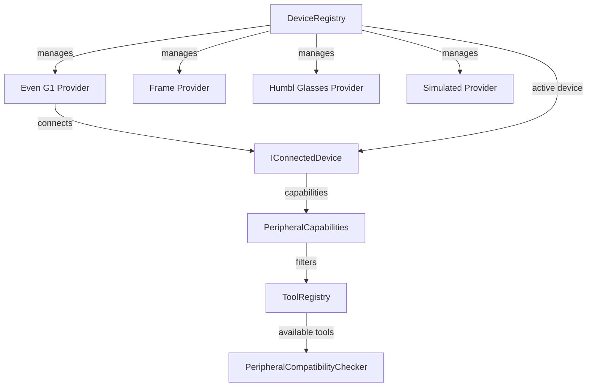

# Devices SDK

The Devices SDK provides a **provider-based abstraction** for smart glasses hardware. Third-party developers implement `IPeripheralProvider` to add support for new glasses. The SDK normalizes different hardware into a capability model that tools can query, so a "take photo" tool works identically whether the user wears Even G1, Frame, or Humbl Glasses.

## Why Provider-Based?

Different smart glasses have different capabilities. The Even G1 has a display, audio output, and IMU sensors but no camera. The Brilliant Labs Frame has a display and camera but limited audio. Humbl Glasses have everything -- camera, display, audio, sensors, input, and WiFi. A tool system that hardcodes device-specific logic would become unmaintainable as more glasses are supported.

The provider pattern solves this by normalizing all devices into a single capability model. Each provider declares what its hardware can do via `PeripheralCapabilities`. The `PeripheralCompatibilityChecker` then filters the tool registry based on these capabilities. If the connected glasses lack a camera, camera tools are automatically excluded from the LM's tool schema -- the model cannot even attempt to invoke them. This happens without any tool-level code changes.

The practical benefit: adding support for a new glasses model requires implementing one interface (`IPeripheralProvider`). No pipeline changes, no tool changes, no security changes. The new device automatically integrates with every existing tool that its capabilities support.

## How It Connects

The Devices SDK connects to the rest of the system through three integration points:

1. **DeviceRegistry manages providers.** At startup, all built-in providers (Even G1, Frame, Humbl Glasses, Simulated) are registered with `DeviceRegistry`. When the user initiates a BLE scan, the registry discovers nearby devices and asks each provider if it can claim the device based on BLE advertisement data.

2. **IConnectedDevice exposes capabilities to the pipeline.** When glasses connect, the active `IConnectedDevice` provides `PeripheralCapabilities`. The pipeline's `ContextAssemblyNode` reads these capabilities and filters `availableTools` accordingly. Tools requiring `camera` will not appear in the LM's tool list if the connected glasses lack a camera.

3. **BLE transport provides data to tools and the confirmation system.** Tools that interact with glasses (display text on HUD, capture photo, read sensors) use `BleCommandServiceImpl` which speaks the K900 binary protocol over `BleTransport`. The `HeadGestureRecognizer` converts IMU data from glasses into nod/shake gestures that feed into the [confirmation system](/architecture/subsystems/security#confirmation-system) as `ConfirmationMethod.headGesture`.

## Architecture



## IPeripheralProvider

The interface that hardware vendors implement to add glasses support:

```dart
abstract class IPeripheralProvider {
  String get id;            // 'even_g1', 'frame', 'humbl_glasses'
  String get displayName;   // 'Even G1'
  PeripheralCapabilities get capabilities;

  /// Check if this provider can claim a discovered BLE device.
  bool canClaim(DiscoveredBleDevice device);

  /// Establish connection and return a connected device handle.
  Future<IConnectedDevice> connect(DiscoveredBleDevice device);

  /// Disconnect the active device.
  Future<void> disconnect();
}
```

`canClaim()` inspects BLE advertisement data (service UUIDs, device name patterns) to identify compatible hardware during scanning. For example, Even G1 glasses advertise a specific service UUID that the Even G1 provider recognizes. Frame glasses have a distinctive device name prefix. This claim-based discovery means multiple providers can coexist without conflict -- each provider only claims devices it knows how to talk to.

## IConnectedDevice

The handle to an active peripheral connection:

```dart
abstract class IConnectedDevice {
  String get deviceId;
  String get displayName;

  /// Send a command to the device.
  Future<void> send(List<int> data);

  /// Listen for data from the device.
  Stream<List<int>> listen();

  /// Battery level (0-100).
  int? get batteryLevel;

  /// Firmware version string.
  String? get firmwareVersion;

  /// Connection state changes.
  Stream<PeripheralConnectionState> get connectionStateStream;
}
```

## PeripheralCapabilities

Capability flags that describe what a device can do:

```dart
enum PeripheralCapabilityFlag {
  camera,   // Device has a camera
  display,  // Device has a display (HUD, screen)
  audio,    // Device has speakers/bone conduction
  sensors,  // Device has IMU/accelerometer
  input,    // Device has touch/button input
  wifi,     // Device has WiFi connectivity
}
```

Tools declare which capabilities they require:

```dart
class TakePhotoTool extends HumblTool {
  @override
  Set<PeripheralCapabilityFlag> get requiredCapabilities => {
    PeripheralCapabilityFlag.camera,
  };
}
```

## Built-in Providers

| Provider | Device | Capabilities | Connection |
|----------|--------|-------------|------------|
| **Even G1** | Even Realities G1 | Display, audio, sensors, input | BLE |
| **Frame** | Brilliant Labs Frame | Display, camera | BLE |
| **Humbl Glasses** | Humbl's reference hardware | Camera, display, audio, sensors, input, wifi | BLE |
| **Simulated** | Virtual device for testing | All capabilities (configurable) | In-memory |

The simulated provider enables full pipeline testing without physical hardware:

```dart
class SimulatedProvider implements IPeripheralProvider {
  final PeripheralCapabilities _capabilities;

  SimulatedProvider({
    PeripheralCapabilities? capabilities,
  }) : _capabilities = capabilities ?? PeripheralCapabilities.all();
}
```

The simulated provider is not just for unit tests. It enables end-to-end pipeline testing with glasses capabilities: set the simulated device to have only `display` and `audio` (like Even G1), run a pipeline turn that requests a photo, and verify that the pipeline correctly reports "camera not available" rather than crashing.

## DeviceRegistry

Singleton that manages provider registration, BLE scanning, and active device tracking:

```dart
class DeviceRegistry {
  static DeviceRegistry get instance => _instance;

  // Registration
  void registerProvider(IPeripheralProvider provider);
  List<IPeripheralProvider> get providers;

  // Scanning
  Future<List<ClaimableDevice>> scan({
    Duration scanDuration = const Duration(seconds: 30),
    PeripheralType? filterType,
  });

  // Active device
  IConnectedDevice? get activeDevice;
  Stream<IConnectedDevice?> get deviceStream;
  Future<IConnectedDevice> connect(ClaimableDevice claimable);
  Future<void> disconnect({DisconnectReason reason, String? newHostMacId});
}
```

### Scanning

The scan process uses `flutter_blue_plus` to discover BLE devices, then asks each registered provider if it can claim the device:

```dart
Future<List<ClaimableDevice>> scan({...}) async {
  await FlutterBluePlus.startScan(timeout: scanDuration);

  await for (final scanResults in FlutterBluePlus.scanResults) {
    for (final sr in scanResults) {
      for (final provider in _providers) {
        if (provider.canClaim(discovered)) {
          results.add(ClaimableDevice(ble: discovered, provider: provider));
          break;  // First provider to claim wins
        }
      }
    }
  }
  return results;
}
```

### Connection Management

Only one device is active at a time (like Apple Handoff). Connecting a new device automatically disconnects the existing one:

```dart
Future<IConnectedDevice> connect(ClaimableDevice claimable) async {
  if (_active != null) {
    await disconnect(reason: DisconnectReason.handoff,
        newHostMacId: claimable.ble.remoteId);
  }
  _active = await claimable.provider.connect(claimable.ble);
  // ...
}
```

### Disconnect Reasons

The disconnect reason determines whether automatic reconnection is allowed:

| Reason | Reconnection Allowed | Description |
|--------|---------------------|-------------|
| `userRequested` | No | User explicitly disconnected |
| `unpaired` | No | Device was unpaired |
| `handoff` | No | Handing off to another host device |
| `connectionLost` | Yes | Unexpected BLE disconnection |
| `gracePeriodExpired` | Yes | 1-minute grace period after connection loss |

```dart
DisconnectReason? shouldRejectReconnection(String remoteId) {
  switch (_lastDisconnectReason!) {
    case DisconnectReason.userRequested:
    case DisconnectReason.unpaired:
    case DisconnectReason.handoff:
      return _lastDisconnectReason;  // Reject
    case DisconnectReason.connectionLost:
    case DisconnectReason.gracePeriodExpired:
      return null;  // Allow
  }
}
```

### Grace Period

When a BLE connection drops unexpectedly (user walks out of range, Bluetooth interference), the registry starts a 1-minute grace period timer. If the device reconnects within that window, the session resumes seamlessly -- no re-pairing, no re-initialization. If the timer expires, the session is terminated and the user must explicitly reconnect.

The grace period is critical for real-world usage. BLE connections are inherently fragile -- momentary interference, pocket occlusion, or range boundary effects cause brief disconnections that resolve within seconds. Without a grace period, every brief signal drop would require the user to manually reconnect their glasses.

## PeripheralCompatibilityChecker

Filters the `ToolRegistry` based on the connected device's capabilities. Tools requiring `camera` will not appear in the LM's tool list if the connected glasses lack a camera:

```dart
// In ContextAssemblyNode
final activeDevice = DeviceRegistry.instance.activeDevice;
final availableTools = toolRegistry.allTools
    .where((tool) => PeripheralCompatibilityChecker.isCompatible(
        tool, activeDevice?.capabilities))
    .toList();
```

This filtering happens at context assembly time, before the LM sees the tool list. The LM never knows about tools that the device cannot support, which eliminates an entire class of errors (model attempts to use camera on camera-less glasses).

## BLE Protocol Layer

Low-level BLE communication for supported devices:

| Component | Purpose |
|-----------|---------|
| `K900Protocol` | Binary command/response protocol for Humbl Glasses |
| `BleTransport` | Reliable BLE GATT read/write with MTU negotiation |
| `BleCommandServiceImpl` | High-level command API (send text, capture photo, get battery) |
| `HeadGestureRecognizer` | IMU data -> nod/shake gesture recognition via glasses sensors |

### K900 Protocol

The K900 protocol is a compact binary format for glasses communication:

- Fixed 2-byte header with command type and payload length
- CRC-8 checksum for integrity
- Commands: display text, capture photo, read sensors, get battery, set volume
- Responses: acknowledgment, data payload, error codes

The protocol is designed for BLE's constrained MTU (typically 20-512 bytes). Large payloads (photos, firmware updates) are fragmented and reassembled by `BleTransport`.

### BleTransport

`BleTransport` handles reliable delivery over BLE GATT:

- **MTU negotiation** -- requests the maximum supported MTU to minimize fragmentation
- **Write with response** -- uses GATT write-with-response for commands that require acknowledgment
- **Fragmentation** -- splits large payloads across multiple BLE packets with sequence numbers
- **Reassembly** -- reconstructs fragmented responses from notification callbacks
- **Retry** -- retransmits failed writes with exponential backoff

### HeadGestureRecognizer

Processes accelerometer/gyroscope data from glasses IMU to detect:

- **Nod** (vertical head movement) -- used for confirmation ("yes")
- **Shake** (horizontal head movement) -- used for denial ("no")

The recognizer uses a windowed peak detection algorithm on the pitch (nod) and yaw (shake) axes. A minimum amplitude threshold filters out normal head movements (looking around, walking) from deliberate gestures.

These gestures feed into the [confirmation system](/architecture/subsystems/security#confirmation-system) as `ConfirmationMethod.headGesture`. When a tool requires `ConfirmationLevel.normal` confirmation, the user can nod to confirm or shake to deny, enabling fully hands-free operation.

## Adding a New Device

To add support for new smart glasses:

1. **Implement `IPeripheralProvider`** -- define `canClaim()` matching logic (which BLE advertisements to recognize), `connect()` (establish GATT connection), and `capabilities` (what the device can do).

2. **Implement `IConnectedDevice`** -- handle BLE GATT read/write for the device's protocol. If the device uses a standard protocol, this may be straightforward. If it uses a proprietary protocol, implement the command/response format.

3. **Register the provider:** `DeviceRegistry.instance.registerProvider(MyGlassesProvider())` -- typically done in `main.dart` startup.

4. **Tools automatically adapt** -- `PeripheralCompatibilityChecker` filters based on capabilities. No tool changes needed. If the new glasses have a camera, camera tools appear. If they do not, camera tools are hidden.

## Source Files

| Path | Purpose |
|------|---------|
| `humbl_core/lib/devices/registry/device_registry.dart` | Discovery, connection, grace period |
| `humbl_core/lib/devices/sdk/i_peripheral_provider.dart` | Provider interface |
| `humbl_core/lib/devices/sdk/i_connected_device.dart` | Connected device handle |
| `humbl_core/lib/devices/sdk/capability_interfaces.dart` | PeripheralCapabilities |
| `humbl_core/lib/devices/sdk/peripheral_type.dart` | Device type enum |
| `humbl_core/lib/devices/providers/` | Built-in providers (Even G1, Frame, Humbl, Simulated) |
| `humbl_core/lib/devices/ble/k900_protocol.dart` | Binary command protocol |
| `humbl_core/lib/devices/ble/ble_transport.dart` | Reliable BLE transport |
| `humbl_core/lib/devices/ble/ble_command_service_impl.dart` | High-level command API |
| `humbl_core/lib/devices/ble/head_gesture_recognizer.dart` | IMU gesture detection |
