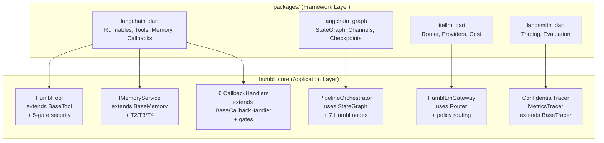

# LangChain Framework — Dart Ports

Humbl's AI layer is built on native Dart ports of four industry-standard Python frameworks. These are **not wrappers** — they are full reimplementations in Dart, following the same abstractions and interfaces as their Python counterparts. All Humbl features are extensions of these ports.

```
Port --> Plug --> Extend --> Connect
 |         |        |          |
 Dart      Use      Add        Cloud runs real
 ports     them     Humbl      Python LangChain/
 of AI     as       features   LangGraph/LiteLLM
 frameworks base    on top
```

## Why Port, Not Wrap?

Three reasons drove the decision to port rather than wrap via FFI or REST:

1. **Edge-first requires native Dart.** On-device inference in a Dart isolate cannot call out to a Python runtime. The frameworks must run natively in the same process.
2. **Same abstractions, same mental model.** Developers who know Python LangChain can read the Dart code immediately. Cloud agents run real Python LangChain/LangGraph — sharing the same concepts makes local-cloud parity natural.
3. **No wrapping, ever.** Wrappers add latency, coupling, and fragility. A native port is testable, debuggable, and refactorable without external dependencies.

## Package Overview

| Package | Port of | Version | Dependencies | Purpose |
|---------|---------|---------|-------------|---------|
| `langchain_dart` | [LangChain](https://python.langchain.com/) | 0.1.0 | `meta`, `uuid`, `collection` | Core framework — runnables, tools, memory, callbacks, prompts |
| `langsmith_dart` | [LangSmith](https://docs.smith.langchain.com/) | 0.1.0 | `langchain_dart` | Observability — tracing, evaluation, feedback |
| `litellm_dart` | [LiteLLM](https://docs.litellm.ai/) | 0.1.0 | `langchain_dart` | Multi-provider gateway — routing, cost, tokens |
| `langchain_graph` | [LangGraph](https://langchain-ai.github.io/langgraph/) | 0.1.0 | `langchain_dart` | State machines — StateGraph, channels, checkpoints |

All four packages live under `packages/` in the repo root. They depend only on each other and standard Dart libraries — no Flutter dependency, no platform code.

## langchain_dart — Core Framework

The foundation package. Everything else builds on it. **175 tests** across 17+ test files.

### Runnables (LCEL)

The Runnable protocol is LangChain's composable unit. Every component (prompts, models, parsers, tools) implements `BaseRunnable<Input, Output>`.

```dart
// LangChain Expression Language (LCEL) — pipe operator composition
final chain = prompt | model | parser;
final result = await chain.invoke({'topic': 'AI safety'});
```

Built-in runnables:
- `LambdaRunnable` — wrap any function
- `SequenceRunnable` — chain steps (pipe operator)
- `ParallelRunnable` — fan-out, merge results
- `BranchRunnable` — conditional routing
- `RetryRunnable` — automatic retry with backoff
- `FallbackRunnable` — try alternatives on failure
- `PassthroughRunnable` — identity pass-through
- `RunnableAssign` — add computed keys to a map via `RunnableParallel`
- `RunnablePick` — pick specific keys from map output
- `RunnableEach` — apply a runnable to each element of a list input
- `RunnableBinding` — wrap a runnable with pre-bound config
- `RunnableGenerator` — wrap a generator function as a runnable

### Tools (BaseTool)

Every tool in Humbl extends `BaseTool`:

```dart
abstract class BaseTool<Input, Output> extends BaseRunnable<Input, Output> {
  String get name;
  String get description;
  Map<String, dynamic> get inputSchema;
}
```

Humbl's `HumblTool` extends `BaseTool` and adds the five-gate security template via `@nonVirtual`. Tool authors implement `runTool()`, and the framework handles policy, access control, permissions, quota, and resources.

`ToolException` provides a typed exception for tool execution failures, distinct from general runtime errors.

### Language Models

Two abstract base classes for LLM providers:

- `BaseChatModel` — chat-based LLMs (messages in, message out). Humbl's `HumblChatModel` extends this.
- `BaseLLM` — text-completion LLMs (string in, string out). For non-chat models.

`RunManager` provides a scoped callback context for individual runs, enabling per-invocation tracing and event handling.

### Memory

Base abstractions for conversation memory:

- `BaseMemory` — load/save context variables
- `BaseChatMessageHistory` — append/clear message sequences
- `BufferMemory` — simple window buffer
- `ConversationSummaryMemory` — progressive summarization memory that condenses older messages into a summary, keeping recent messages intact. Useful for long conversations that would exceed the context window.
- `EntityMemory` — extracts and tracks named entities (people, places, projects) across conversations, maintaining an entity store that provides relevant entity context for each new message.

Humbl's `IMemoryService` extends `BaseMemory`. `ConversationStore` implements `BaseChatMessageHistory` with SQLite persistence and session binding.

### Messages

Core message types with utilities for message list manipulation:

- `HumanMessage`, `AIMessage`, `SystemMessage`, `ToolMessage` — standard message types
- `FunctionMessage` — deprecated OpenAI function calling message type (retained for backward compatibility)
- `RemoveMessage` — control message that removes a message by ID from the `addMessages` reducer in `langchain_graph` channels

Message utilities:
- `merge_message_runs()` — merge consecutive same-type messages into a single message
- `trim_messages()` — trim a message list to fit a token budget (supports `last` and `first` strategies)
- `filter_messages()` — filter messages by type, name, or ID

### Callbacks

Event-driven hooks into the execution lifecycle:

```dart
abstract class BaseCallbackHandler {
  void onLlmStart(Map<String, dynamic> serialized, List<String> prompts);
  void onLlmEnd(LLMResult response);
  void onToolStart(Map<String, dynamic> serialized, String input);
  void onToolEnd(String output);
  void onToolError(Object error);
  // ... more events
}
```

Humbl wires 6 callback handlers into this system:

| Handler | Gate | Purpose |
|---------|------|---------|
| `PolicyCallbackHandler` | Gate 1 | Tool policy enforcement (allow/deny lists) |
| `AccessControlCallbackHandler` | Gate 2 | Caller privilege level checks |
| `LoggingCallbackHandler` | — | Structured logging of all LM/tool events |
| `PermissionCallbackHandler` | Gate 3 | OS permission state validation |
| `QuotaCallbackHandler` | Gate 5 | Token/credit quota enforcement |
| `ToolFilterCallbackHandler` | — | Keyword-based tool group selection |

### Prompts

- `Prompt` / `ChatPrompt` — prompt templates with variable substitution
- `FewShotPromptTemplate` — prompt template with formatted examples, enabling in-context learning by injecting example input/output pairs into the prompt
- `PipelinePromptTemplate` — compose multiple prompt templates into a single prompt, useful for separating system instructions, context, and user input into maintainable pieces

### Other Modules

- **Output Parsers** — `StringParser`, `JSONParser`, `ListParser`, `XMLOutputParser`
- **Documents** — `BaseDocument` with metadata
- **Text Splitters** — `CharacterTextSplitter` for chunking
- **Embeddings** — `BaseEmbedding` interface, `FakeEmbedding` for tests
- **Vector Stores** — `BaseVectorStore`, `InMemoryVectorStore`
- **Retrievers** — `BaseRetriever`, `VectorStoreRetriever`, `ContextualCompressionRetriever` (with `ThresholdCompressor` and `TopKCompressor` for relevance filtering)
- **Test Models** — `GenericFakeChatModel`, `FakeListChatModel`, `FakeStreamingListLLM` for deterministic testing

## langchain_graph — State Machines

Port of LangGraph's StateGraph for building agent workflows. **128 tests** across 7+ test files.

### StateGraph

```dart
final graph = StateGraph<AgentState>(AgentState.new)
  ..addNode('classify', classifyNode)
  ..addNode('execute', executeNode)
  ..addNode('respond', respondNode)
  ..addEdge(start, 'classify')
  ..addConditionalEdges('classify', routeDecision, {
    'tool_call': 'execute',
    'direct_response': 'respond',
  })
  ..addEdge('execute', 'respond')
  ..addEdge('respond', end);

final compiled = graph.compile();
final result = await compiled.invoke(initialState);
```

### Superstep Execution Engine

`CompiledStateGraph` executes nodes in **parallel supersteps** using `Future.wait`. Nodes within the same superstep that have no data dependencies run concurrently, improving throughput for graphs with parallelizable work. This replaces the old sequential execution loop.

### Send for Parallel Routing (Fan-Out)

A `ConditionFunction` can return `List<Send>` to fan-out execution to multiple nodes, each with custom state:

```dart
graph.addConditionalEdges('router', (state) {
  return [
    Send('summarize', {'doc': state['doc1']}),
    Send('summarize', {'doc': state['doc2']}),
    Send('summarize', {'doc': state['doc3']}),
  ];
});
```

Conditional edges now support returning `dynamic` — a `String` (single target), `List<String>` (multiple targets with shared state), `Send` (single target with custom state), or `List<Send>` (fan-out with per-target state).

### Fan-In with addWaitingEdge

`addWaitingEdge` creates a fan-in barrier: the target node waits for **all** source nodes to complete before executing. This is the complement to `Send` fan-out:

```dart
graph.addWaitingEdge('summarize', 'aggregate');
// 'aggregate' only runs after all 'summarize' instances finish
```

### Subgraph Composition

`addSubgraph()` allows a compiled graph to be used as a node in a parent graph. The subgraph runs its full execution cycle and outputs its final state. Subgraph output uses `seedDynamic` (replacement), not `updateDynamic` (reducer), to avoid double-application of reducers.

```dart
final innerGraph = innerBuilder.compile();
outerGraph.addSubgraph('inner_step', innerGraph);
```

### MessageGraph

`MessageGraph` is a convenience `StateGraph` with a single `'messages'` channel using the `addMessages` reducer. Designed for simple chatbot patterns where the entire state is the message history.

### Channels

State communication between graph nodes:

- `LastValueChannel` — stores latest value (most common)
- `BinaryOperatorAggregateChannel` — reduces values with operator (e.g., append messages)
- `TopicChannel` — pub/sub by topic
- `EphemeralValueChannel` — single-use, cleared after read

### Checkpointing

Persistence for graph state, enabling time-travel and recovery:

- `BaseCheckpointSaver` — interface
- `InMemorySaver` — for testing
- `SqliteCheckpointSaver` — SQLite-backed persistence for production
- `PostgresCheckpointSaver` — PostgreSQL-backed persistence for cloud/server deployments
- `CheckpointID` — unique checkpoint identification
- `NamespacedInMemoryStore` — cross-thread memory sharing between graph executions

Humbl's `ICheckpointStore` extends the base saver for SQLite-backed persistence.

### Prebuilt Agents

6 prebuilt agent patterns covering the most common multi-agent architectures:

| Prebuilt | Pattern | Description |
|----------|---------|-------------|
| `createReactAgent` | ReAct | Reason + act loop. The standard single-agent pattern. |
| `createSupervisor` | Supervisor | A supervisor agent orchestrates N worker agents, deciding which worker handles each step. |
| `createSwarm` | Swarm | Peer-to-peer agent collaboration. Agents hand off to each other without a central coordinator. |
| `createHandoffTool` | Handoff | Creates a tool that transfers control from one agent to another, used by Swarm and Supervisor patterns. |
| `createPlanAndExecute` | Plan-and-Execute | Two-phase: a planner agent creates a step-by-step plan, then an executor agent carries out each step. |
| `createHierarchicalAgent` | Hierarchical | Manager-worker tree. A top-level manager delegates to sub-managers who delegate to workers. |

Supporting utilities:
- `ToolNode` — executes tools from the registry
- `tools_condition` — routes based on whether the LM returned tool calls

### Runtime

`GraphRuntime` executes compiled graphs with Dart Zones for error isolation and context propagation.

## litellm_dart — Multi-Provider Gateway

Port of LiteLLM's unified LLM interface with routing and cost tracking. **113 tests** across 7+ test files.

### Router

The Router selects the best provider for each request:

```dart
final router = Router(
  deployments: [
    Deployment(model: 'gpt-4', provider: openai),
    Deployment(model: 'claude-3', provider: anthropic),
    Deployment(model: 'qwen3-0.6b', provider: ollama),
  ],
  routingStrategy: RoutingStrategy.latencyBased,
);

final response = await router.complete(request);
```

Routing strategies:
- `simple` — round-robin
- `costBased` — cheapest provider first
- `leastBusy` — fewest in-flight requests
- `latencyBased` — lowest p50 latency
- `usageBased` — least tokens consumed

### Providers

12 provider adapters, all implementing `BaseProvider`:

| Provider | Protocol |
|----------|----------|
| OpenAI | OpenAI Chat Completions API |
| Anthropic | Anthropic Messages API |
| Gemini | Google Generative AI API |
| Azure OpenAI | Azure OpenAI Service API |
| Bedrock | AWS Bedrock Runtime API |
| Vertex AI | Google Vertex AI API |
| Cohere | Cohere API |
| HuggingFace | Hugging Face Inference API |
| Together AI | Together AI API |
| Mistral | Mistral AI API |
| Ollama | Ollama REST API |
| Custom OpenAI | Configurable OpenAI-compatible endpoint |

`Router.getProviderForModel` maps model prefixes to the correct provider adapter for all 12 providers.

### Async Completion Pipeline

`acompletion()` provides the full async completion pipeline: prepare request, HTTP call, transform response, track spend, enforce budget. This is the primary entry point for making LLM calls through the Router.

`createCompletionFunction()` bridges an `HttpPostFunction` to a `CompletionFunction`, enabling the Router to use any HTTP transport for completions.

### Embedding API

Full embedding support with typed request/response models:

- `EmbeddingRequest` — input text(s) + model specification
- `EmbeddingResponse` — vector output with usage metadata
- `EmbeddingData` — individual embedding vectors
- `EmbeddingUsage` — token consumption for embedding calls

### Cost Tracking

- `TokenCounter` — per-provider token counting
- `CostCalculator` — maps tokens to cost using `ModelPrices`
- `SpendLog` — persistent spend tracking with SQLite
- `BudgetManager` — enforces spending budgets with rolling window support. Prevents exceeding configured cost limits per time period.

### Image Generation

Typed request/response models for image generation:

- `ImageGenerationRequest` — prompt, model, size, quality, and style parameters
- `ImageGenerationResponse` — generated image URLs or base64 data

### Request Logging

- `RequestLog` — structured log of every completion request with latency percentiles (p50, p95, p99) for observability and debugging

### Cooldown & Caching

- `CooldownManager` — tracks provider failures with failure counting and exponential backoff. Enhanced with per-provider cooldown tracking.
- `BaseCache` / `MemoryCache` — response caching for identical requests
- `RedisResponseCache` — pluggable Redis-based cache adapter for distributed deployments

Humbl's `HumblChatModel` (extends `BaseChatModel` from `langchain_dart`) is the single entry point for LLM calls. It uses `addProvider(Deployment, CompletionFunction)` to register providers and delegates to the Router for selection and routing.

## langsmith_dart — Observability

Port of LangSmith's tracing and evaluation for LLM applications. **56 tests** across 4+ test files.

### Client

`Client` is the HTTP client for the LangSmith API with pluggable transport and `x-api-key` authentication. It provides typed methods for all CRUD operations and evaluation workflows.

### Tracers

All tracers implement `BaseTracer` and receive callback events:

| Tracer | Purpose |
|--------|---------|
| `ConsoleTracer` | Human-readable console output for debugging |
| `InMemoryTracer` | Captures runs in memory for testing |
| `LangChainTracer` | Persists runs to the LangSmith API via `Client`, enriches with project metadata |
| `ConfidentialTracer` | Encrypts PII fields before logging (Humbl extension) |
| `MetricsTracer` | Aggregates latency, token count, error rate metrics (Humbl extension) |

### Run CRUD

Full lifecycle management for execution traces:

- `createRun` / `readRun` / `updateRun` / `deleteRun` — individual run operations
- `listRuns` — query runs with filters (project, run type, date range)

### Dataset & Example CRUD

Test case management for evaluation workflows:

- `createDataset` / `readDataset` / `updateDataset` / `deleteDataset` / `listDatasets`
- `createExample` / `updateExample` / `deleteExample` / `listExamples`

### Evaluation

- `evaluate()` — runs a target function against a `Dataset`, applies `RunEvaluator` instances, and returns `EvaluationResults` with `averageScore`
- `evaluateComparative()` — A/B model testing. Runs two target functions against the same dataset and compares results with pairwise evaluators.
- `RunEvaluator` — scores runs against criteria
- `EvaluationResult` — structured evaluation output with score, key, and comment

### Data Models

- `Run` — a single execution trace (LLM call, tool call, chain step)
- `RunType` — enum (`llm`, `tool`, `chain`, `retriever`)
- `Feedback` — user or automated feedback on a run

## How Humbl Extends the Frameworks

The relationship between framework packages and `humbl_core`:



| Humbl Component | Extends | What It Adds |
|----------------|---------|-------------|
| `HumblTool` | `BaseTool` | Five-gate security, MCP schema, streaming, confirmation |
| `PipelineOrchestrator` | Uses `StateGraph` | 4 nodes (classify, route, execute, deliver), concurrent runs, cancellation |
| `HumblChatModel` | `BaseChatModel` | Single LM entry point with `addProvider()`, delegates to Router |
| `IMemoryService` | `BaseMemory` | T2-T4 hierarchy, importance scoring, SQLite |
| `ConversationStore` | `BaseChatMessageHistory` | Session binding, SQLite persistence |
| `IVectorStore` | `VectorStore` | SQLite + sqlite_vector, ONNX embeddings |
| `IEmbeddingProvider` | `Embeddings` | ONNX MiniLM-L6-v2, noop for testing |
| Callback handlers | `BaseCallbackHandler` | Policy, access, permission, quota, logging, filtering |
| `ConfidentialTracer` | `BaseTracer` | PII encryption before logging |
| `MetricsTracer` | `BaseTracer` | Aggregated performance metrics |

## Testing

All framework packages have independent test suites. Total: **472 tests** across all 4 packages (up from 314 at the start of the port effort).

| Package | Tests | Test Files | Key Tests |
|---------|-------|-----------|-----------|
| `langchain_dart` | 175 | 17+ | LCEL chains, runnables (Assign/Pick/Each/Binding/Generator), tool rendering, memory (buffer + summary + entity), callbacks, vector stores, message utilities, few-shot prompts, contextual compression retriever, XML parser, fake models |
| `langchain_graph` | 128 | 7+ | StateGraph compilation, superstep execution, Send fan-out, fan-in barriers, subgraph composition, MessageGraph, channels, checkpointing (SQLite + Postgres), prebuilt agents (supervisor, swarm, handoff, plan-and-execute, hierarchical) |
| `litellm_dart` | 113 | 7+ | Router strategies, all 12 provider adapters, cost calculation, cooldown, embedding API, image generation types, budget manager, acompletion pipeline, Redis cache, request logging |
| `langsmith_dart` | 56 | 4+ | Client HTTP API with pluggable transport, LangChainTracer, run/dataset/example CRUD, evaluate() with datasets, evaluateComparative() for A/B testing |

Tests run with `dart test` (no Flutter required). All use in-memory implementations — no external services needed.

## Cloud Parity

The Dart ports share the same abstractions as their Python counterparts. This enables cloud parity:

| Layer | Local (Dart) | Cloud (Python) |
|-------|-------------|----------------|
| Tools | `BaseTool` (langchain_dart) | `BaseTool` (langchain) |
| Graphs | `StateGraph` (langchain_graph) | `StateGraph` (langgraph) |
| Gateway | `Router` (litellm_dart) | `Router` (litellm) |
| Tracing | `BaseTracer` (langsmith_dart) | `BaseTracer` (langsmith) |

Same graph definitions, same tool schemas, same routing strategies. The local app and cloud backend speak the same language.
