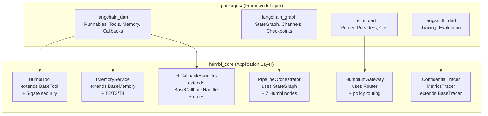

# LangChain Framework — Dart Ports

Humbl's AI layer is built on native Dart ports of four industry-standard Python frameworks. These are **not wrappers** — they are full reimplementations in Dart, following the same abstractions and interfaces as their Python counterparts. All Humbl features are extensions of these ports.

```
Port --> Plug --> Extend --> Connect
 |         |        |          |
 Dart      Use      Add        Cloud runs real
 ports     them     Humbl      Python LangChain/
 of AI     as       features   LangGraph/LiteLLM
 frameworks base    on top
```

## Why Port, Not Wrap?

Three reasons drove the decision to port rather than wrap via FFI or REST:

1. **Edge-first requires native Dart.** On-device inference in a Dart isolate cannot call out to a Python runtime. The frameworks must run natively in the same process.
2. **Same abstractions, same mental model.** Developers who know Python LangChain can read the Dart code immediately. Cloud agents run real Python LangChain/LangGraph — sharing the same concepts makes local-cloud parity natural.
3. **No wrapping, ever.** Wrappers add latency, coupling, and fragility. A native port is testable, debuggable, and refactorable without external dependencies.

## Package Overview

| Package | Port of | Version | Dependencies | Purpose |
|---------|---------|---------|-------------|---------|
| `langchain_dart` | [LangChain](https://python.langchain.com/) | 0.1.0 | `meta`, `uuid`, `collection` | Core framework — runnables, tools, memory, callbacks, prompts |
| `langsmith_dart` | [LangSmith](https://docs.smith.langchain.com/) | 0.1.0 | `langchain_dart` | Observability — tracing, evaluation, feedback |
| `litellm_dart` | [LiteLLM](https://docs.litellm.ai/) | 0.1.0 | `langchain_dart` | Multi-provider gateway — routing, cost, tokens |
| `langchain_graph` | [LangGraph](https://langchain-ai.github.io/langgraph/) | 0.1.0 | `langchain_dart` | State machines — StateGraph, channels, checkpoints |

All four packages live under `packages/` in the repo root. They depend only on each other and standard Dart libraries — no Flutter dependency, no platform code.

## langchain_dart — Core Framework

The foundation package. Everything else builds on it.

### Runnables (LCEL)

The Runnable protocol is LangChain's composable unit. Every component (prompts, models, parsers, tools) implements `BaseRunnable<Input, Output>`.

```dart
// LangChain Expression Language (LCEL) — pipe operator composition
final chain = prompt | model | parser;
final result = await chain.invoke({'topic': 'AI safety'});
```

Built-in runnables:
- `LambdaRunnable` — wrap any function
- `SequenceRunnable` — chain steps (pipe operator)
- `ParallelRunnable` — fan-out, merge results
- `BranchRunnable` — conditional routing
- `RetryRunnable` — automatic retry with backoff
- `FallbackRunnable` — try alternatives on failure
- `PassthroughRunnable` — identity pass-through

### Tools (BaseTool)

Every tool in Humbl extends `BaseTool`:

```dart
abstract class BaseTool<Input, Output> extends BaseRunnable<Input, Output> {
  String get name;
  String get description;
  Map<String, dynamic> get inputSchema;
}
```

Humbl's `HumblTool` extends `BaseTool` and adds the five-gate security template via `@nonVirtual`. Tool authors implement `runTool()`, and the framework handles policy, access control, permissions, quota, and resources.

### Memory

Base abstractions for conversation memory:

- `BaseMemory` — load/save context variables
- `BaseChatMessageHistory` — append/clear message sequences
- `BufferMemory` — simple window buffer

Humbl's `IMemoryService` extends `BaseMemory`. `ConversationStore` implements `BaseChatMessageHistory` with SQLite persistence and session binding.

### Callbacks

Event-driven hooks into the execution lifecycle:

```dart
abstract class BaseCallbackHandler {
  void onLlmStart(Map<String, dynamic> serialized, List<String> prompts);
  void onLlmEnd(LLMResult response);
  void onToolStart(Map<String, dynamic> serialized, String input);
  void onToolEnd(String output);
  void onToolError(Object error);
  // ... more events
}
```

Humbl wires 6 callback handlers into this system:

| Handler | Gate | Purpose |
|---------|------|---------|
| `PolicyCallbackHandler` | Gate 1 | Tool policy enforcement (allow/deny lists) |
| `AccessControlCallbackHandler` | Gate 2 | Caller privilege level checks |
| `LoggingCallbackHandler` | — | Structured logging of all LM/tool events |
| `PermissionCallbackHandler` | Gate 3 | OS permission state validation |
| `QuotaCallbackHandler` | Gate 5 | Token/credit quota enforcement |
| `ToolFilterCallbackHandler` | — | Keyword-based tool group selection |

### Other Modules

- **Messages** — `HumanMessage`, `AIMessage`, `SystemMessage`, `ToolMessage`
- **Prompts** — `Prompt`, `ChatPrompt` with variable substitution
- **Output Parsers** — `StringParser`, `JSONParser`, `ListParser`
- **Documents** — `BaseDocument` with metadata
- **Text Splitters** — `CharacterTextSplitter` for chunking
- **Embeddings** — `BaseEmbedding` interface, `FakeEmbedding` for tests
- **Vector Stores** — `BaseVectorStore`, `InMemoryVectorStore`
- **Retrievers** — `BaseRetriever`, `VectorStoreRetriever`

## langchain_graph — State Machines

Port of LangGraph's StateGraph for building agent workflows.

### StateGraph

```dart
final graph = StateGraph<AgentState>(AgentState.new)
  ..addNode('classify', classifyNode)
  ..addNode('execute', executeNode)
  ..addNode('respond', respondNode)
  ..addEdge(start, 'classify')
  ..addConditionalEdges('classify', routeDecision, {
    'tool_call': 'execute',
    'direct_response': 'respond',
  })
  ..addEdge('execute', 'respond')
  ..addEdge('respond', end);

final compiled = graph.compile();
final result = await compiled.invoke(initialState);
```

### Channels

State communication between graph nodes:

- `LastValueChannel` — stores latest value (most common)
- `BinaryOperatorAggregateChannel` — reduces values with operator (e.g., append messages)
- `TopicChannel` — pub/sub by topic
- `EphemeralValueChannel` — single-use, cleared after read

### Checkpointing

Persistence for graph state, enabling time-travel and recovery:

- `BaseCheckpointSaver` — interface
- `InMemorySaver` — for testing
- `CheckpointID` — unique checkpoint identification

Humbl's `ICheckpointStore` extends the base saver for SQLite-backed persistence.

### Prebuilt Agents

- `ToolNode` — executes tools from the registry
- `create_react_agent` — ReAct agent template (reason + act loop)
- `tools_condition` — routes based on whether the LM returned tool calls

### Runtime

`GraphRuntime` executes compiled graphs with Dart Zones for error isolation and context propagation.

## litellm_dart — Multi-Provider Gateway

Port of LiteLLM's unified LLM interface with routing and cost tracking.

### Router

The Router selects the best provider for each request:

```dart
final router = Router(
  deployments: [
    Deployment(model: 'gpt-4', provider: openai),
    Deployment(model: 'claude-3', provider: anthropic),
    Deployment(model: 'qwen3-0.6b', provider: ollama),
  ],
  routingStrategy: RoutingStrategy.latencyBased,
);

final response = await router.complete(request);
```

Routing strategies:
- `simple` — round-robin
- `costBased` — cheapest provider first
- `leastBusy` — fewest in-flight requests
- `latencyBased` — lowest p50 latency
- `usageBased` — least tokens consumed

### Providers

11 provider adapters, all implementing `BaseProvider`:

| Provider | Protocol |
|----------|----------|
| OpenAI | OpenAI Chat Completions API |
| Anthropic | Anthropic Messages API |
| Gemini | Google Generative AI API |
| Mistral | Mistral API |
| xAI | xAI Grok API |
| Cohere | Cohere API |
| Sarvam | Sarvam AI API |
| Ollama | Ollama REST API |
| LM Studio | OpenAI-compatible (localhost) |
| OpenAI-compatible | Generic OpenAI-compatible endpoint |
| Custom OpenAI | Configurable OpenAI-compatible |

### Cost Tracking

- `TokenCounter` — per-provider token counting
- `CostCalculator` — maps tokens to cost using `ModelPrices`
- `SpendLog` — persistent spend tracking with SQLite

### Cooldown & Caching

- `CooldownManager` — tracks provider failures, backs off automatically
- `BaseCache` / `MemoryCache` — response caching for identical requests

Humbl's `HumblLmGateway` wraps the LiteLLM Router and integrates it with the five-gate security model, adding latency tracking and request metrics per deployment.

## langsmith_dart — Observability

Port of LangSmith's tracing and evaluation for LLM applications.

### Tracers

All tracers implement `BaseTracer` and receive callback events:

| Tracer | Purpose |
|--------|---------|
| `ConsoleTracer` | Human-readable console output for debugging |
| `InMemoryTracer` | Captures runs in memory for testing |
| `ConfidentialTracer` | Encrypts PII fields before logging (Humbl extension) |
| `MetricsTracer` | Aggregates latency, token count, error rate metrics (Humbl extension) |

### Evaluation

- `RunEvaluator` — scores runs against criteria
- `EvaluationResult` — structured evaluation output
- `Dataset` / `Example` — test case management
- `InMemoryDatasetStore` — dataset storage for testing

### Data Models

- `Run` — a single execution trace (LLM call, tool call, chain step)
- `RunType` — enum (`llm`, `tool`, `chain`, `retriever`)
- `Feedback` — user or automated feedback on a run

## How Humbl Extends the Frameworks

The relationship between framework packages and `humbl_core`:



| Humbl Component | Extends | What It Adds |
|----------------|---------|-------------|
| `HumblTool` | `BaseTool` | Five-gate security, MCP schema, streaming, confirmation |
| `PipelineOrchestrator` | Uses `StateGraph` | 7 specialized nodes, concurrent runs, cancellation |
| `HumblLmGateway` | Uses `Router` | Policy-based provider selection, latency tracking |
| `IMemoryService` | `BaseMemory` | T2-T4 hierarchy, importance scoring, SQLite |
| `ConversationStore` | `BaseChatMessageHistory` | Session binding, SQLite persistence |
| `IVectorStore` | `VectorStore` | SQLite + sqlite_vector, ONNX embeddings |
| `IEmbeddingProvider` | `Embeddings` | ONNX MiniLM-L6-v2, noop for testing |
| Callback handlers | `BaseCallbackHandler` | Policy, access, permission, quota, logging, filtering |
| `ConfidentialTracer` | `BaseTracer` | PII encryption before logging |
| `MetricsTracer` | `BaseTracer` | Aggregated performance metrics |

## Testing

All framework packages have independent test suites:

| Package | Test Files | Key Tests |
|---------|-----------|-----------|
| `langchain_dart` | 17 | LCEL chains, tool rendering, memory, callbacks, vector stores |
| `langsmith_dart` | 4 | Tracers, evaluation, dataset management |
| `litellm_dart` | 7 | Router strategies, provider adapters, cost calculation |
| `langchain_graph` | 7 | StateGraph compilation, channels, checkpointing |

Tests run with `dart test` (no Flutter required). All use in-memory implementations — no external services needed.

## Cloud Parity

The Dart ports share the same abstractions as their Python counterparts. This enables cloud parity:

| Layer | Local (Dart) | Cloud (Python) |
|-------|-------------|----------------|
| Tools | `BaseTool` (langchain_dart) | `BaseTool` (langchain) |
| Graphs | `StateGraph` (langchain_graph) | `StateGraph` (langgraph) |
| Gateway | `Router` (litellm_dart) | `Router` (litellm) |
| Tracing | `BaseTracer` (langsmith_dart) | `BaseTracer` (langsmith) |

Same graph definitions, same tool schemas, same routing strategies. The local app and cloud backend speak the same language.
