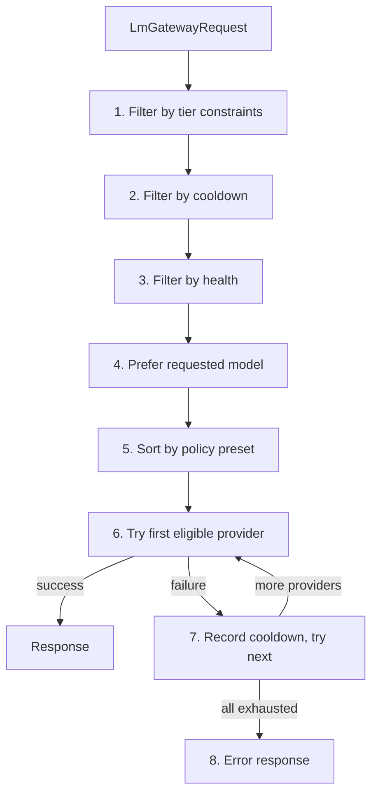
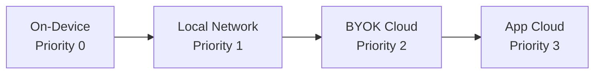
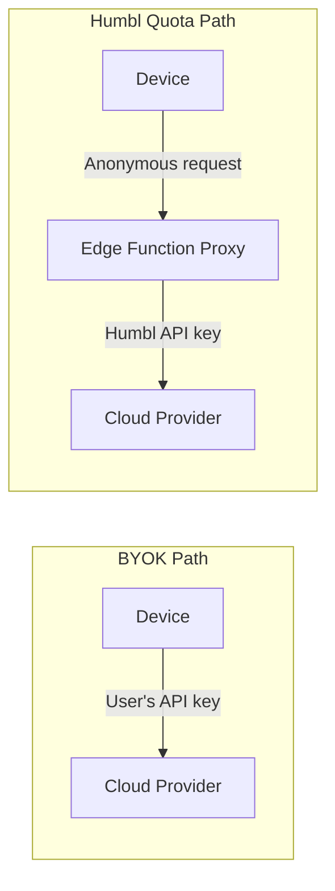

# LM Gateway

The LM Gateway is Humbl's **pure routing engine** for language model inference, built on top of the `litellm_dart` `Router`. It abstracts away which model, provider, and runtime is used -- the caller sends a request and the gateway figures out the best available option based on policy, tier, connectivity, cooldown state, and health.

## Built on LiteLLM Router (SP7)

As of the SP7 refactor, `HumblLmGateway` wraps the `litellm_dart` `Router` for provider selection and request routing. This gives Humbl access to LiteLLM's battle-tested routing strategies, cost tracking, and cooldown management:

- **5 routing strategies:** `simple` (round-robin), `costBased` (cheapest first), `leastBusy` (fewest in-flight), `latencyBased` (lowest p50), `usageBased` (least tokens consumed)
- **Cost tracking:** `SpendLog` + `CostCalculator` from `litellm_dart` track per-provider spend
- **Cooldown:** `CooldownManager` from `litellm_dart` backs off failed providers
- **Latency/request metrics:** Per-deployment tracking feeds routing decisions

## Why a Gateway?

Humbl supports multiple LM providers simultaneously: an on-device SLM via llama.cpp, a local network model via Ollama or LM Studio, the user's own API keys (BYOK) for OpenAI/Anthropic/Gemini, and Humbl's own cloud quota for subscribers. The pipeline should not care which provider answers a given request -- it calls one interface and gets a response.

The gateway solves three problems:

**Unified routing.** The pipeline's `ClassifyNode` calls `ILmGateway.complete()`. It does not know or care whether the response comes from a 600M parameter on-device model or a cloud-hosted GPT-4. The gateway wraps the LiteLLM `Router` which selects the best available deployment based on the configured routing strategy, filters out providers that are in cooldown or unhealthy, and tries them in order until one succeeds.

**Automatic failover.** If the on-device model runs out of memory (OOM), the `CooldownManager` records a cooldown and the Router tries the next deployment. If the local network Ollama server is unreachable, same thing. If the user's BYOK API key is rate-limited, same thing. The pipeline sees a single response or a single error -- it never manages retry logic.

**Tier-gated access.** Free tier users can only use on-device and local network providers. Standard/Plus/Ultimate subscribers can use cloud providers. The gateway enforces these constraints before even passing the request to the Router, so a free user's query never accidentally hits a paid cloud API.

## ILmGateway

The top-level interface is minimal:

```dart
abstract class ILmGateway {
  Future<LmGatewayResponse> complete(LmGatewayRequest request);
  Stream<LmGatewayToken> stream(LmGatewayRequest request);
}
```

Every consumer (ClassifyNode, cloud gateway, scout agents) calls the same interface. The gateway handles model selection, failover, and escalation internally.

## HumblLmGateway

The concrete implementation routes requests through a multi-step filtering and sorting algorithm:



### How Routing Works

The routing algorithm processes requests through a deterministic filter-and-sort pipeline:

1. **Tier constraint filter** -- Free tier cannot use appCloud providers. Each tier has an allowed set of `LmProviderType` values. This check is first because it is the cheapest and eliminates the most candidates.

2. **Cooldown filter** -- Skip providers in exponential backoff after recent failures. A provider that failed 30 seconds ago is skipped; a provider that failed 2 hours ago is retried. The CooldownRegistry manages the backoff durations.

3. **Health filter** -- Skip providers marked unhealthy by background health checks. A local Ollama server that is unreachable is marked unhealthy and skipped until its next health probe succeeds.

4. **Preferred model hint** -- If the request specifies a model ID (e.g., the user configured a preference for a specific model), prefer providers that have it loaded. This avoids model loading latency.

5. **Sort by policy preset** -- Order remaining candidates by the user's routing preference. The default `auto` preset sorts by: on-device (priority 0) > local network (priority 1) > BYOK cloud (priority 2) > app cloud (priority 3).

6. **Try first eligible** -- Send request to the top candidate. On success, record success in cooldown registry and return.

7. **On failure** -- Record cooldown in registry with exponential backoff. Detect OOM specifically (different recovery than a network error). If `autoFailover` is enabled in the policy, continue to the next provider.

8. **All exhausted** -- Return user-facing error with recovery suggestions ("No providers available. Connect to WiFi for local network providers, or subscribe for cloud access.").

```dart
class HumblLmGateway implements ILmGateway {
  final LmProviderRegistry _providers;
  final CooldownRegistry _cooldown;
  final IQuotaManager? _quota;
  LmGatewayPolicy _policy;

  // LiteLLM integration (SP7)
  final litellm.SpendLog _spendLog;         // Records USD cost per LLM call
  final litellm.CostCalculator _costCalc;   // Computes cost from pricing tables
  late final litellm.Router router;          // Strategy-based deployment selection

  @override
  Future<LmGatewayResponse> complete(LmGatewayRequest request) async {
    final eligible = _resolveProviders(request);
    if (eligible.isEmpty) return errorResponse;

    for (final provider in eligible) {
      try {
        // Record request start for latency tracking
        router.recordRequestStart(provider.instanceId);

        final response = await provider.complete(request);

        // Record success metrics for routing decisions
        router.recordLatency(provider.instanceId, response.latencyMs);
        router.recordRequestEnd(provider.instanceId);
        _cooldown.recordSuccess(provider.instanceId);

        // Track cost via litellm SpendLog
        final cost = _costCalc.calculate(
          model: response.modelUsed,
          inputTokens: response.inputTokens,
          outputTokens: response.outputTokens,
        );
        _spendLog.record(userId: request.userId, cost: cost, model: response.modelUsed);

        return response;
      } catch (e) {
        _cooldown.recordFailure(provider.instanceId);
        if (!_policy.autoFailover) rethrow;
        // Continue to next provider
      }
    }
    return allFailedResponse;
  }
}
```

### LiteLLM Router Strategies

The `Router` from `litellm_dart` supports 5 routing strategies that can be configured via `LmGatewayPolicy`:

| Strategy | Algorithm | Best For |
|----------|-----------|----------|
| `simple` | Round-robin across deployments | Even load distribution |
| `costBased` | Cheapest provider first (via `ModelPrices`) | Minimizing cost |
| `leastBusy` | Fewest in-flight requests | Load balancing |
| `latencyBased` | Lowest p50 latency (tracked per deployment) | Speed-critical queries |
| `usageBased` | Least tokens consumed | Fair usage across providers |

The strategy integrates with Humbl's existing tier-filtering and cooldown — the Router selects among providers that have already passed Humbl's policy, tier, and health filters.

### Escalation Chain

The default escalation chain reflects the edge-first philosophy:

```
On-Device SLM (free, ~50-200ms, works offline)
  ↓ fails or OOM
Local Network (free, ~100-500ms, requires LAN)
  ↓ unreachable
BYOK Cloud (user pays provider, ~200-2000ms, requires internet)
  ↓ rate limited or no key configured
App Cloud (Humbl credits/subscription, ~200-2000ms, subscribers only)
  ↓ all exhausted
Error with recovery suggestions
```

Each step in the chain is automatic. The user says "what's the weather?" and gets an answer. They do not need to know whether the answer came from the on-device model or a cloud fallback.

## Provider Tiers

Four provider types ordered by default priority (cheapest/fastest first):



| Tier | Interface | Examples | Cost | Latency |
|------|-----------|---------|------|---------|
| **On-Device** | `IOnDeviceLmProvider` | llama.cpp, ExecuTorch, LiteRT | Free | ~50-200ms |
| **Local Network** | `ILocalNetworkLmProvider` | Ollama on LAN, LM Studio | Free | ~100-500ms |
| **BYOK Cloud** | `IByokLmProvider` | User's own OpenAI/Anthropic API key | User pays provider | ~200-2000ms |
| **App Cloud** | `IAppCloudLmProvider` | Humbl's cloud quota | Credits/subscription | ~200-2000ms |

Default tier constraints:

```dart
static const defaultTierConstraints = {
  'free': {LmProviderType.onDevice, LmProviderType.localNetwork},
  'standard': LmProviderType.values.toSet(),
  'plus': LmProviderType.values.toSet(),
  'ultimate': LmProviderType.values.toSet(),
};
```

## Connector System

### ILmConnector

Each cloud/network LM API has a connector that normalizes request/response format:

```dart
abstract class ILmConnector {
  String get connectorId;
  String get displayName;
  List<ConnectorConfigField> get configSchema;  // API key, base URL, etc.

  Future<LmGatewayResponse> complete(LmGatewayRequest request, Map<String, String> config);
  Stream<LmGatewayToken> stream(LmGatewayRequest request, Map<String, String> config);
}
```

### Connector Pattern

The connector pattern separates API format normalization from provider routing. Each connector knows how to translate Humbl's `LmGatewayRequest` into the provider's native API format and parse the response back. The `OpenAiCompatibleConnector` base class handles the most common format (OpenAI chat completions), which covers the majority of LM APIs.

Adding a new connector for a new LM API requires implementing `ILmConnector` with the provider's request/response format. If the provider follows the OpenAI chat completions format (most do), extend `OpenAiCompatibleConnector` and override only the differences (authentication header, endpoint path, model name mapping).

### 11 Built-in Connectors

| Connector | File | API |
|-----------|------|-----|
| `OpenAiConnector` | `openai_connector.dart` | OpenAI Chat Completions |
| `AnthropicConnector` | `anthropic_connector.dart` | Anthropic Messages |
| `GeminiConnector` | `gemini_connector.dart` | Google Gemini |
| `MistralConnector` | `mistral_connector.dart` | Mistral Chat |
| `CohereConnector` | `cohere_connector.dart` | Cohere Chat |
| `XaiConnector` | `xai_connector.dart` | xAI (Grok) |
| `SarvamConnector` | `sarvam_connector.dart` | Sarvam AI (Indic languages) |
| `OllamaConnector` | `ollama_connector.dart` | Ollama local API |
| `LmStudioConnector` | `lm_studio_connector.dart` | LM Studio local API |
| `OpenAiCompatibleConnector` | `openai_compatible_connector.dart` | Any OpenAI-compatible API |
| `OpenAiCompatibleProvider` | `openai_compatible_provider.dart` | Provider wrapper for compatible APIs |

All connectors share common infrastructure via `OpenAiCompatibleConnector` -- most cloud APIs follow the OpenAI chat completions format.

## Cloud Privacy & Anonymity

When the gateway routes a request to a cloud provider, privacy is maintained through three layers:

### Containerised Cloud Agents

Cloud agents are **identity-blind**. They receive a task with only the minimum data required for processing — no user ID, no device ID, no session history beyond what's needed for the current request. The agent processes the request, returns a result, and retains no state. If the agent needs additional information (e.g., location for a weather query), it pushes an information request back to the Humbl app, which gates it through the user's permission system before responding.

### Minimum Data Principle

The gateway sends only what the cloud provider needs:

| Scenario | Data sent | Data NOT sent |
|----------|-----------|---------------|
| Simple question ("What is quantum computing?") | The question text only | User identity, location, history, device info |
| Tool-assisted ("What's the weather?") | Question + city (after user approval) | Full location coordinates, user name, session context |
| Multi-step reasoning | Conversation turns relevant to the task | Full conversation history, memory tiers, journal |

### BYOK vs Humbl Quota Routing

The privacy guarantee differs by routing path:

- **BYOK (Bring Your Own Key):** The device calls the provider directly using the user's own API key. The provider knows the user's identity (it's their account). This is the user's choice — they trade anonymity for direct control and potentially lower cost.

- **Humbl Quota:** Requests route through Humbl's Edge Function proxy. The proxy forwards the request using Humbl's API key. The cloud provider sees only Humbl's server IP and API credentials — the user is **completely anonymous** to the provider. The proxy strips any identifying metadata before forwarding.



### ConnectorRegistry

Registration, lookup, and config validation for connectors:

```dart
class ConnectorRegistry {
  void register(ILmConnector connector);
  ILmConnector? lookup(String connectorId);
  List<ILmConnector> get all;
}
```

Each connector declares its configuration schema via `ConnectorConfigField`:

```dart
class ConnectorConfigField {
  final String key;          // 'api_key', 'base_url', 'model_id'
  final String displayName;  // Human-readable label
  final bool required;
  final bool secret;         // Stored in SecureKeyVault
  final String? defaultValue;
}
```

## Routing Policy

### LmGatewayPolicy

Controls how the gateway selects providers:

```dart
class LmGatewayPolicy {
  final RoutingPolicyPreset preset;
  final bool autoFailover;
  final Map<String, Set<LmProviderType>> tierConstraints;
  final List<LmRoutingTarget> priorityList;  // For custom preset
}
```

### Routing Presets

| Preset | Behavior |
|--------|----------|
| `auto` | On-device first, then local network, BYOK, app cloud (default) |
| `onDeviceOnly` | Only use on-device providers, never cloud |
| `cloudOnly` | Only use cloud providers, skip on-device |
| `cloudFirst` | Prefer cloud (faster for complex queries), on-device as fallback |
| `custom` | User-defined priority list of specific provider instances |

### CooldownRegistry

Tracks provider failures with exponential backoff:

```dart
class CooldownRegistry {
  void recordSuccess(String providerId);   // Reset cooldown
  void recordFailure(String providerId);   // Increase cooldown duration
  bool isInCooldown(String providerId);    // Check if provider is cooling down
}
```

### ConfigVersionManager

Detects when a provider's configuration changes (API key rotation, model updates) and invalidates cached state.

## LM Scheduling

`LmScheduler` provides priority-aware scheduling for local inference:

- **Realtime** requests (pipeline classify, voice session) preempt background tasks
- **Background** requests (memory consolidation, training data export) are queued
- One active local inference at a time (GPU/CPU constraint)

### Priority Preemption

When a foreground request arrives while a background inference is running:

1. The background inference is immediately paused (the on-device runtime supports cooperative yielding)
2. The foreground request executes to completion
3. The background inference is re-queued at the front of the queue and resumes from where it left off

Cloud requests bypass the scheduler entirely -- they are HTTP calls that run in parallel without contending for local GPU/CPU resources. The scheduler only manages on-device and local network providers where a single inference engine is shared.

## Runtime Layer

The runtime abstraction separates model execution from provider routing:

| Component | Purpose |
|-----------|---------|
| `IModelRuntime` | Interface for a model execution backend |
| `RuntimeRegistry` | Register/lookup available runtimes |
| `RuntimeBackend` | Enum: llamaCpp, execuTorch, liteRt, onnx, coreML |
| `MemoryBudget` | Track available RAM/VRAM for model loading decisions |
| `RuntimeHotSwap` | Unload current model and load a different one at runtime |

## Training & Adaptation

The gateway includes interfaces for model personalization:

| Component | Purpose |
|-----------|---------|
| `ILoraTrainer` | QLoRA fine-tuning interface |
| `AdapterIndex` | Track available LoRA adapters per base model |
| `AdapterManager` | Load/unload adapters at runtime |
| `TrainingOrchestrator` | End-to-end training pipeline (data selection -> training -> validation) |
| `ITrainingDataExporter` | Export training data in 4 formats (Alpaca, ShareGPT, DPO, custom) |

## Provider Marketplace

`IProviderMarketplace` defines the interface for discovering and installing third-party LM providers. This enables a marketplace where developers can publish custom connectors for new LM APIs.

## Source Files

| Path | Purpose |
|------|---------|
| `humbl_core/lib/lm_gateway/i_lm_gateway.dart` | Top-level gateway interface |
| `humbl_core/lib/lm_gateway/humbl_lm_gateway.dart` | Concrete routing implementation |
| `humbl_core/lib/lm_gateway/noop_lm_gateway.dart` | No-op for testing |
| `humbl_core/lib/lm_gateway/connectors/` | 11 connector implementations |
| `humbl_core/lib/lm_gateway/providers/` | Provider tier interfaces |
| `humbl_core/lib/lm_gateway/routing/` | Policy, cooldown, presets |
| `humbl_core/lib/lm_gateway/scheduling/` | LmScheduler |
| `humbl_core/lib/lm_gateway/runtime/` | IModelRuntime, RuntimeRegistry |
| `humbl_core/lib/lm_gateway/training/` | LoRA, adapters, training pipeline |
| `humbl_core/lib/lm_gateway/marketplace/` | IProviderMarketplace |
| `humbl_core/lib/lm_gateway/lm_gateway.dart` | Barrel export (all public types) |
