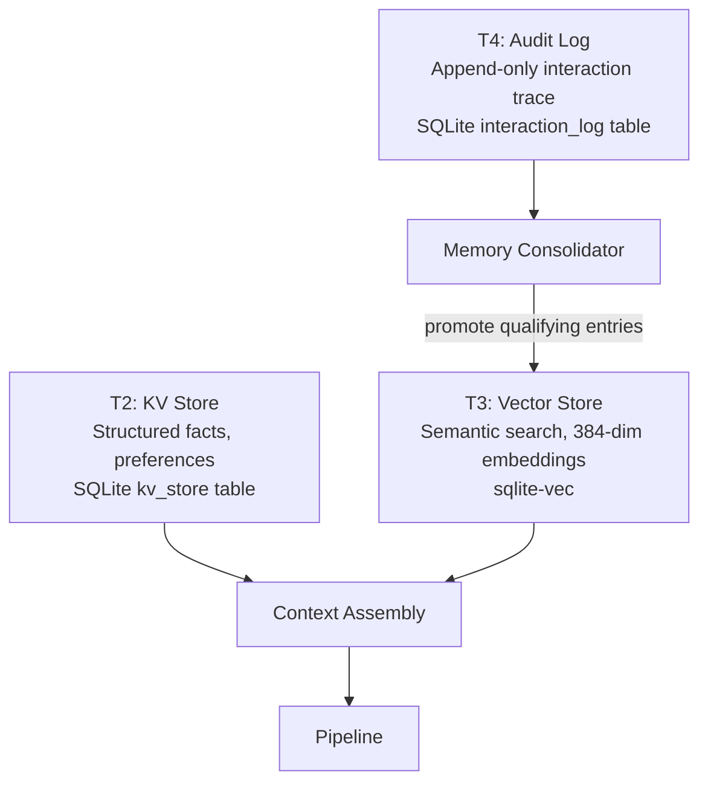

# Memory System

Humbl's memory system provides **three storage tiers** -- all backed by SQLite, with interfaces extending LangChain base classes from `langchain_dart`. The original T1 performance cache was removed after analysis showed near-zero cache hit rates for NLP workloads. Local storage is cheap (~20MB for 10K memories), so there is no eviction pressure -- importance scoring is used for context assembly priority, not deletion.

## Built on LangChain Memory (SP5)

As of the SP5 refactor, all memory interfaces extend their LangChain equivalents:

| Humbl Interface | Extends | What It Adds |
|----------------|---------|-------------|
| `IMemoryService` | `BaseMemory` | T2-T4 tiered hierarchy, importance scoring, SQLite persistence |
| `ConversationStore` | `BaseChatMessageHistory` | `bindSession()` for daily session binding, SQLite-backed message storage |
| `IVectorStore` | `VectorStore` | SQLite + sqlite_vector (384-dim ONNX embeddings) |
| `IEmbeddingProvider` | `Embeddings` | ONNX MiniLM-L6-v2 (on-device), noop for testing |

This means Humbl's memory components are compatible with any LangChain chain or agent that expects `BaseMemory` or `BaseChatMessageHistory`. The same memory abstractions work in Dart (local) and Python (cloud).

## Why SQLite Everywhere?

The decision to use SQLite as the sole storage engine was driven by the nature of NLP workloads:

**Near-zero cache hit rate.** Users almost never say the exact same thing twice. A traditional key-value cache like Hive or Redis assumes temporal locality -- recent reads will be read again soon. In conversation, this assumption is false. The user asks "what's the weather?" once, gets an answer, and moves on. Caching the intent classification result for that exact string is wasted memory because the user will never say those exact words again. Analysis of conversation logs showed under 2% exact-match hit rates, making a dedicated cache layer pure overhead.

**Single engine, single query language.** With SQLite for structured data (T2), sqlite-vec for vectors (T3), and SQLite for the audit log (T4), every query across the memory system uses SQL. There is no impedance mismatch between storage engines, no serialization boundary between a KV cache and a relational store, and no separate lifecycle management for different databases. One engine, one file format, one backup story, one sync protocol.

**Local storage is cheap.** A smartphone has 128-512GB of storage. Humbl's memory footprint is approximately 20MB for 10,000 memories (T2 + T3 + T4 combined). There is no eviction pressure, no LRU policy needed, and no risk of running out of space. Importance scoring exists for *context assembly priority* (which memories to include in the LM prompt), not for deletion decisions.

## Memory Tiers



| Tier | Storage | Purpose | Access Pattern |
|------|---------|---------|---------------|
| **T2** | SQLite `kv_store` table | Structured facts, user preferences, learned patterns | Exact key lookup, keyword search, importance ordering |
| **T3** | sqlite-vec | Semantic similarity search across all memories | Vector cosine similarity (384-dim embeddings) |
| **T4** | SQLite `interaction_log` table | Append-only audit trail of all pipeline interactions | Sequential write, time-range queries, consolidation reads |

## How Memory Connects to the Pipeline

Memory participates in two pipeline nodes:

### ContextAssemblyNode (start of every turn)

At the start of every pipeline run, `ContextAssemblyNode` calls `IMemoryService.assembleContext()`. This method:

1. **Queries T2 KV** for user preferences. If the user has previously set "preferred_units: metric" or "home_city: Bangalore", these facts are included in the prompt so the LM knows the user's context without being told each time.

2. **Queries T3 vectors** for semantic context. If the user says "tell me more about that restaurant", the vector search finds past conversations about restaurants and includes relevant snippets. This enables the LM to maintain topical continuity across sessions.

3. **Applies a context budget.** The assembled context must fit within the LM's context window alongside the conversation history, system prompt, and tool schemas. `ContextBudget` calculates available tokens and selects memories by importance score, truncating or omitting lower-importance entries to stay within budget.

The result is a `MemoryContext` object that the pipeline carries through to `ClassifyNode`, where it is injected into the LM prompt by prompt adapters.

### DeliverNode (end of every turn)

After a pipeline turn completes, `DeliverNode` writes the interaction to two places:

1. **ConversationStore** -- the turn-by-turn conversation log (user input, assistant response, tool used, timestamp). This feeds back into the next turn's conversation history.

2. **T4 interaction log** -- the audit trail entry with trace ID, timing, token usage, and success/failure status. This feeds into the memory consolidator for later T3 promotion.

## IMemoryService (extends BaseMemory)

The unified memory interface extends `BaseMemory` from `langchain_dart`, which means it participates natively in LangChain chains and agents. The LangChain interface (`loadMemoryVariables`, `saveContext`, `clear`) is implemented alongside Humbl-specific T2/T3/T4 methods:

```dart
abstract class IMemoryService extends BaseMemory {
  // -- LangChain BaseMemory interface --
  @override
  List<String> get memoryVariables => ['history', 'semantic_context', 'kv_context'];

  @override
  Future<Map<String, dynamic>> loadMemoryVariables(Map<String, dynamic> inputs);
  @override
  Future<void> saveContext(Map<String, dynamic> inputs, Map<String, dynamic> outputs);
  @override
  Future<void> clear();

  // -- T2: KV Store --
  Future<Map<String, dynamic>?> getKv(String userId, String key);
  Future<void> setKv(String userId, String key, Map<String, dynamic> value,
      {double importanceScore = 0.5});
  Future<Map<String, dynamic>> getManyKv(String userId, List<String> keys);
  Future<List<KvEntry>> getKvModifiedSince(String userId, DateTime since);

  // -- T3: Vector Store --
  Future<List<MemoryEntry>> querySemanticMemory(String userId, String query,
      {int maxResults = 10, double minSimilarity = 0.5});
  Future<void> writeSemanticMemory(String userId, String content,
      {Map<String, dynamic>? metadata, double importanceScore = 0.5});

  // -- T4: Audit Log --
  Future<void> logInteraction(InteractionLog log);

  // -- Context Assembly --
  Future<MemoryContext> assembleContext(String userId, String inputText,
      {List<Map<String, dynamic>> conversationHistory = const []});

  // -- Lifecycle --
  Future<void> initialize();
  Future<void> dispose();
}
```

The `loadMemoryVariables()` method delegates to `assembleContext()` internally, returning T2 KV context and T3 semantic context as variables that LangChain chains can inject into prompts. `saveContext()` delegates to `logInteraction()` for T4 audit trailing.

## SqliteMemoryService

The production implementation backed by SQLite for T2/T4 and an injected `IVectorStore` for T3:

```dart
class SqliteMemoryService implements IMemoryService {
  final Database _db;
  final IVectorStore _vectors;
  final IEmbeddingProvider _embedder;

  static Future<SqliteMemoryService> open(
    String dbPath, {
    IVectorStore vectors = const NoopVectorStore(),
    IEmbeddingProvider embedder = const NoopEmbeddingProvider(),
  }) async { /* ... */ }
}
```

### T2 Schema

```sql
CREATE TABLE kv_store (
  user_id TEXT NOT NULL,
  key TEXT NOT NULL,
  value_json TEXT NOT NULL,
  importance REAL NOT NULL DEFAULT 0.5,
  updated_at TEXT NOT NULL,
  PRIMARY KEY (user_id, key)
);
CREATE INDEX idx_kv_user ON kv_store (user_id);
```

### T4 Schema

```sql
CREATE TABLE interaction_log (
  id INTEGER PRIMARY KEY AUTOINCREMENT,
  run_id TEXT NOT NULL,
  trace_id TEXT,
  user_id TEXT NOT NULL,
  session_id TEXT NOT NULL,
  input_text TEXT NOT NULL,
  output_text TEXT,
  tool_name TEXT,
  success INTEGER NOT NULL,
  duration_ms INTEGER NOT NULL,
  tokens_used INTEGER NOT NULL,
  timestamp TEXT NOT NULL
);
CREATE INDEX idx_log_user ON interaction_log (user_id);
CREATE INDEX idx_log_trace ON interaction_log (trace_id);
```

### Context Assembly

`assembleContext()` is called by `ContextAssemblyNode` at the start of every pipeline run. It combines T2 keyword matches with T3 semantic search:

```dart
Future<MemoryContext> assembleContext(String userId, String inputText, ...) async {
  // T2: keyword matching on KV keys (words >= 4 chars from input)
  final kvRows = await _fetchRelevantKv(userId, inputText);

  // T3: semantic search (when vectors are available)
  final semanticResults = await querySemanticMemory(userId, inputText);

  return MemoryContext(
    relevantMemories: [...kvMemories, ...semanticMemories],
    activeConversation: conversationHistory.isNotEmpty
        ? {'turns': conversationHistory} : null,
  );
}
```

The keyword matching strategy:

1. Extract words >= 4 characters from input text
2. LIKE-match against KV keys, ordered by importance
3. If no keyword matches, fall back to top-20 highest-importance entries

This two-pronged approach (keyword + semantic) ensures that both explicit facts ("user's timezone is IST") and fuzzy contextual memories ("user asked about Italian food last week") are surfaced.

## SqliteVecStore (IVectorStore extends VectorStore)

Vector similarity search using the `sqlite-vec` extension for 384-dimensional embeddings. `IVectorStore` extends `VectorStore` from `langchain_dart`, making it compatible with LangChain retrievers and RAG chains:

```dart
class SqliteVecStore implements IVectorStore {
  Future<List<VectorResult>> search(
    List<double> queryEmbedding, {
    int topK = 10,
    double minScore = 0.5,
  });

  Future<void> upsert(
    String id,
    List<double> embedding,
    Map<String, dynamic> metadata,
  );
}
```

Vector IDs include a monotonic counter to prevent collision when two writes occur within the same millisecond:

```dart
final id = '${userId}_${DateTime.now().millisecondsSinceEpoch}_${_idCounter++}';
```

## EmbeddingGateway (IEmbeddingProvider extends Embeddings)

Routes embedding requests to the best available provider with automatic failover. `IEmbeddingProvider` extends `Embeddings` from `langchain_dart`, so Humbl's embedding providers work with any LangChain component expecting embeddings (vector stores, retrievers, etc.):

```dart
class EmbeddingGateway implements IEmbeddingGateway {
  final IEmbeddingProvider _onDevice;   // all-MiniLM-L6-v2, 384 dims
  final IEmbeddingProvider? _cloud;

  Future<List<double>> embed(String text) async {
    try {
      return await _activeProvider.embed(text);
    } catch (primaryError) {
      if (_cloud != null && _activeProvider != _cloud) {
        return await _cloud.embed(text);  // Automatic cloud fallback
      }
      rethrow;
    }
  }
}
```

Three source modes:

| Mode | Behavior |
|------|----------|
| `auto` | On-device first (default, free, fast) |
| `onDevice` | Force on-device only |
| `cloud` | Force cloud provider |

Default on-device model: **all-MiniLM-L6-v2** (384 dimensions, ONNX format).

## ConversationStore (implements BaseChatMessageHistory)

Turn-by-turn conversation history implementing `BaseChatMessageHistory` from `langchain_dart`. The store uses LangChain message types (`HumanMessage`, `AIMessage`, `SystemMessage`, `ToolMessage`) and adds session binding for Humbl's daily session model.

```dart
class ConversationStore implements BaseChatMessageHistory {
  final Database _db;

  // -- LangChain BaseChatMessageHistory interface --
  @override
  Future<List<BaseMessage>> getMessages();  // Returns HumanMessage/AIMessage/ToolMessage
  @override
  Future<void> addMessage(BaseMessage message);  // Accepts any LangChain message type
  @override
  Future<void> clear();

  // -- Humbl-specific --
  Future<void> bindSession(String sessionId);  // Bind to daily session
  Future<void> addTurn(ConversationTurn turn);  // Rich turn with quality scoring
  Future<List<ConversationTurn>> getTurns(String sessionId, {int limit = 20});
}
```

The `getMessages()` method returns properly typed LangChain messages, which means `ConversationStore` can be used directly in LangChain `BufferMemory` chains or passed to any component expecting `BaseChatMessageHistory`.

### Quality Scoring

### Quality Scoring

ConversationStore implements an implicit quality scoring system that detects when the assistant gave a bad answer:

- **Default quality: 0.7** -- every assistant response starts with this score.
- **Rephrase detection: 0.3** -- if the user sends a new message within 30 seconds that is semantically similar to the previous input, the system infers that the user is rephrasing because the assistant's response was unsatisfactory. The previous turn's quality drops to 0.3.
- **Explicit override** -- the user can provide direct feedback (thumbs up/down) that overrides the implicit score.

This quality signal has two downstream effects:

1. **Context assembly** -- lower-quality turns are deprioritized when selecting conversation history to include in the LM prompt. The LM sees the user's best interactions, not the worst.

2. **Training data selection** -- when exporting training data via `ITrainingDataExporter`, high-quality turns (>= 0.7) are preferred. Low-quality turns can be exported as DPO (Direct Preference Optimization) negative examples.

The store is used by `DeliverNode` to persist conversation turns and by `ContextAssemblyNode` to include recent history in the LM prompt.

## MemoryConsolidator

Periodically scans T4 journal entries and promotes qualifying entries to T3 semantic vectors:

```dart
class MemoryConsolidator implements IMemoryConsolidator {
  static const double _promotionThreshold = 0.6;
  static const Duration _lookbackWindow = Duration(hours: 24);
  static const int _minTextLength = 20;

  Future<void> consolidate(String userId) async {
    final events = await _journal.query(since: lastProcessedCursor);

    for (final event in events) {
      final text = _extractConsolidationText(event);
      final importance = await computeImportance(text, event.metadata);

      if (importance >= _promotionThreshold) {
        await _memory.writeSemanticMemory(userId, text,
            importanceScore: importance,
            metadata: {'source': 'consolidation', ...});
      }
    }
  }
}
```

### Importance Scoring

The heuristic-based importance scorer considers:

| Factor | Score Adjustment |
|--------|-----------------|
| Base score | +0.5 |
| Tool call interaction | +0.15 |
| Long text (>100 chars) | +0.1 |
| Very long text (>300 chars) | +0.05 |
| Error event (learning from failures) | +0.1 |
| Significant duration (>5s) | +0.1 |
| Very short text (under 30 chars) | -0.2 |
| Final score | clamped to 0.0 - 1.0 |

### Consolidation Text Extraction

The consolidator extracts meaningful text from journal events, preferring the assistant's response for richer semantic content:

```
[tool_name] Q: {user input} A: {assistant output}
```

### Cursor Tracking

A per-user cursor (`_lastProcessed[userId]`) tracks the last processed timestamp to prevent re-promoting the same entries on subsequent consolidation runs.

## Embedding Migration

When the embedding model changes (e.g., upgrading from all-MiniLM-L6-v2 to a newer model), all T3 vector entries must be re-embedded. `EmbeddingMigrationService` handles this:

1. **Re-embed all T3 entries** using the new model in a background task
2. **Quality comparison** -- run 20 test queries against both old and new embeddings, comparing retrieval relevance
3. **Rollback threshold** -- if the new model performs >10% worse on the test queries, the migration is rolled back and the old embeddings are preserved
4. **Atomic cutover** -- the new vector table replaces the old one only after all entries are re-embedded and quality is verified

This ensures that model upgrades do not silently degrade memory retrieval quality.

## Cloud Sync

`ICloudSyncService` enables syncing memory across devices:

- `getKvModifiedSince()` returns KV entries changed after a timestamp for incremental push
- T3 vectors sync via `queryUnsynced()` + `markSynced()` pattern
- T4 audit log syncs similarly for analytics and backup

Free tier users sync to their own cloud (Drive/iCloud/OneDrive). Subscriber tier users get Humbl cloud storage.

## Source Files

| File | Purpose |
|------|---------|
| `humbl_core/lib/memory/i_memory_service.dart` | Unified memory interface |
| `humbl_core/lib/memory/sqlite_memory_service.dart` | Production SQLite adapter |
| `humbl_core/lib/memory/sqlite_vec_store.dart` | sqlite-vec vector search |
| `humbl_core/lib/memory/embedding_gateway.dart` | On-device/cloud embedding routing |
| `humbl_core/lib/memory/memory_consolidator.dart` | T4 -> T3 promotion engine |
| `humbl_core/lib/memory/memory_models.dart` | KvEntry, VectorResult, etc. |
| `humbl_core/lib/memory/noop_memory_service.dart` | Test/fallback no-op implementation |
| `humbl_core/lib/memory/i_embedding_provider.dart` | Embedding provider interface (extends `Embeddings` from langchain_dart) |
| `humbl_core/lib/memory/i_vector_store.dart` | Vector store interface (extends `VectorStore` from langchain_dart) |
| `humbl_core/lib/memory/conversation_store.dart` | ConversationStore (implements `BaseChatMessageHistory` from langchain_dart) |
