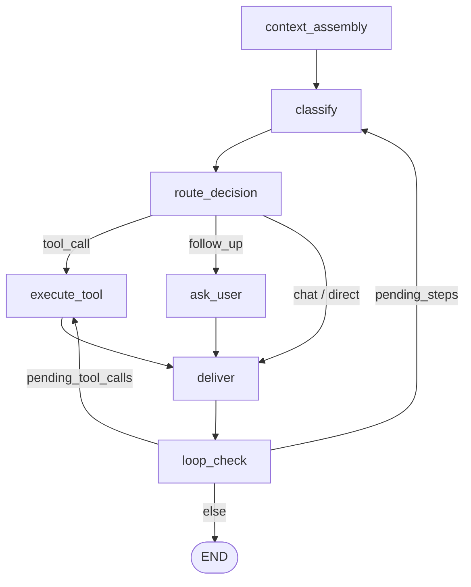

# Pipeline

The Humbl pipeline is a **LangGraph-compatible deterministic router** implemented in pure Dart. No LLM is involved in routing decisions -- nodes and edges are static, testable, and zero token cost. The LM is only invoked inside `ClassifyNode` for intent classification; all other routing is rule-based.

:::info Current State vs Target
The pipeline currently uses a **custom `StateGraph` implementation in pure Dart** (`humbl_core/lib/pipeline/state_graph.dart`) that follows LangGraph's patterns but is not the same class as `langchain_graph`'s `StateGraph`. **SP6 (Pipeline Refactor)** will migrate to using `langchain_graph`'s `StateGraph` directly, gaining channels, checkpointing, and the Pregel execution engine. SP6 is now unblocked after SP7 (LM Gateway) completion.
:::

## Why Deterministic Routing?

The pipeline deliberately separates **routing** (what to do next) from **inference** (understanding the user). This separation has three consequences:

**Zero token cost for routing.** Every conditional edge in the graph is a Dart function that reads `PipelineState` fields and returns the next node name. No LLM tokens are consumed to decide whether to execute a tool, ask a follow-up question, or escalate to cloud. The only LLM invocation in the entire pipeline is `ClassifyNode`, which calls the gateway once per turn for intent classification.

**Testable with mocks.** Because routing is pure Dart, every path through the pipeline can be tested by constructing a `PipelineState` with specific field values and asserting which node executes next. There is no prompt engineering, no temperature randomness, and no "sometimes the model decides differently" in test results. The 18 pipeline tests in the test suite are deterministic and run in milliseconds.

**Swappable inference.** The pipeline knows nothing about how inference works. It calls `ILmGateway.complete()` in `ClassifyNode` and receives structured JSON back. Swap the on-device SLM for a cloud model, mock it for tests, or replace it with a rule-based classifier -- the pipeline code does not change. The only contract is: given an utterance and tool schemas, return intent, tool name, and parameters.

## How It Connects

`PipelineOrchestrator` is the entry point that apps interact with. It is constructed with all its dependencies injected:

- **`ILmGateway`** -- for intent classification in `ClassifyNode`. The gateway handles model selection, failover, and provider routing internally.
- **`ToolRegistry`** -- for tool execution in `ExecuteToolNode`. The registry looks up tools and the `HumblTool.execute()` template enforces all five security gates before calling `tool.runTool()`. Six callback handlers (`BaseCallbackHandler` extensions from `langchain_dart`) fire during tool and LM events.
- **`IMemoryService`** -- for context assembly in `ContextAssemblyNode`. Memory provides relevant T2 key-value facts and T3 semantic vectors to enrich the LM prompt.
- **`ConversationStore`** -- for turn persistence in `DeliverNode`. Each pipeline turn writes the user input and assistant response to the conversation log.
- **`IHardwareResourceManager`** -- for hardware lease acquisition in `ExecuteToolNode`. Tools that need camera, mic, or BLE must acquire a lease before executing.
- **`SystemJournal`** -- for structured logging of every pipeline step with timing and trace IDs.

The orchestrator wires these into a `StateGraph` of `GraphNode`s connected by direct and conditional edges. Once constructed, it exposes two methods: `run()` (returns final state) and `runStream()` (yields state after each node for UI progress indicators).

## StateGraph Engine (Custom — SP6 Will Migrate to langchain_graph)

`StateGraph` is a custom graph execution engine implemented in pure Dart, inspired by LangGraph's state machine pattern. It follows the same concepts (nodes, edges, conditional routing, immutable state) but is a separate implementation from `langchain_graph`'s `StateGraph`.

**Why custom?** The pipeline was built before the `langchain_graph` package existed in Dart. SP6 will migrate to `langchain_graph`'s `StateGraph`, gaining channels (`LastValueChannel`, `BinaryOperatorAggregateChannel`), `BaseCheckpointSaver` for persistence, `GraphRuntime` with Dart Zones, and `ToolNode` / `create_react_agent` prebuilts.

It supports two types of edges:

- **Direct edges** -- unconditional transitions between nodes
- **Conditional edges** -- a function evaluates `PipelineState` and returns the next node name (or `null` for implicit end)

```dart
final graph = StateGraph()
  ..addNode(ContextAssemblyNode(memoryService))
  ..addNode(ClassifyNode(gateway))
  ..addNode(RouteDecisionNode())
  ..addNode(ExecuteToolNode(toolRegistry))
  ..addNode(DeliverNode(memoryService))
  ..addNode(LoopCheckNode())
  ..addEdge(Edge.direct(from: 'context_assembly', to: 'classify'))
  ..addEdge(Edge.conditional(
    from: 'route_decision',
    condition: (s) => switch (s.routeDecision) {
      ExecutionPath.fast => 'execute_tool',
      ExecutionPath.slmLoop => 'ask_user',
      _ => 'execute_tool',
    },
  ))
  ..setEntryPoint('context_assembly')
  ..setMaxSteps(20);
```

Safety features built into the engine:

| Feature | Implementation |
|---------|---------------|
| Loop prevention | `setMaxSteps(20)` -- pipeline aborts if step count exceeded |
| Cooperative cancellation | `CancellationToken` checked before each node |
| Node timeout | Optional `Duration` per-node, throws `TimeoutException` |
| Checkpointing | `onCheckpoint` callback after each node for crash recovery |
| Interrupts | `Stream<PipelineInterrupt>` checked before each node (UserCancel, ExternalEvent, SystemAlert) |

## Graph Topology

The pipeline has **7 nodes** connected in a directed graph:



### Node Responsibilities

| Node | Purpose | Key Logic |
|------|---------|-----------|
| `context_assembly` | Assemble memory context + filter available tools | Queries T2 KV + T3 vectors, filters tools by tier/connectivity/state, builds `availableTools` list |
| `classify` | Intent classification via LM Gateway | Tier 0 (pre-classified) -> Tier 2 (full LM). Sets `intent`, `confidence`, `activeToolName`, `toolParams` |
| `route_decision` | Pick execution path from intent status | Maps `intentStatus` to `ExecutionPath`: fast, slmLoop, cloudLoop, cloudAlways |
| `ask_user` | Generate follow-up question for user | Sets `followUpQuestion` and `outputText` |
| `execute_tool` | Run the identified tool via ToolRegistry | Builds `ToolContext`, calls `tool.execute()`, sets `toolResult` |
| `deliver` | Format output + log to memory | Writes to ConversationStore, logs InteractionLog to T4 |
| `loop_check` | Decide if pipeline should loop or terminate | Checks `pendingSteps` (multi-step) and `pendingToolCalls` (cloud tool chains) |

### Execution Paths

```dart
enum ExecutionPath {
  fast,        // Tool call ready -- execute immediately
  slmLoop,     // Need more info -- ask user, then re-classify
  cloudLoop,   // Cloud LM agentic loop with tool calls
  cloudAlways, // User preference: bypass on-device LM entirely
}
```

## Multi-Step Patterns

The pipeline supports two distinct multi-step patterns, both managed by `LoopCheckNode`:

### Pattern 1: SLM Multi-Step (pendingSteps)

When the on-device SLM determines that a task requires multiple sequential tool calls (e.g., "check the weather and then set a reminder"), it populates `pendingSteps` with a list of remaining actions. After each tool execution and delivery, `LoopCheckNode` checks whether more steps remain. If so, it routes back to `classify` with the next step pre-loaded.

```
User: "Check the weather and set a timer for 10 minutes"
  → classify: intent=tool_call, tool=weather_check, pendingSteps=[{tool: set_timer, params: {minutes: 10}}]
  → execute_tool: weather_check → deliver
  → loop_check: pendingSteps not empty → classify (with next step)
  → classify: Tier 0 (pre-classified from pendingSteps) → execute_tool: set_timer → deliver
  → loop_check: pendingSteps empty → END
```

### Pattern 2: Cloud Tool Chains (pendingToolCalls)

When a cloud LLM handles a complex query, it may return multiple tool calls in a single response. The cloud response populates `pendingToolCalls`. After executing the first tool, `LoopCheckNode` routes directly to `execute_tool` (not back to classify -- the cloud already decided what to call).

```
User: "Find Italian restaurants nearby, pick the highest rated, and navigate there"
  → classify: cloudRequired=true → route_decision: cloudLoop
  → cloud_gateway: returns [search_restaurants, get_directions] as pendingToolCalls
  → execute_tool: search_restaurants → deliver
  → loop_check: pendingToolCalls not empty → execute_tool (next call)
  → execute_tool: get_directions → deliver
  → loop_check: empty → END
```

The distinction matters: `pendingSteps` loops through classify (the SLM re-evaluates each step), while `pendingToolCalls` skips classify (the cloud already planned the sequence).

## PipelineState

An immutable typed state object that flows through every node. Each node reads what it needs and returns a modified copy via `copyWith()`.

The `_absent` sentinel pattern distinguishes "not provided" from "explicitly set to null":

```dart
const _absent = Object();

class PipelineState {
  final String? activeToolName;
  // ...

  PipelineState copyWith({
    Object? activeToolName = _absent,
    // ...
  }) {
    return PipelineState(
      activeToolName: activeToolName == _absent
          ? this.activeToolName
          : activeToolName as String?,
    );
  }
}
```

### Key State Fields

| Category | Fields |
|----------|--------|
| Input | `inputText`, `inputModality` (voice/text/vision/gesture), `sessionId`, `runId` |
| User & Device | `userId`, `tier` (free/standard/plus/ultimate), `device` (battery, network, thermal, glasses) |
| Routing | `routingPolicy`, `routeDecision`, `intent`, `confidence`, `intentStatus` |
| Memory | `memory` (MemoryContext), `conversationHistory`, `availableTools` |
| Tool Execution | `activeToolName`, `toolParams`, `toolResult` |
| Cloud | `cloudRequired`, `cloudMessages`, `cloudResponse`, `pendingToolCalls` |
| Multi-step | `pendingSteps`, `kvSnapshot` |
| Output | `outputText`, `outputModality`, `memoryWritten`, `journalLogged` |
| Graph | `currentNode`, `error`, `statusMessage`, `iterationCount` |
| Confirmation | `needsConfirmation`, `confirmationMessage`, `userConfirmed` |
| Tracing | `traceId`, `startedAt`, `activeModelId`, `activeProviderId`, `tokensUsed` |

## PipelineOrchestrator

The pre-wired pipeline graph. Supports **concurrent runs** -- multiple `run()` / `runStream()` calls are allowed simultaneously because each run has its own `PipelineState` (immutable). Shared dependencies (gateway, tools, resources) are concurrent-safe.

```dart
final orchestrator = PipelineOrchestrator(
  lmGateway: gateway,
  modelRegistry: models,
  toolRegistry: tools,
  journal: journal,
  resourceManager: resources,
  memoryService: memory,
  conversationStore: conversations,
);

// One-shot: returns final state
final result = await orchestrator.run(initialState);

// Streaming: yields state after each node for UI progress
await for (final state in orchestrator.runStream(initialState)) {
  updateUI(state.statusMessage);  // "Classifying intent...", "Executing wifi_scan..."
}
```

## Modularity

The pipeline's modularity is not theoretical -- it is exercised daily in the test suite. Every pipeline test injects a mock `ILmGateway` that returns pre-canned structured JSON responses. The tests verify routing logic, loop limits, multi-step chaining, and error handling without any language model loaded. The same pattern works for any replacement:

- **Mock gateway** -- returns hardcoded JSON for unit tests (current test suite)
- **On-device SLM** -- Qwen3-0.6B via llama.cpp, ~400ms classification
- **Cloud classifier** -- any OpenAI-compatible API via the connector system
- **Rule-based classifier** -- pattern matching for known commands, no LM at all
- **Hybrid** -- try on-device first, fall back to cloud if confidence < threshold

The pipeline does not care. It calls `ILmGateway.complete()`, receives structured JSON, and routes accordingly.

## ClassifyNode Tiers

ClassifyNode uses a tiered classification strategy that skips the LM entirely when possible:

### Tier 0: Pre-classified Input

If `activeToolName` is already set on the state, classification is skipped entirely. This happens when:

- **Scout agents** set `activeToolName` + `intentStatus=complete` before entering the pipeline
- **Device input mappings** (e.g., glasses button press -> specific tool)
- **EventTriggerManager** dispatches a scheduled event with a known tool

```dart
// Tier 0 check in ClassifyNode.process()
if (state.activeToolName != null &&
    state.activeToolName!.isNotEmpty &&
    state.activeToolName != 'direct_response') {
  return state.copyWith(
    intentStatus: IntentProcessorStatus.complete,
    confidence: 1.0,
  );
}
```

### Tier 2: Full LM Classification

Sends conversation history + current input + available tool schemas to the LM Gateway. The gateway auto-selects the best available model (on-device first, cloud fallback). Parses the response into intent, tool name, and parameters.

The LM receives tool schemas via `state.availableTools` so it knows which tools exist and their parameter formats:

```dart
final request = LmGatewayRequest(
  messages: [...state.conversationHistory, {'role': 'user', 'content': state.inputText}],
  tools: state.availableTools.isNotEmpty ? state.availableTools : null,
  category: QueryCategory.intentClassification,
  userId: state.userId,
  tier: state.tier.name,
);
final response = await _gateway.complete(request);
```

## Scout Agents

Scout agents are lightweight task executors that bypass classification entirely. They set the pipeline state before entering:

```dart
// Scout agent pre-sets state for direct tool execution
final state = PipelineState(
  inputText: 'Check weather',
  activeToolName: 'weather_check',
  toolParams: {'location': 'current'},
  intentStatus: IntentProcessorStatus.complete,
  // ... other required fields
);
// ClassifyNode sees activeToolName set -> Tier 0 -> skip LM
final result = await orchestrator.run(state);
```

This makes scout agents zero-cost from an inference perspective -- they consume no LM tokens.

## Error Handling

Every node execution is wrapped in try/catch. Errors are stored in `PipelineState.error` with:

- `node` -- which node failed
- `message` -- human-readable error description
- `recoverable` -- whether the pipeline can be retried

```dart
class PipelineError {
  final String node;
  final String message;
  final bool recoverable;
}
```

The interrupt system provides three priority levels:

| Interrupt Type | Behavior |
|---------------|----------|
| `UserCancel` | Immediate abort, recoverable |
| `ExternalEvent(critical)` | Immediate abort, not recoverable |
| `ExternalEvent(high)` | Immediate abort, recoverable |
| `ExternalEvent(low/medium)`, `NodeTimeout`, `SystemAlert(non-abort)` | Logged but does not stop pipeline |

## Source Files

| File | Purpose |
|------|---------|
| `humbl_core/lib/pipeline/state_graph.dart` | Generic graph engine |
| `humbl_core/lib/pipeline/pipeline_state.dart` | Immutable state + enums |
| `humbl_core/lib/pipeline/pipeline_orchestrator.dart` | Pre-wired graph with all nodes |
| `humbl_core/lib/pipeline/graph_node.dart` | Abstract `GraphNode` base |
| `humbl_core/lib/pipeline/nodes/` | All 7 node implementations |
| `humbl_core/lib/pipeline/models/` | CancellationToken, PipelineInterrupt, PipelineCheckpoint |
