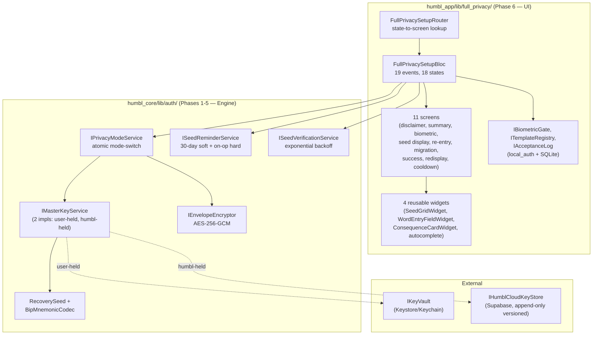

# Privacy & Encryption — Dual-Mode Architecture

Humbl encrypts every user's PII envelope before persisting it anywhere a Humbl server can see. The architecture mirrors **Apple iCloud + Advanced Data Protection (ADP)**: encryption is always on, and users only choose **who holds the key**.

| Mode | Key holder | Default? | Recoverable? | Warrant response |
|---|---|---|---|---|
| **Limited Privacy** | Humbl (Supabase `user_encryption_keys` table) | Yes — every user starts here | Automatic on reinstall | Plaintext PII (audit-logged + lawful-process review) |
| **Full Privacy** | User (OS Keystore + 24-word BIP-39 seed) | Opt-in via Settings | Only via user's seed | Encrypted blobs + metadata only |

The key insight: **encryption cannot be opted out of**. Users only choose between Limited Privacy (Humbl-held key, recoverable) and Full Privacy (user-held key, zero-knowledge). Non-PII bio data (age, gender, activity tier) stays cleartext in both modes per the existing product-identity stance.

This subsystem is implemented as **Task 11 Phases 1–6** across `humbl_core/lib/auth/` (engine) and `humbl_app/lib/full_privacy/` (UI). All six phases are shipped and tested as of 2026-04-28.

## Architectural Layers



The engine layer (`humbl_core/lib/auth/`) is pure Dart and Flutter-free; the UI layer (`humbl_app/lib/full_privacy/`) is the BLoC + screens that drive the mode-switch flow.

## Phase 1–2: Foundation

**Files:** `humbl_core/lib/auth/{privacy_mode.dart, i_privacy_mode_service.dart, i_master_key_service.dart, i_envelope_encryptor.dart, recovery_seed.dart, bip_mnemonic_codec.dart, user_held_key_service.dart, aes_gcm_envelope_encryptor.dart}`

The foundation defines the interface contracts and ships the first concrete crypto:

- **`PrivacyMode`** enum — `limited` and `full`
- **`IPrivacyModeService`** — abstract contract for mode lookup + atomic switching
- **`IMasterKeyService`** — abstract contract for fetching, generating, and rotating the 32-byte master key (two implementations: `UserHeldKeyService` and `HumblHeldKeyService`)
- **`IEnvelopeEncryptor`** — abstract contract for encrypt/decrypt of arbitrary byte payloads with metadata-pinned `key_source` + `key_id` + `key_version`
- **`RecoverySeed`** value class — 24 BIP-39 words + the 32-byte master key they encode, with `clear()` for in-place zeroing
- **`BipMnemonicCodec`** — pure synchronous BIP-39 codec with SHA-256 checksum, backed by the canonical 2,048-word English wordlist
- **`UserHeldKeyService`** — generates a 32-byte key, stores in `IKeyVault` (Keystore/Keychain), exports/imports/verifies 24-word seeds
- **`AesGcmEnvelopeEncryptor`** — AES-256-GCM via `package:cryptography`. Wire format: `[12-byte nonce][ciphertext][16-byte tag]`. Metadata: `alg`, `key_source`, `key_id`, `key_version`

## Phase 3 & 3.5: Cloud-Held Keys with Versioning

**Files:** `humbl_core/lib/auth/{humbl_held_key_service.dart, i_humbl_cloud_key_store.dart, humbl_cloud_key.dart}`

Limited Privacy users have their key on Humbl's servers. The `HumblHeldKeyService` fetches it on first launch, caches it for the session, and invalidates the cache on logout / rotation / mode-switch. The `IHumblCloudKeyStore` interface is **append-only and versioned** — every rotation creates a new row at version `N+1`; old versions are retained so existing envelopes can still decrypt during background re-encryption. This was added in Phase 3.5 to resolve the Phase 4 failure mode F6 (cloud rotation mid-migration).

The Supabase concrete (`SupabaseCloudKeyStore`) lives in `humbl_app/services/humbl/` (queued in the ready queue).

## Phase 4: PrivacyModeService — Atomic Mode-Switch

**Files:** `humbl_core/lib/auth/{privacy_mode_service.dart, i_privacy_migration_journal.dart, i_migration_safety_coordinator.dart, migration_journal_entry.dart, migration_precheck.dart, privacy_mode_errors.dart}`

The keystone of the whole subsystem: switching from Limited Privacy to Full Privacy requires re-encrypting **every existing PII envelope** under the new key. This is an atomic operation that must survive crashes mid-migration.

### switchMode lifecycle

```
precheck (battery, disk, memory)
    ↓
generate user-held key (UserHeldKeyService)
    ↓
seed callback (UI presents seed + waits for re-entry)
    ↓
journal write ←── COMMIT BOUNDARY: after this, mode is committed
    ↓
sync lock (IMigrationSafetyCoordinator pauses voice / agents / sync)
    ↓
rekey loop (per-envelope checkpoint; resumable across crashes)
    ↓
finalize (delete journal, emit completion progress, markVerified hook)
```

### Critical invariants enforced by Phase 4

- Crash before journal write → orphan-key sweep on next `currentMode()` / `switchMode()` call
- Crash after journal write → resume from the last checkpoint on next `initialize()`
- `pauseAll()` failures restore via `resumeAll()` to avoid permanently locked subsystems
- Cloud rotation during migration → `getMasterKeyForVersion(N)` routes envelopes to their pinned historical key
- **9 critical invariants** total, all preserved across Phase 4's 182+ auth tests

### Migration progress observability

`Stream<PrivacyMigrationProgress>` emits `(fraction, status, envelopesMigrated, envelopesTotal)` for the UI to bind to. Phase 6's `MigrationModalScreen` subscribes to this stream.

## Phase 5: Reminder + Verification Infrastructure

**Files:** `humbl_core/lib/auth/{seed_reminder_service.dart, seed_verification_service.dart, reminder_message_generator.dart, reminder_templates.dart, seed_security_state.dart, sensitive_op.dart}`

Full Privacy users hold the only copy of their key. To minimize the risk of seed loss, Humbl runs a **two-cadence reminder system**:

- **Soft reminder (30-day cadence)**: every 30 days, surface a banner asking "do you still have your seed?" Tap-to-dismiss snoozes for 7 days.
- **Hard verify (on-sensitive-op)**: 4 sensitive operations (`deleteAccount`, `exportData`, `redisplaySeed`, `connectCloudProvider`) require the user to re-enter their full 24-word seed. Wrong words trigger exponential backoff (`1s × 5^(N-1)`, capped at `5^13 ≈ 38 years` to prevent overflow), persisted across app restarts.

The two services share `ISeedSecurityStateStore` (which tracks `lastVerifiedAt`, `snoozeUntilAt`, `failureCount`, `lastFailedAt`) and coordinate via:

- A successful Limited→Full migration counts as verification (`PrivacyModeService._finalize` calls `markVerified` automatically)
- During a pending mode-switch, no soft reminders fire (`hasPendingMigration` short-circuits)

### Hybrid copy generation

Standard 30/60/90-day reminders use static templates. The hard-verify intro uses an LM gateway (when available) to generate context-aware copy ("you have 240 memories and 17 journals depending on this seed"), with a graceful template fallback on null/empty/error.

## Phase 6: Onboarding UX

**Files:** `humbl_app/lib/full_privacy/`

The Flutter UI surface. Decision-locked architecture (Q1–Q8 + D1–D2 from the Phase 6 design spec):

- **Q1: Hybrid entry point** — brief explainer tile at first-launch onboarding (already wired to the Glasses choice page) + full opt-in flow lives in Settings → Privacy & Encryption
- **Q2: Wizard then summary** — 4-screen disclaimer wizard (one consequence per screen) + final summary with checkbox-per-consequence + single "I understand" commit button
- **Q3: Maximum-protection seed display** — 4×6 numbered grid + tap-to-reveal blur + Android `FLAG_SECURE` / iOS screencap-block + no copy-to-clipboard + 30-second anti-rush gate
- **Q4: One-word-at-a-time re-entry wizard** — single-cell input with BIP-39 autocomplete chips, back-navigation preserves entries, paste-on-cell-1 distributes to all 24
- **Q5: Memory-only resume with 10-min timeout** — seed lives in volatile memory only; OS-kill, explicit cancel, or timeout zeros the seed
- **Q6: Migration modal with 30-second background-opt-in gate** — user can elect to background the migration after the gate, push notification on completion
- **Q7: Educational success recap** — 4-bullet "What changed" + checkmark animation
- **Q8: Hard-verify gated redisplay** — Phase 5 hard-verify modal → 1-screen reminder → biometric/PIN gate → seed display
- **D1: Template-driven copy** — versioned templates with append-only `IAcceptanceLog` audit log
- **D2: Biometric/PIN reveal gate** — required before any seed un-blur (hard prerequisite via `local_auth`)

### Module composition

```
humbl_app/lib/full_privacy/
├── bloc/        FullPrivacySetupBloc + events + states + setup mode
├── router/      FullPrivacySetupRouter (state-to-screen widget)
├── screens/     11 screens (DisclaimerWizard, SummaryConfirm, BiometricPrompt,
│                SeedDisplay, ReentryWizard, ReentryFailed, MigrationModal,
│                MigrationError, Success, RedisplayReminder, Cooldown)
├── widgets/     4 reusable widgets (SeedGridWidget, WordEntryFieldWidget,
│                ConsequenceCardWidget, Bip39WordlistAutocomplete)
├── copy/        ITemplateRegistry + StaticTemplateRegistry + TemplatesV1En
├── audit/       IAcceptanceLog + SqliteAcceptanceLog (append-only)
├── auth/        IBiometricGate + LocalAuthBiometricGate
└── full_privacy.dart   (barrel export)
```

## Critical Invariants — The Sixteen Tests

The Phase 6 BLoC enforces 16 named critical invariants — each is a dedicated test in `humbl_app/test/full_privacy/bloc/full_privacy_setup_bloc_invariants_test.dart`:

| # | Invariant |
|---|---|
| INV-1 | Seed bytes zeroed after `Cancel` from any seed-holding state |
| INV-2 | Seed bytes zeroed after 10-minute `TimeoutElapsed` |
| INV-3 | Seed bytes zeroed after `SubmitReentry` (post Phase 4 commit) |
| INV-4 | Seed bytes zeroed when `BLoC.close()` runs while holding a seed |
| INV-5 | Seed bytes zeroed after `MigrationFailed` |
| INV-6 | `BiometricGate.authenticate` called BEFORE the un-blurred seed state can be entered (opt-in) |
| INV-7 | `BiometricGate.authenticate` called BEFORE the un-blurred seed state can be entered (redisplay) |
| INV-8 | `acceptanceLog.recordAcceptance` called EXACTLY ONCE per opt-in attempt and BEFORE `IPrivacyModeService.switchMode` |
| INV-9 | The 30-second anti-rush gate cannot be bypassed (button disabled) |
| INV-10 | Re-entry validates against the in-memory seed, not any persisted value |
| INV-11 | Phase 4 callback returns `false` on abort (no journal written) |
| INV-12 | Phase 4 callback returns `true` on re-entry success |
| INV-13 | `migrationProgress` subscription cancelled on `MigrationCompleted` and on `BLoC.close()` |
| INV-14 | Redisplay flow does NOT call `IPrivacyModeService.switchMode` |
| INV-15 | If `BiometricGate.checkAvailability == none`, "Switch to Full Privacy" tile disabled |
| INV-16 | After `BackgroundOptIn`, the BLoC keeps subscribing to `migrationProgress` until completion |

These are non-negotiable: every change to the BLoC must keep all 16 named tests green.

## Current Wiring Status (2026-04-28)

| Layer | Status |
|---|---|
| Phase 1–5 humbl_core engine (interfaces + concrete services + tests) | ✅ Shipped, ~235 auth tests pass |
| Phase 6 humbl_app/lib/full_privacy/ (BLoC + screens + router) | ✅ Shipped, 120 humbl_app tests pass, all 16 INV tests green |
| Settings → Privacy & Encryption tile UI | ✅ Visible (Settings group renders) |
| Onboarding Full Privacy explainer tile | ✅ Visible on the Glasses choice page (Step 4) |
| Settings tile deep-link to `FullPrivacySetupRouter` | ⏳ Stubbed with SnackBar — gated on Phase 4 humbl_app service wiring |
| `IPrivacyModePersistence` (IKeyVault-backed) concrete | ⏳ Pending humbl_app wiring task |
| `IPrivacyMigrationJournal` (SQLite-backed) concrete | ⏳ Pending humbl_app wiring task |
| `IMigrationSafetyCoordinator` concrete | ⏳ Pending humbl_app wiring task |
| `SupabaseCloudKeyStore` concrete | ⏳ Pending humbl_app wiring task |
| `ISeedSecurityStateStore` concrete (durable) | ⏳ Pending humbl_app wiring task |
| Android `FLAG_SECURE` + iOS screen-capture detection | ⏳ Pending native task (deferred from Phase 6 spec §M1+M2) |
| Phase 5 reminder banner / push notification UI | ⏳ Phase 6.5 follow-up |
| 5 end-to-end integration tests | ⏳ Phase 6.5 follow-up (depends on wiring) |

## Test Coverage

- **humbl_core auth:** ~235 tests (phases 1-5)
- **humbl_app full_privacy:** 120 tests (4 skeleton + 21 state machine + 9 redisplay + 14 invariants + 4 lifecycle + 13 widgets + 25 screens + 5 router + 16 INV-named + others)
- **All 16 critical invariants** are named tests with dedicated assertions

## Source Files

| File | Responsibility |
|---|---|
| `humbl_core/lib/auth/i_privacy_mode_service.dart` | Mode-switch contract |
| `humbl_core/lib/auth/privacy_mode_service.dart` | Atomic switchMode impl + journal-backed migration |
| `humbl_core/lib/auth/i_master_key_service.dart` | Master key contract (versioned) |
| `humbl_core/lib/auth/user_held_key_service.dart` | User-held concrete (Keystore-backed) |
| `humbl_core/lib/auth/humbl_held_key_service.dart` | Humbl-held concrete (cloud-backed) |
| `humbl_core/lib/auth/i_humbl_cloud_key_store.dart` | Append-only versioned cloud key store |
| `humbl_core/lib/auth/aes_gcm_envelope_encryptor.dart` | AES-256-GCM impl |
| `humbl_core/lib/auth/recovery_seed.dart` | 24-word seed value class with clear() |
| `humbl_core/lib/auth/bip_mnemonic_codec.dart` | BIP-39 codec |
| `humbl_core/lib/auth/seed_reminder_service.dart` | 30-day soft reminder (Phase 5) |
| `humbl_core/lib/auth/seed_verification_service.dart` | Hard-verify with exp backoff (Phase 5) |
| `humbl_core/lib/auth/reminder_message_generator.dart` | Hybrid LM + template copy (Phase 5) |
| `humbl_app/lib/full_privacy/bloc/full_privacy_setup_bloc.dart` | Phase 6 state machine |
| `humbl_app/lib/full_privacy/router/full_privacy_setup_router.dart` | State-to-screen routing |
| `humbl_app/lib/full_privacy/screens/*.dart` | 11 screens |
| `humbl_app/lib/full_privacy/widgets/*.dart` | 4 reusable widgets |
| `humbl_app/lib/full_privacy/copy/*.dart` | Template registry + v1 English copy |
| `humbl_app/lib/full_privacy/audit/*.dart` | Append-only acceptance log (SQLite) |
| `humbl_app/lib/full_privacy/auth/*.dart` | local_auth biometric/PIN gate |

## Specs and Plans

- Phase 4 spec/plan: `docs/superpowers/plans/2026-04-24-task-11-phase-4-privacy-mode-service.md`
- Phase 5 spec: `docs/superpowers/specs/2026-04-27-task-11-phase-5-reminder-verification-design.md`
- Phase 5 plan: `docs/superpowers/plans/2026-04-27-task-11-phase-5-reminder-verification.md`
- Phase 6 spec: `docs/superpowers/specs/2026-04-27-task-11-phase-6-onboarding-ux-design.md`
- Phase 6 plan: `docs/superpowers/plans/2026-04-27-task-11-phase-6-onboarding-ux.md`

## Decision Memory

The dual-mode architecture replaced an earlier "single-mode zero-knowledge" design (decided 2026-04-21 → revised 2026-04-23 to dual-mode) after Apple's iCloud + ADP precedent showed how to give users zero-knowledge as an opt-in without forcing it on the mainstream funnel.
