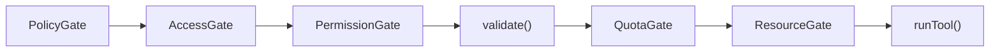

# Security & Access Control

Humbl uses a **five-gate security model** that controls who can invoke tools, what state they must be in, what resources they can access, and whether the user has explicitly permitted the action. Every gate is enforced in `HumblTool`'s `@nonVirtual` template methods -- subclasses cannot bypass them.

## Why Five Gates?

The five-gate model exists because Humbl is an extensible platform. Third-party developers can publish tool bundles (weather, news, productivity, etc.) that run inside the same process as system tools like `emergency_call` and `power_off`. A single security check is not sufficient to handle the variety of threats this creates.

Each gate catches a different class of violation:

- **PolicyGate** catches tools the *user* has disabled. A parent might deny all `shell` group tools. A privacy-conscious user might deny all `communication` tools. This is the user's explicit preference, checked before anything else.
- **AccessGate** catches privilege escalation. A third-party plugin signed at `standard` access must never invoke a `system`-level tool, even if the plugin's tool code tries to override its access level. The `@nonVirtual` `applyGrantedAccess()` method makes this mathematically impossible.
- **PermissionGate** catches runtime state issues. The camera tool requires the camera OS permission. The WiFi tool requires network state access. The GPS tool requires location permission. These are checked at execution time, not just at startup, because the user can revoke permissions between invocations.
- **validate()** catches parameter errors before execution. If the schema says `minutes` is required and the caller omits it, the tool fails fast with a clear error instead of crashing midway through execution.
- **ResourceGate** catches hardware conflicts. Two tools cannot use the camera simultaneously. The lease system ensures exclusive or shared access based on the resource type, with automatic timeout to prevent deadlocks.

No single gate is redundant. Remove PolicyGate and users cannot disable tools. Remove AccessGate and plugins can escalate privileges. Remove PermissionGate and tools crash on missing OS permissions. Remove validate() and tools crash on bad parameters. Remove ResourceGate and tools fight over hardware.

## Five Named Gates

Every tool invocation passes through these gates in order. If any gate denies, the tool returns an error `ToolResult` without executing:



### Dual Enforcement: Gates + Callback Handlers

Gates are enforced in two complementary ways:

1. **`@nonVirtual` template** in `HumblTool.execute()` — enforces gates sequentially before calling `runTool()`. This is the hard enforcement that cannot be bypassed.

2. **Callback handlers** extending `BaseCallbackHandler` from `langchain_dart` — fire during the LangChain callback lifecycle (`onToolStart`, `onToolEnd`, `onToolError`). These provide cross-cutting enforcement and logging:

| Callback Handler | Gate | Fires On |
|-----------------|------|----------|
| `PolicyCallbackHandler` | PolicyGate | `onToolStart` — throws `ToolDeniedException` |
| `AccessControlCallbackHandler` | AccessGate | `onToolStart` — throws `AccessDeniedException` |
| `PermissionCallbackHandler` | PermissionGate | `onToolStart` — validates OS permission state |
| `QuotaCallbackHandler` | QuotaGate | `onToolStart` — throws `QuotaExceededException` |
| `HumblLoggingHandler` | — | All events — structured logging |
| `ToolFilterCallbackHandler` | — | `onToolStart` — keyword-based group filtering |

The callback handlers complement the template gates. The template provides hard enforcement (cannot be bypassed), while callbacks provide observability (logging, metrics) and pre-filtering (tool selection by keyword). Both systems use the same gate logic but serve different purposes.

| Gate | What It Checks | Who Controls It |
|------|---------------|----------------|
| **PolicyGate** | Is this tool allowed by user settings? `ToolPolicy.isAllowed(tool)` | User via settings UI |
| **AccessGate** | Does the caller have sufficient privilege? `AccessControl.canAccess(callerAccess, tool.accessLevel)` | System -- based on caller type and bundle grants |
| **PermissionGate** | Is the tool in `ToolState.ready`? Does `canExecute(ctx)` pass? (OS permissions, tier, connectivity, glasses) | OS permissions + device state |
| **validate()** | Do params match the JSON Schema? Required fields present? Types correct? | Tool author defines schema |
| **QuotaGate** | Does the user have remaining quota for this tool? | Subscription tier + credit balance |
| **ResourceGate** | Can hardware resources be leased? (camera, mic, BLE, GPS, etc.) | `HardwareResourceManager` lease state |

## How Gates Connect

The gate enforcement is distributed across three systems that cooperate:

1. **At registration time** -- `ToolRegistry.registerBundle()` calls `applyGrantedAccess()` on each tool to cap its effective access level. A third-party bundle registered with `grantedAccess: AccessLevel.standard` will have all its tools' effective access levels capped at `standard`, regardless of what the tools declare.

2. **At execution time** -- `HumblTool.execute()` (the `@nonVirtual` template) runs all five gates sequentially. This is where the actual enforcement happens. The template is not overridable, not bypassable, and not optional.

3. **At resource acquisition time** -- `HardwareResourceManager.acquire()` checks that the caller's granted access level meets the resource's policy requirements. A `restricted` caller cannot acquire `exclusive` camera access even if it passes the other gates.

## AccessLevel Hierarchy

Six privilege levels, highest to lowest:

```dart
enum AccessLevel { system, core, confidential, trusted, standard, restricted }
```

Numeric privilege values (lower = higher privilege):

| Level | Value | Who Has It | Example Tools |
|-------|-------|-----------|---------------|
| `system` | 0 | Emergency/firmware tools only | `emergency_call`, `firmware_update` |
| `core` | 1 | Pipeline, SLM processor | `memory_store`, `model_load` |
| `confidential` | 2 | Biometric, encrypted data tools | `voice_fingerprint`, `decrypt_data` |
| `trusted` | 3 | User-initiated actions (default) | `take_photo`, `set_timer`, `wifi_scan` |
| `standard` | 4 | Third-party plugins | `weather_check`, `news_fetch` |
| `restricted` | 5 | Untrusted/sandboxed plugins | Read-only query tools |

Access check: a caller at level N can invoke tools at level N or below (numerically equal or higher):

```dart
static bool canAccess(AccessLevel callerLevel, AccessLevel toolLevel) {
  return privilegeOf(callerLevel) <= privilegeOf(toolLevel);
}
```

Default caller access levels:

```dart
static AccessLevel resolveCallerAccess(CallerType caller) => switch (caller) {
  CallerType.pipeline => AccessLevel.core,
  CallerType.slm      => AccessLevel.core,
  CallerType.user     => AccessLevel.trusted,
  CallerType.plugin   => AccessLevel.restricted,  // overridden by bundle grant
};
```

## Declared vs Effective Access Level

The `declaredAccessLevel` pattern is the core mechanism that prevents privilege escalation. It works through a deliberate asymmetry:

```
declaredAccessLevel (tool author sets, immutable, overridable)
       |
       v
applyGrantedAccess() caps it (@nonVirtual, can only go DOWN)
       |
       v
accessLevel (effective, what AccessGate checks)
```

The key property: `applyGrantedAccess()` can only *lower* the effective access level, never raise it. If a tool declares `AccessLevel.system` but the bundle grants `AccessLevel.standard`, the effective level becomes `standard`. If a tool declares `AccessLevel.standard` and the bundle grants `AccessLevel.system`, the effective level stays `standard` -- the grant cannot elevate beyond what the tool declared.

```dart
// Tool author declares intent
class EmergencyCallTool extends HumblTool {
  @override
  AccessLevel get declaredAccessLevel => AccessLevel.system;
}

// registerBundle() caps all tools to the granted level
registry.registerBundle(
  'third_party_safety',
  [EmergencyCallTool()],
  grantedAccess: AccessLevel.standard,  // Tool's effective level becomes standard
);
```

`applyGrantedAccess()` is `@nonVirtual` -- tools cannot override it:

```dart
@nonVirtual
void applyGrantedAccess(AccessLevel granted) {
  final grantedPriv = AccessControl.privilegeOf(granted);
  final effectivePriv = AccessControl.privilegeOf(_effectiveAccessLevel);
  if (grantedPriv > effectivePriv) {
    _effectiveAccessLevel = granted;  // Can only restrict, never elevate
  }
}
```

This means a malicious third-party tool that declares `declaredAccessLevel => AccessLevel.system` and tries to override `applyGrantedAccess()` will fail at compile time (Dart enforces `@nonVirtual`). The effective access level will be capped to whatever the bundle registration grants.

## ToolState

Every tool has a readiness state managed by `ToolStateManager`:

```dart
enum ToolState {
  ready,                  // All gates pass, tool can execute
  initializing,           // Startup probe in progress
  notSupported,           // Platform doesn't support this tool
  notAvailable,           // Temporarily unavailable (hardware disconnected)
  permissionNotGranted,   // OS permission denied
  error,                  // Unexpected failure (stateError has details)
}
```

`ToolStateManager` runs at startup and probes each tool's requirements:

1. Check `requiredResources` against OS permissions via `IPermissionService`
2. Check platform support (e.g., no telephony on desktop)
3. Check connectivity requirements against device state
4. Set `ToolState` accordingly

```dart
// PermissionGate in the execute() template
if (state != ToolState.ready) {
  return ToolResult(success: false, error: 'Tool not ready: ${state.name}');
}
if (!canExecute(ctx)) {
  return ToolResult(success: false, error: 'Cannot execute in this context');
}
```

`canExecute()` performs runtime checks:

```dart
bool canExecute(ToolContext context) {
  if (_state != ToolState.ready) return false;
  if (!availableTiers.contains(context.tier)) return false;
  if (!context.device.meetsConnectivity(connectivity)) return false;
  if (requiredResources.contains(ResourceType.ble) &&
      !context.device.hasGlassesConnected) return false;
  return true;
}
```

## IPermissionService

Platform-specific permission handling with two implementations:

| Platform | Implementation | Behavior |
|----------|---------------|----------|
| Android / iOS | `MobilePermissionService` | Wraps `permission_handler` package, prompts user for OS permissions |
| Windows / macOS / Linux | `DesktopPermissionService` | Auto-grants all permissions (desktop apps have implicit access) |

```dart
static IPermissionService permissions() {
  if (Platform.isAndroid || Platform.isIOS) return MobilePermissionService();
  return DesktopPermissionService();
}
```

## Confirmation System

Tools that perform destructive or sensitive actions require explicit user confirmation. The confirmation system is **decoupled from the tool execution flow** -- the SLM cannot bypass it. This is a critical security property: the language model can request a tool call, but it cannot confirm the action on behalf of the user.

### Why Confirmation Levels?

Not all sensitive actions are equally sensitive. Toggling WiFi is mildly consequential -- the wrong toggle is easily reversed. Sending a payment is highly consequential -- the wrong payment may not be reversible. Emergency calls are critically consequential -- a false emergency call has legal implications. The three confirmation levels match these severity tiers to appropriate verification methods.

### Confirmation Levels

```dart
enum ConfirmationLevel {
  normal,    // Any method: voice "yes", head nod, tap, button, notification, UI dialog
  elevated,  // Identity required: voice fingerprint OR platform biometric
  critical,  // Platform biometric only: Face ID, fingerprint, iris
}
```

### Confirmation Methods

Eight input methods, each accepted at specific levels:

| Method | Normal | Elevated | Critical |
|--------|--------|----------|----------|
| `voiceCommand` (spoken "yes"/"no") | Yes | -- | -- |
| `headGesture` (nod/shake via glasses IMU) | Yes | -- | -- |
| `glassesTap` (touchpad) | Yes | -- | -- |
| `glassesButton` (physical button) | Yes | -- | -- |
| `notificationAction` (OS notification buttons) | Yes | -- | -- |
| `uiDialog` (in-app dialog) | Yes | -- | -- |
| `voiceFingerprint` (speaker verification) | Yes | Yes | -- |
| `platformBiometric` (Face ID, Touch ID, etc.) | Yes | Yes | Yes |

### Confirmation Escalation Examples

| Tool | Confirmation Level | Accepted Methods | Rationale |
|------|--------------------|------------------|-----------|
| `wifi_toggle` | none | N/A | Easily reversible, low risk |
| `send_sms` | normal | Voice "yes", nod, tap, button | Moderate consequence, quick confirmation |
| `make_call` | normal | Voice "yes", nod, tap, button | Moderate consequence |
| `send_payment` | elevated | Voice fingerprint, biometric | Financial transaction, identity verification |
| `emergency_call` | critical | Face ID, fingerprint only | Legal implications, must verify identity |
| `factory_reset` | critical | Face ID, fingerprint only | Irreversible data loss |

### Confirmation Flow

Tools declare their required level:

```dart
class MakeCallTool extends HumblTool {
  @override
  ConfirmationLevel? get confirmationLevel => ConfirmationLevel.normal;
}

class SendPaymentTool extends HumblTool {
  @override
  ConfirmationLevel? get confirmationLevel => ConfirmationLevel.critical;
}
```

When a tool returns `ToolResult.confirmationRequired`, the pipeline pauses and delegates to the app layer. The `userConfirmed` field on `ToolContext` is set by the pipeline/UI layer -- never by the tool or the SLM:

```dart
/// Set to true by the pipeline/UI layer after the user explicitly confirms.
/// Tools MUST NOT read confirmation from their own params -- use this field
/// instead so the SLM cannot bypass the human-in-the-loop gate.
final bool userConfirmed;
```

### Confirmation Result

```dart
class ConfirmationResult {
  final ConfirmationOutcome outcome;  // confirmed, denied, timeout, cancelled, error
  final ConfirmationMethod? method;   // which method the user used
  final bool identityVerified;        // voiceprint match or biometric
  final double? voiceConfidence;      // 0.0-1.0 for voice fingerprint
  final Duration? responseTime;       // how long the user took
}
```

## Confidential Logging

Sensitive operations are logged through `ILogEncryptor` -- plaintext is never stored at rest:

- Tool calls marked as confidential encrypt their parameters before journaling
- T4 audit log entries with sensitive data use the encryption layer
- Decryption requires explicit key access (not available to the LM or plugins)

This ensures that even if the device is compromised, the journal does not leak sensitive tool parameters (phone numbers, message content, payment details).

## Source Files

| File | Purpose |
|------|---------|
| `humbl_core/lib/permissions/access_control.dart` | `AccessControl.canAccess()`, privilege values |
| `humbl_core/lib/permissions/i_permission_service.dart` | OS permission interface |
| `humbl_core/lib/permissions/mobile_permission_service.dart` | Android/iOS permission handling |
| `humbl_core/lib/permissions/desktop_permission_service.dart` | Desktop auto-grant |
| `humbl_core/lib/tools/humbl_tool.dart` | Gate enforcement templates |
| `humbl_core/lib/tools/models.dart` | AccessLevel, ToolState, ToolContext enums |
| `humbl_core/lib/tools/tool_policy.dart` | User-controlled deny/allow policy |
| `humbl_core/lib/confirmation/confirmation_models.dart` | ConfirmationLevel, ConfirmationMethod, ConfirmationResult |
