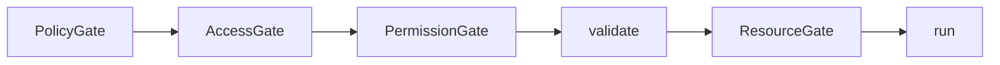

# Tool System

Humbl's tool system provides **70+ tools across 16 domain files**, all MCP-compatible. Every tool is self-describing with JSON Schema input/output, so any LLM (local or cloud) can discover and invoke tools via `toMcpSchema()` without Humbl-specific integration.

## Why MCP Compatibility?

The Model Context Protocol (MCP) defines a standard schema format for tools that LLMs can discover and invoke. Humbl adopts this standard for a practical reason: **any LLM that supports MCP tool calling works with Humbl tools without custom integration**.

When the on-device SLM classifies intent, it receives tool schemas in MCP format via `state.availableTools`. When a cloud LLM handles a complex query, it receives the same schemas. When a third-party MCP client connects to Humbl as a tool server, it receives the same schemas. One format, every consumer.

The `x-humbl-*` extension fields carry Humbl-specific metadata (access level, resource requirements, streaming support) that MCP consumers can ignore but Humbl's pipeline uses for gate enforcement and capability filtering.

## How It Connects

`createToolRegistry()` in `register_all.dart` is the bootstrap function. It takes platform manager interfaces as parameters and produces a fully populated `ToolRegistry`:

```dart
ToolRegistry createToolRegistry({
  required ISystemManager system,
  required IWifiManager wifi,
  required IBluetoothManager bluetooth,
  required ICameraManager camera,
  required IMicrophoneManager microphone,
  required IContactsManager contacts,
  required INotificationManager notifications,
  // ... 15+ more manager interfaces
})
```

Each tool receives only the manager interfaces it needs via constructor injection. `WifiScanTool` receives `IWifiManager`. `TakePhotoTool` receives `ICameraManager`. Tools never import concrete implementations and never access managers they do not need.

The pipeline's `ExecuteToolNode` calls `registry.lookup()` to find the tool, then calls `tool.execute()` which enforces all 5 gates in the `@nonVirtual` template before delegating to the tool's `runTool()` method. Six callback handlers (extending `BaseCallbackHandler` from `langchain_dart`) fire events during execution. The full execution flow is:

```
ExecuteToolNode.process(state)
  → registry.lookup(state.activeToolName)
  → Callback handlers fire: onToolStart (Policy, AccessControl, Permission, Quota, Logging, ToolFilter)
  → tool.execute(toolContext, state.toolParams)
    → PolicyGate: ToolPolicy.isAllowed(tool) — user settings deny/allow list
    → AccessGate: AccessControl.canAccess(callerAccess, tool.accessLevel) — privilege check
    → PermissionGate: tool.state == ready && tool.canExecute(ctx) — OS permissions, tier, connectivity
    → validate(): validateAgainst(params, inputSchema) — JSON Schema validation
    → ResourceGate: resourceManager.acquire(requiredResources) — hardware lease
    → runTool(ctx, params) — actual tool logic (subclass override)
    → release leases in finally block
  → Callback handlers fire: onToolEnd or onToolError
```

### LangChain Bridge

Because `HumblTool` extends `BaseTool`, every tool is also a valid LangChain `Runnable`. The `run()` method (from `BaseTool`) bridges to Humbl's gate-enforced `execute()`:

```dart
@override
Future<String> run(dynamic input, {RunnableConfig? config}) async {
  final ctx = ToolContext.fromRunnableConfig(config); // Extract ToolContext
  final params = input is Map<String, dynamic> ? input : {'input': input};
  final result = await execute(ctx, params);
  return result.data?.toString() ?? result.message;
}
```

This means tools work in LCEL chains (`prompt | model | tool`), with `create_react_agent()`, and in any LangChain-compatible pipeline.

## Adding a Tool

Adding a new tool requires three steps and no changes to the pipeline, security system, or platform layer:

1. **Extend HumblTool** -- implement `name`, `description`, `inputSchema`, `outputSchema`, `runTool()`, and declare `groups`, `declaredAccessLevel`, `requiredResources`, and `connectivity`. (Note: `runTool()` replaces the old `run()` to avoid conflicts with `BaseTool.run()` from `langchain_dart`.)
2. **Add to a domain factory** -- add the tool to the appropriate factory function in `tools/domains/`. For example, a new WiFi tool goes in `connectivity_tools.dart`.
3. **Register** -- the domain factory is called by `createToolRegistry()` which passes the relevant manager interfaces.

Tools depend only on `I`-prefix interfaces, never concrete implementations. A `WifiScanTool` that calls `IWifiManager.scan()` works identically whether the manager is `AndroidWifiManager`, `DesktopWifiManager`, or a mock in tests.

## HumblTool Base Class

Every tool extends `HumblTool`, which itself extends `BaseTool` from `langchain_dart`. This means every Humbl tool is a valid LangChain tool — it can be used in LCEL chains, passed to `create_react_agent()`, and discovered by any LangChain-compatible system.

`HumblTool` adds the five-gate security template, MCP schema export, streaming, and hardware resource leasing on top of `BaseTool`'s identity and invocation interface:

```dart
abstract class HumblTool extends BaseTool {
  // Identity
  String get name;
  String get description;

  // Capability flags (opt-in)
  bool get supportsOneShot => false;
  bool get supportsStream => false;

  // Groups (replaces ToolDomain)
  Set<ToolGroup> get groups => {};

  // Access control
  AccessLevel get declaredAccessLevel => AccessLevel.trusted;

  // Schemas
  Map<String, dynamic> get inputSchema;
  Map<String, dynamic> get outputSchema;

  // Metadata
  ToolPriority get priority;
  Set<ResourceType> get requiredResources;
  ConnectivityRequirement get connectivity => ConnectivityRequirement.offline;
  Set<UserTier> get availableTiers;

  // Confirmation
  ConfirmationLevel? get confirmationLevel => null;
}
```

### ToolGroup Enum

Tools belong to **multiple groups** for capability-based discovery and filtering. The 22 groups replace the old single-domain model:

```dart
enum ToolGroup {
  // Hardware resources
  mic, camera, speaker, sensor, display, bluetooth, wifi, location, nfc,
  // Functional groups
  capture, media, communication, file, web, shell, contacts,
  // System groups
  system, runtime, memory, pipeline, agent, mcp,
  // AI & automation
  ai, automation,
}
```

A single tool can belong to several groups. For example, a "capture photo with AI description" tool belongs to `{camera, capture, ai}`. This multi-group model enables flexible filtering: the LM can request "all camera tools" or "all AI tools that also use the camera" with a single query.

## Gate Enforcement Template

Both `execute()` and `executeStream()` are `@nonVirtual` template methods. Subclasses never override them -- they override `run()` and `runStream()` instead. The template enforces all five gates in order:



### Gate Details

| Gate | Check | Failure Result |
|------|-------|---------------|
| **PolicyGate** | `ToolPolicy.isAllowed(this)` -- user settings can deny/allow specific tools or groups | `"$name is disabled by user policy"` |
| **AccessGate** | `AccessControl.canAccess(callerAccess, accessLevel)` -- caller privilege vs tool's effective access level | `"Access denied"` |
| **PermissionGate** | `state != ToolState.ready` or `canExecute(ctx)` returns false -- checks OS permissions, tier, connectivity | `"Tool not ready"` or `"Cannot execute in this context"` |
| **validate()** | `validateAgainst(params, schema)` -- checks required fields, unknown fields, type correctness against JSON Schema | `"Missing required params: ..."` or `"Unknown param: ..."` |
| **ResourceGate** | `resourceManager.acquire()` for each `requiredResources` -- hardware lease acquisition | `"Resource acquisition failed: ..."` |

The `@nonVirtual` annotation is the enforcement mechanism. Dart's `@nonVirtual` means subclasses cannot override these methods. A third-party tool author cannot skip the policy check, cannot bypass the access gate, and cannot avoid resource leasing. The template is the law.

### One-shot Execution

```dart
@nonVirtual
Future<ToolResult> execute(ToolContext ctx, Map<String, dynamic> params) async {
  if (!supportsOneShot) return ToolResult.notSupported('...');
  final denied = _checkGates(ctx, params, inputSchema);
  if (denied != null) return denied;

  // Gate 3: Acquire resource leases
  final leases = <ResourceLease>[];
  for (final resource in requiredResources) {
    leases.add(await ctx.resourceManager!.acquire(resource, ...));
  }

  try {
    final result = await run(ctx, params).timeout(executionTimeout);
    return ToolResult(success: result.success, data: result.data, ...);
  } finally {
    for (final lease in leases) {
      await ctx.resourceManager!.release(lease.leaseId);
    }
  }
}
```

### Stream Execution

The streaming template uses a `StreamController` wrapper with lease-on-listen and idle timeout:

```dart
@nonVirtual
Stream<ToolStreamEvent> executeStream(ToolContext ctx, Map<String, dynamic> params) {
  final controller = StreamController<ToolStreamEvent>();
  Timer? idleTimer;

  // 5s idle timeout: if no listener attaches, close the stream
  idleTimer = Timer(const Duration(seconds: 5), () {
    if (!controller.hasListener) {
      controller.addError(TimeoutException('No listener within 5s'));
      controller.close();
    }
  });

  controller.onListen = () async {
    idleTimer?.cancel();
    // Acquire leases on first listen
    // Forward runStream() events to controller
    innerSub = runStream(ctx, params).listen(controller.add, ...);
  };

  controller.onCancel = () async {
    // Release leases on cancel
  };

  return controller.stream;
}
```

The lease-on-listen pattern means hardware resources are not acquired until a consumer actually subscribes to the stream. If the stream is created but never listened to (e.g., the UI navigates away), the 5-second idle timer closes it without ever acquiring hardware.

## Sealed ToolStreamData

Stream events carry typed data using sealed classes for compile-time exhaustiveness:

```dart
sealed class ToolStreamData {}

class AudioStreamData extends ToolStreamData {
  final AudioChunk chunk;
}

class VideoStreamData extends ToolStreamData {
  final VideoFrame frame;  // bytes, width, height, encoding, fps, timestamp
}

class SensorStreamData extends ToolStreamData {
  final SensorFrame frame;  // values (axis->double), sensorType, timestamp
}

class LocationStreamData extends ToolStreamData {
  final LocationFrame frame;  // lat, lng, altitude, accuracy, speed, bearing
}

class DownloadProgressData extends ToolStreamData {
  final int bytesReceived;
  final int? totalBytes;
  final double? speedBytesPerSec;
  double? get progressPercent => ...;
}
```

Consumers pattern-match instead of casting:

```dart
stream.listen((event) {
  switch (event.data) {
    case AudioStreamData(:final chunk):
      processAudio(chunk);
    case VideoStreamData(:final frame):
      displayFrame(frame);
    case DownloadProgressData(:final progressPercent):
      updateProgressBar(progressPercent);
    case null:
      // Metadata-only event
  }
});
```

## ToolRegistry

`ToolRegistry` handles registration, discovery, policy enforcement, and change notification. It does **not** execute tools -- that is handled by `HumblTool`'s `@nonVirtual` templates.

### Registration

```dart
final registry = ToolRegistry();

// Single tool registration
registry.register(WifiScanTool(wifiManager));

// Bundle registration with access capping (replaces PluginRegistry)
registry.registerBundle(
  'third_party_weather',
  [WeatherTool(), ForecastTool()],
  grantedAccess: AccessLevel.standard,  // Caps all tools to standard
);
```

`registerBundle()` calls `applyGrantedAccess()` on each tool, which prevents privilege escalation:

```dart
@nonVirtual
void applyGrantedAccess(AccessLevel granted) {
  final grantedPriv = AccessControl.privilegeOf(granted);
  if (grantedPriv > currentPriv) {
    _effectiveAccessLevel = granted;  // Can only go down, never up
  }
}
```

### Lookup and Filtering

```dart
// By name (filtered by policy)
final tool = registry.lookup('wifi_scan');

// By group
final cameraTools = registry.byGroup(ToolGroup.camera);

// By multiple groups (AND intersection)
final aiCameraTools = registry.byGroups({ToolGroup.camera, ToolGroup.ai});

// Available right now (state + connectivity + tier check)
final usable = registry.available(toolContext);

// All registered (unfiltered, for settings UI)
final all = registry.allRegistered;
```

### Change Stream

`ToolRegistry.toolsChanged` emits `ToolChangeEvent`s that `ContextAssemblyNode` subscribes to for rebuilding the LM tool list:

```dart
enum ToolChangeType { added, removed, schemaChanged, policyChanged }

registry.toolsChanged.listen((event) {
  if (event.type == ToolChangeType.schemaChanged) {
    rebuildToolSchemas();
  }
});
```

## ToolPolicy

User-controlled access policy from settings. Three modes with a single list:

```dart
enum ToolPolicyAction { none, deny, allow }

class ToolPolicy {
  final ToolPolicyAction action;
  final Set<String> tools;     // Tool names
  final Set<ToolGroup> groups;  // Tool groups
}
```

| Action | Behavior |
|--------|----------|
| `none` | All tools allowed (default) |
| `deny` | Block tools/groups in the list, allow everything else |
| `allow` | Allow only tools/groups in the list, block everything else |

**Double-gating**: Policy is checked in two places -- `ToolRegistry.lookup()` filters at discovery time, and the `HumblTool.execute()` template rechecks at execution time. This prevents bypass via direct tool reference. Even if code holds a reference to a tool object obtained before a policy change, the execution-time check will deny it.

## ConnectivityRequirement

Each tool declares what network access it needs:

```dart
enum ConnectivityRequirement {
  offline,       // No network needed (default)
  localNetwork,  // WiFi/LAN/BLE (Ollama, LM Studio)
  internet,      // Cloud APIs, web fetch, Supabase sync
}
```

`DeviceState.meetsConnectivity()` evaluates the requirement:

```dart
bool meetsConnectivity(ConnectivityRequirement requirement) => switch (requirement) {
  ConnectivityRequirement.offline => true,
  ConnectivityRequirement.localNetwork => hasLocalNetwork || hasInternet,
  ConnectivityRequirement.internet => hasInternet,
};
```

`ContextAssemblyNode` uses connectivity requirements to filter `availableTools` before sending schemas to the LM. If the device is offline, internet-requiring tools are excluded from the schema list -- the LM cannot even attempt to invoke them.

## MCP Schema Export

Every tool produces an MCP-compatible schema with Humbl extensions:

```dart
Map<String, dynamic> toMcpSchema() => {
  'name': name,
  'description': description,
  'input_schema': inputSchema,
  'x-humbl-output-schema': outputSchema,
  'x-humbl-groups': groups.map((g) => g.name).toList(),
  'x-humbl-supports-one-shot': supportsOneShot,
  'x-humbl-supports-stream': supportsStream,
  'x-humbl-priority': priority.name,
  'x-humbl-resources': requiredResources.map((r) => r.name).toList(),
  'x-humbl-connectivity': connectivity.name,
  'x-humbl-access-level': accessLevel.name,
  'x-humbl-state': state.name,
  'x-humbl-tiers': availableTiers.map((t) => t.name).toList(),
  if (confirmationLevel != null)
    'x-humbl-confirmation-level': confirmationLevel!.name,
};
```

## Tool Domain Files

Tools are organized by domain in `humbl_core/lib/tools/domains/`:

| File | Domain | Example Tools |
|------|--------|--------------|
| `media_capture_tools.dart` | Camera, mic, screen recording | `take_photo`, `record_audio`, `video_start` |
| `system_control_tools.dart` | Power, volume, brightness | `power_off`, `set_volume`, `set_brightness` |
| `communication_tools.dart` | Calls, SMS, contacts | `make_call`, `send_sms`, `read_contacts` |
| `connectivity_tools.dart` | WiFi, Bluetooth, cellular | `wifi_scan`, `wifi_toggle`, `bluetooth_pair` |
| `productivity_tools.dart` | Calendar, timer, alarm, notes | `set_timer`, `set_alarm`, `create_note` |
| `ai_vision_tools.dart` | Scene description, OCR, object detection | `describe_scene`, `read_text`, `detect_objects` |
| `navigation_a11y_tools.dart` | Navigation, accessibility | `get_directions`, `read_screen` |
| `subsystem_tools.dart` | Memory, model management | `memory_store`, `memory_recall` |
| `shell_tools.dart` | OS commands (whitelisted) | `shell_exec` |
| `search_tools.dart` | Web search, file search | `web_search`, `file_search` |
| `web_tools.dart` | Web fetch, API calls | `web_fetch` |
| `platform_tools.dart` | System info, intents | `get_system_info`, `launch_app` |
| `model_file_tools.dart` | GGUF management | `list_models`, `download_model` |
| `download_tool.dart` | File downloads | `download_file` |
| `permission_tool.dart` | Permission management | `request_permission` |
| `settings_tool.dart` | App settings | `get_setting`, `set_setting` |

## Callback Handlers (LangChain Integration)

Six callback handlers extend `BaseCallbackHandler` from `langchain_dart`, participating in the LangChain callback lifecycle. These fire during tool and LM execution, providing gate enforcement, logging, and filtering as cross-cutting concerns.

| Handler | File | Gate | Purpose |
|---------|------|------|---------|
| `PolicyCallbackHandler` | `callbacks/policy_handler.dart` | Gate 1 | Enforces user tool policy (deny/allow lists). Throws `ToolDeniedException` on violation. |
| `AccessControlCallbackHandler` | `callbacks/access_control_handler.dart` | Gate 2 | Checks caller privilege level against tool's `declaredAccessLevel`. Throws `AccessDeniedException`. |
| `HumblLoggingHandler` | `callbacks/logging_handler.dart` | — | Structured logging of all `onToolStart`, `onToolEnd`, `onToolError`, `onLlmStart`, `onLlmEnd`, `onLlmError` events. |
| `PermissionCallbackHandler` | `callbacks/permission_handler.dart` | Gate 3 | Validates OS-level permission state (camera, mic, location, etc.) before tool execution. |
| `QuotaCallbackHandler` | `callbacks/quota_handler.dart` | Gate 5 | Enforces token/credit quota. Checks remaining budget before allowing tool or LM call. |
| `ToolFilterCallbackHandler` | `callbacks/tool_filter_handler.dart` | — | Keyword-based tool group selection. Filters `availableTools` by matching keywords to `ToolGroup` names. |

### How Callbacks Integrate

Callbacks are registered via `CallbackManager` (from `langchain_dart`) and fire automatically during execution:

```dart
// onToolStart fires BEFORE gate checks — can reject early
void onToolStart(Map<String, dynamic> serialized, String inputStr, ...) {
  // PolicyCallbackHandler checks deny list
  // AccessControlCallbackHandler checks privilege level
  // PermissionCallbackHandler checks OS permissions
  // QuotaCallbackHandler checks remaining budget
  // LoggingHandler logs the event
}

// onToolEnd fires AFTER successful execution
void onToolEnd(String output, ...) {
  // LoggingHandler logs success
  // QuotaCallbackHandler records token usage
}

// onToolError fires on failure
void onToolError(Object error, ...) {
  // LoggingHandler logs error
}
```

The callback system complements the `@nonVirtual` gate template — callbacks handle cross-cutting concerns (logging, quota tracking) while the template handles per-tool enforcement (resource leasing, parameter validation).

## ToolProviderRegistry

Tools that depend on external providers (e.g., AI vision tools that need a vision provider, web search tools that need a search provider) declare their requirements:

```dart
abstract class HumblTool extends BaseTool {
  /// Provider types this tool needs (empty = no providers needed)
  List<Type> get requiredProviderTypes => [];
}
```

When a tool is registered, it receives a `ToolProviderRegistry` — a filtered view of the global `ProviderRegistry` that only exposes providers matching the tool's `requiredProviderTypes`:

```dart
class ToolProviderRegistry {
  List<T> getProviders<T extends IProvider>();
  T? getDefault<T extends IProvider>();
  void setDefault<T extends IProvider>(String instanceId);
  Stream<ProviderChangeEvent> get changes;
}
```

This allows tools to discover and use providers without knowing the full provider ecosystem. For example, `DescribeSceneTool` declares `requiredProviderTypes: [IVisionProvider]` and calls `providers.getDefault<IVisionProvider>()` at execution time.

## Source Files

| File | Purpose |
|------|---------|
| `humbl_core/lib/tools/humbl_tool.dart` | Base class extending `BaseTool`, gate templates |
| `humbl_core/lib/tools/tool_registry.dart` | Registration, lookup, policy, change stream |
| `humbl_core/lib/tools/models.dart` | Enums, ToolContext, ToolResult, stream data |
| `humbl_core/lib/tools/tool_policy.dart` | ToolPolicy with deny/allow modes |
| `humbl_core/lib/tools/register_all.dart` | Bootstrap: `createToolRegistry()` |
| `humbl_core/lib/tools/domains/` | One file per domain (16 files) |
| `humbl_core/lib/tools/connectors/` | Read-only query tools wrapping platform managers |
| `humbl_core/lib/callbacks/` | 6 callback handlers extending `BaseCallbackHandler` |
| `humbl_core/lib/providers/` | IProvider, ProviderRegistry, ToolProviderRegistry |
