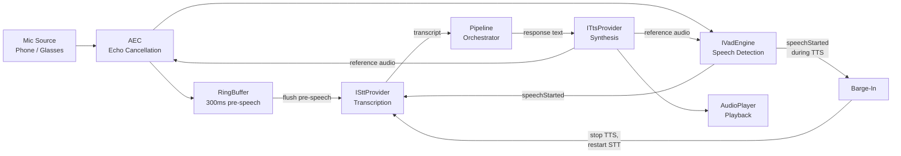
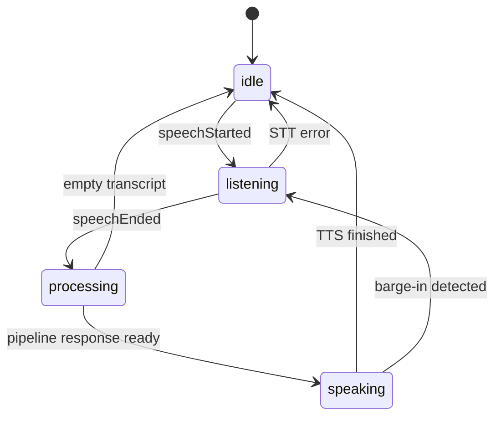

# Voice I/O

The voice I/O system orchestrates the full **VAD -> STT -> Pipeline -> TTS** cycle for hands-free operation. It handles microphone source selection, acoustic echo cancellation, barge-in detection, and zero-audio-loss buffering.

:::info Provider Interfaces
Voice provider interfaces (`ISttProvider`, `ITtsProvider`, `IVadEngine`) are defined in `humbl_core`. Concrete provider implementations will live in `humbl_voice` (scaffolded, not yet implemented). The interfaces support 4 STT providers (Android native, iOS native, Whisper API, Whisper.cpp), 5 TTS providers (Android native, iOS native, ElevenLabs, OpenAI TTS, Piper), and Silero VAD.
:::

## Why TTS-Aware VAD?

Voice Activity Detection (VAD) determines when the user is speaking. Without TTS awareness, VAD triggers on the assistant's own voice output played through the speakers. On smart glasses with bone conduction speakers, the TTS audio bleeds directly into the microphone at high volume. Without echo cancellation awareness, this creates a feedback loop: the assistant speaks, VAD detects speech, STT transcribes the assistant's own words, the pipeline processes the transcription as user input, the assistant responds to itself.

Humbl's VAD is TTS-aware by design. During TTS playback:

1. **The energy threshold is raised.** TTS audio bleeds into the mic, so the ambient energy baseline is higher. The VAD raises its detection threshold proportionally to avoid false triggers from speaker bleed.

2. **The TTS audio stream is provided as a reference signal.** The VAD receives the exact audio being played through `onTtsStarted(ttsAudioStream)`. This reference enables fingerprint-based rejection -- if the detected audio matches the TTS output, it is suppressed.

3. **A cooldown period follows TTS stop.** When TTS playback ends, the VAD enters a brief cooldown (configurable, typically 200-500ms) before returning to normal detection sensitivity. This prevents detecting the tail end of TTS playback or room reverb as user speech.

## Barge-In

Barge-in is the ability for the user to start speaking during TTS playback and have the system respond to the interruption naturally. This is critical for a conversational assistant -- if the user hears the wrong response, they should not have to wait for TTS to finish before correcting.

When VAD detects speech during TTS playback (`VoiceSessionState.speaking`), the barge-in sequence executes:

1. **TTS stops immediately.** The `ITtsProvider.stop()` method halts synthesis and the audio player stops playback. No more assistant audio.
2. **VAD is notified.** `onTtsStopped()` resets the energy threshold and disables the TTS reference signal. The VAD returns to normal sensitivity.
3. **STT resets for a new utterance.** `beginNewUtterance()` clears any partial transcription state so the new utterance starts fresh.
4. **Fresh STT capture begins.** The mic audio stream is routed to STT, which begins transcribing the user's interruption.

```dart
void _onBargeIn() {
  _tts.stop();
  _audioPlayer.stop();
  _vad.onTtsStopped();
  _stt.beginNewUtterance();
  _onSpeechStarted();  // Start fresh STT capture
}
```

The transition from `speaking` to `listening` is seamless. The user experiences a natural interruption, as if they raised their hand in a conversation. The previous response is discarded and the pipeline processes the new utterance.

## AudioStreamBuffer and Zero-Audio-Loss

The RingBuffer captures 300ms of pre-speech audio to prevent clipping the first syllable. But there is a second buffering challenge: the BLE-to-STT handoff.

When the mic source is the glasses' BLE microphone, audio arrives over BLE before STT is ready to consume it. The startup sequence is:

1. Glasses mic stream starts (BLE audio chunks arriving)
2. VAD needs to process audio to detect speech
3. Speech detected -- need to start STT
4. STT initialization takes time (load model, allocate buffers)
5. Audio keeps arriving during STT initialization

Without buffering, audio arriving between steps 3 and 4 is lost -- the beginning of the utterance is clipped. The `AudioStreamBuffer` solves this with an unbounded buffer:

- **Never drops audio.** Unlike the RingBuffer (which evicts old chunks to maintain a fixed window), AudioStreamBuffer accumulates all incoming audio until the consumer attaches.
- **Zero-audio-loss guarantee.** Every audio chunk that arrives between VAD speech detection and STT readiness is preserved and delivered in order.
- **Consumer attach/detach.** When STT is ready, it attaches to the buffer. The buffer flushes all accumulated chunks, then forwards live audio in real time.

The two buffers serve different purposes:
- **RingBuffer** -- fixed 300ms window, captures pre-speech audio before VAD triggers, used for every utterance
- **AudioStreamBuffer** -- unbounded, bridges the BLE-to-STT startup gap, only used when mic source is glasses

## Voice Pipeline



## VoiceSessionRunner

The main orchestrator that wires all voice components together:

```dart
class VoiceSessionRunner implements IVoiceSessionController {
  final ToolRegistry _toolRegistry;
  final IVadEngine _vad;
  final ISttProvider _stt;
  final ITtsProvider _tts;
  final IAudioPlayer _audioPlayer;

  /// Pipeline callback: receives user text, returns assistant response.
  Future<String> Function(String userText)? onPipelineRequest;
}
```

### Session States

```dart
enum VoiceSessionState {
  idle,        // Waiting for speech
  listening,   // Speech detected, STT active
  processing,  // STT complete, pipeline running
  speaking,    // TTS playing response
}
```



### Session Lifecycle

```dart
// Start the voice session
await voiceSession.start();

// Set the pipeline callback
voiceSession.onPipelineRequest = (transcript) async {
  final state = PipelineState(inputText: transcript, ...);
  final result = await orchestrator.run(state);
  return result.outputText ?? '';
};

// Listen for turn events
voiceSession.turnEvents.listen((event) {
  switch (event) {
    case SpeechDetected():       // VAD detected speech
    case TranscriptionComplete(:final text):  // STT finished
    case PipelineProgress(:final nodeName):   // Pipeline node executing
    case SpeakingStarted(:final text):        // TTS started
    case SpeakingFinished():     // TTS done
    case BargeInDetected():      // User interrupted TTS
    case TurnError(:final message):           // Error occurred
  }
});

// Stop when done
await voiceSession.stop();
```

### Mic Source Selection

The session discovers available microphone sources via the ToolRegistry's `mic` group:

```dart
List<MicSource> get availableMicSources;
MicSource get activeMicSource;
Future<void> setActiveMicSource(String sourceId);
Stream<List<MicSource>> get micSourcesChanged;
```

```dart
enum MicSourceType { phone, glasses, external }

class MicSource {
  final String id;           // 'phone_mic', 'glasses_mic_left'
  final String displayName;  // 'Phone Microphone'
  final MicSourceType type;
  final Map<String, dynamic>? deviceCapabilities;  // For AEC strategy selection
}
```

When switching mic sources, the AEC strategy is reconfigured and the VAD re-latches to the new audio stream:

```dart
Future<void> setActiveMicSource(String sourceId) async {
  _activeMicSource = source;
  _aec = AecStrategyFactory.create(source.deviceCapabilities);
  _ringBuffer.clear();

  if (_state != VoiceSessionState.idle) {
    _vad.detachSource();
    await _stopMicStream();
    await _startMicStream();
  }
}
```

## IVadEngine

Voice Activity Detection -- always on-device, no cloud VAD. TTS-aware with source latching:

```dart
abstract class IVadEngine {
  Future<void> start();
  Future<void> stop();

  Stream<VadEvent> get onSpeechDetected;
  bool get isListening;

  // TTS-Awareness
  void onTtsStarted(Stream<AudioChunk> ttsAudioStream);
  void onTtsStopped();
  void setMode(VadMode mode);

  // Source Latching
  void attachSource(Stream<AudioChunk> audioStream);
  void detachSource();

  VadConfig get config;
  Future<void> updateConfig(VadConfig config);
}
```

### TTS-Awareness

During TTS playback, the VAD needs to distinguish the speaker output from actual user speech. It does this by:

1. **Raising the energy threshold** -- TTS audio bleeds into the mic, so the baseline is higher
2. **Receiving the TTS audio stream** as a reference signal for fingerprinting
3. **Entering cooldown** after TTS stops, before returning to normal detection sensitivity

```dart
// VoiceSessionRunner wires TTS audio to VAD
final ttsStream = _tts.synthesizeStream(text);
final vadRefController = StreamController<AudioChunk>.broadcast();
_vad.onTtsStarted(vadRefController.stream);

ttsStream.listen((chunk) {
  playbackController.add(chunk);
  vadRefController.add(chunk);  // Reference for VAD
  _aec.feedReference(chunk);    // Reference for AEC
});
```

### Source Latching

The VAD latches to a specific audio source stream. When the mic source changes (phone to glasses or vice versa), the VAD detaches from the old stream and attaches to the new one. This prevents the VAD from processing audio from a stale or disconnected source.

## ISttProvider

Speech-to-text interface with streaming support and barge-in awareness:

```dart
abstract class ISttProvider {
  Stream<SttPartialResult> transcribeStream(Stream<AudioChunk> audio);
  Future<void> cancel();
  void beginNewUtterance();  // Reset state for barge-in
}
```

### Provider Implementations

| Provider | Platform | Engine | Latency |
|----------|----------|--------|---------|
| `AndroidSttProvider` | Android | Android SpeechRecognizer (via SttPlugin.kt) | ~200ms first partial |
| `IosSttProvider` | iOS | SFSpeechRecognizer (via SttPlugin.swift) | ~200ms first partial |
| `WhisperApiSttProvider` | All | OpenAI Whisper API (cloud) | ~500-2000ms |
| `WhisperCppSttProvider` | All | whisper.cpp on-device | ~300-800ms |

STT partial results include a `isFinal` flag:

```dart
class SttPartialResult {
  final String text;
  final bool isFinal;
  final double? confidence;
}
```

The `isFinal` flag distinguishes intermediate results (which may change as more audio arrives) from final results (which are committed). The voice session waits for `isFinal: true` before sending the transcript to the pipeline, ensuring the complete utterance is captured.

## ITtsProvider

Text-to-speech interface with streaming synthesis:

```dart
abstract class ITtsProvider {
  Stream<AudioChunk> synthesizeStream(String text);
  Future<void> stop();
}
```

### Provider Implementations

| Provider | Platform | Engine | Quality |
|----------|----------|--------|---------|
| `AndroidTtsProvider` | Android | Android TextToSpeech (via TtsPlugin.kt) | System voices |
| `IosTtsProvider` | iOS | AVSpeechSynthesizer (via TtsPlugin.swift) | System voices |
| `ElevenLabsTtsProvider` | All | ElevenLabs API (cloud) | High quality, emotional |
| `OpenAiTtsProvider` | All | OpenAI TTS API (cloud) | High quality |
| `PiperTtsProvider` | All | Piper on-device (ONNX) | Good quality, offline |

TTS providers emit `AudioChunk` streams that can be teed for both playback and AEC reference. The stream is consumed by two listeners simultaneously: the audio player (for output) and the AEC/VAD system (for echo cancellation reference).

## Audio Buffering

### RingBuffer

Fixed-size circular buffer (300ms default) that captures pre-speech audio. When VAD detects speech, the ring buffer is flushed into STT so the beginning of the utterance is not lost:

```dart
class RingBuffer {
  final Duration capacity;  // Default: 300ms
  final Queue<AudioChunk> _chunks = Queue();

  void write(AudioChunk chunk) {
    _chunks.addLast(chunk);
    // Evict oldest chunks until within capacity
    while (_bufferedDuration > capacity && _chunks.isNotEmpty) {
      _chunks.removeFirst();
    }
  }

  /// Drain all chunks for STT pre-fill. Clears buffer.
  List<AudioChunk> flush() {
    final result = _chunks.toList();
    _chunks.clear();
    return result;
  }
}
```

The pre-speech capture flow:

```dart
void _onSpeechStarted() {
  // Start STT streaming
  _sttAudioController = StreamController<AudioChunk>.broadcast();

  // Flush ring buffer pre-speech audio into STT
  final preAudio = _ringBuffer.flush();
  for (final chunk in preAudio) {
    _sttAudioController?.add(chunk);
  }

  // STT starts receiving live audio + pre-speech audio
  _sttStreamSub = _stt.transcribeStream(_sttAudioController!.stream).listen(...);
}
```

Without the RingBuffer, the first 100-300ms of every utterance would be lost. The user says "set a timer for five minutes" but STT only hears "timer for five minutes" because the first syllables arrived before VAD triggered and STT started. The RingBuffer captures those leading syllables so STT receives the complete utterance.

### AudioStreamBuffer

Unbounded buffer for BLE-to-STT startup bridging. Different from RingBuffer -- it never drops audio:

- Used when glasses mic stream starts before STT is ready
- Buffers all incoming audio until the consumer attaches
- Zero-audio-loss guarantee

## Acoustic Echo Cancellation

`SoftwareAec` processes mic audio to remove TTS playback echo:

```dart
abstract class IAecProcessor {
  /// Process a mic audio chunk, removing echo from TTS playback.
  AudioChunk process(AudioChunk micChunk);

  /// Feed TTS audio as reference for echo cancellation.
  void feedReference(AudioChunk ttsChunk);
}
```

The AEC strategy is selected based on mic source capabilities:

```dart
class AecStrategyFactory {
  static IAecProcessor create(Map<String, dynamic>? deviceCapabilities) {
    // If device has hardware AEC (some glasses do), use passthrough
    // Otherwise use SoftwareAec
  }
}
```

Some smart glasses have hardware AEC built into their audio chipset. In that case, the software AEC is bypassed (passthrough mode) to avoid double-processing. The `deviceCapabilities` map from `MicSource` indicates whether hardware AEC is available.

Audio processing chain: **Mic -> AEC -> RingBuffer + VAD + STT feed**

## PlatformAudioSource & PlatformAudioPlayer

Cross-platform audio I/O abstractions:

```dart
// Audio input (mic capture)
abstract class IAudioSource {
  Stream<AudioChunk> get audioStream;
  Future<void> start({int sampleRate = 16000});
  Future<void> stop();
}

// Audio output (TTS playback)
abstract class IAudioPlayer {
  Future<void> playStream(Stream<AudioChunk> audio);
  Future<void> stop();
}
```

These wrap platform-specific APIs:
- Android: AudioRecord / AudioTrack
- iOS: AVAudioEngine
- Windows: WASAPI
- macOS: AVAudioEngine
- Linux: ALSA/PulseAudio

## Source Files

| Path | Purpose |
|------|---------|
| `humbl_core/lib/voice_session/voice_session_runner.dart` | Main orchestrator |
| `humbl_core/lib/voice_session/voice_session_controller.dart` | IVoiceSessionController interface |
| `humbl_core/lib/voice_session/voice_config.dart` | Session configuration |
| `humbl_core/lib/voice_session/mic_source.dart` | MicSource model |
| `humbl_core/lib/voice_session/ring_buffer.dart` | Pre-speech circular buffer |
| `humbl_core/lib/voice_session/audio_stream_buffer.dart` | Unbounded BLE bridging buffer |
| `humbl_core/lib/voice_session/audio_io.dart` | IAudioSource, IAudioPlayer |
| `humbl_core/lib/voice_session/platform_audio_source.dart` | Cross-platform mic capture |
| `humbl_core/lib/voice_session/platform_audio_player.dart` | Cross-platform audio playback |
| `humbl_core/lib/voice_activity_detection/i_vad_engine.dart` | VAD interface |
| `humbl_core/lib/voice_activity_detection/vad_config.dart` | VAD configuration |
| `humbl_core/lib/voice_activity_detection/aec/software_aec.dart` | Software echo cancellation |
| `humbl_core/lib/voice_activity_detection/aec/i_aec_processor.dart` | AEC interface |
| `humbl_core/lib/speech_to_text/i_stt_provider.dart` | STT interface |
| `humbl_core/lib/speech_to_text/stt_models.dart` | AudioChunk, SttPartialResult |
| `humbl_core/lib/speech_to_text/providers/` | STT provider implementations |
| `humbl_core/lib/text_to_speech/i_tts_provider.dart` | TTS interface |
| `humbl_core/lib/text_to_speech/providers/` | TTS provider implementations |
